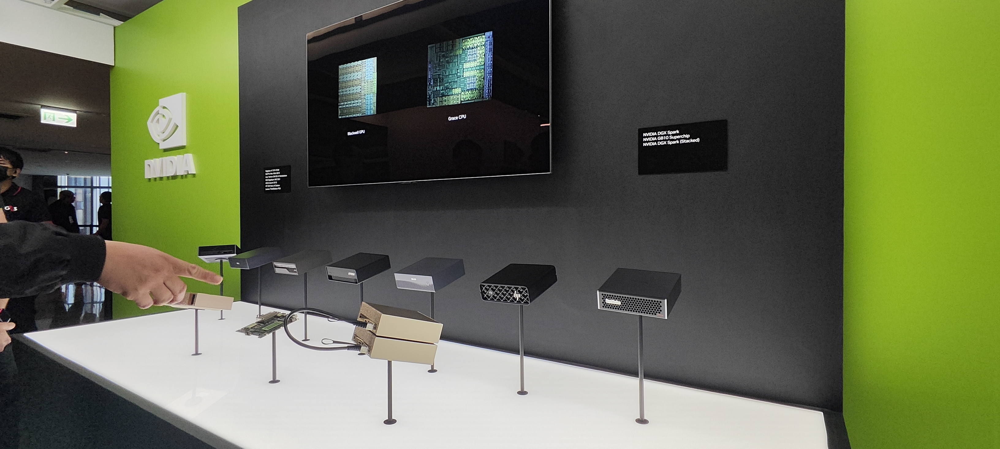
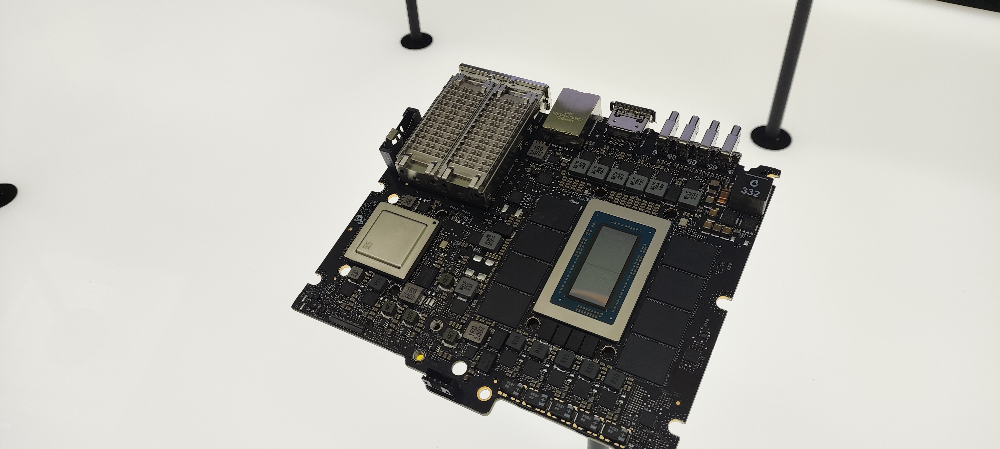
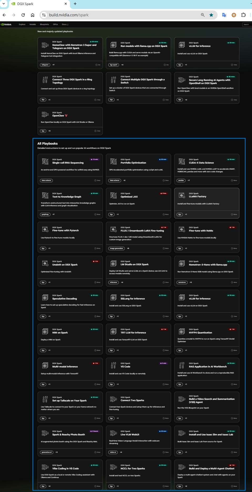

## NVIDIA DGX Spark：個人 AI 超級電腦簡介  > 從桌上型 AI 開發，走向資料中心級 AI 應用
# NVIDIA DGX Spark 是一款定位為「個人 AI 超級電腦」的桌上型工作站，專為開發人員、研究人員和數據科學家設計。 
採用了最新的 NVIDIA Blackwell 架構，體積非常精巧（僅約 15 公分見方），旨在讓使用者能在桌面上直接進行大規模 AI 模型的原型設計、微調與推論。 

## 1. 核心技術規格

| 項目 | 詳細規格 |
| :--- | :--- |
| **處理器晶片** | **NVIDIA GB10** (Grace Blackwell 超級晶片) |
| **GPU 架構** | Blackwell (第 5 代 Tensor Core) |
| **CPU 架構** | 20 核心 Arm (10x 高性能核心 + 10x 節能核心) |
| **AI 算力** | 高達 **1 PetaFLOP** (FP4 精度) |
| **統一記憶體** | **128 GB LPDDR5x** (CPU 與 GPU 共享的一致性架構) |
| **記憶體頻寬** | 273 GB/s |
| **儲存空間** | 1TB ~ 4TB NVMe SSD  |
| **網路連接** | 10 GbE RJ-45 + **ConnectX-7 SmartNIC** (最高 200 Gbps) |
| **無線技術** | Wi-Fi 7 / Bluetooth 5.4 |
| **尺寸與重量** | 150 x 150 x 50.5 mm / 1.2 kg |
| **最大功耗** | 約 240W |

---

## 2. 主要特點分析

### 🚀 革命性的統一記憶體架構
DGX Spark 最核心的優勢在於其 **128GB 的一致性統一記憶體**。由於 CPU 與 GPU 直接共享相同的記憶體空間，消除了資料在兩者之間搬移的延遲。這使其能在極小體積下，直接運行參數規模高達 **2,000 億 (200B)** 的大型語言模型 (LLM) 進行推論。

### 🔌 高速擴展與群集能力
雖然體積輕巧，但它具備強大的擴充潛力：
* **雙機串聯**：透過內建的 ConnectX-7 高速網路，可將兩台 DGX Spark 連接，共同處理高達 **4,050 億 (405B)** 參數的巨型模型（如 Llama 3.1 405B）。
* **資料中心級網路**：支援 200Gbps 頻寬，確保本地開發環境與大型資料中心集群的網路環境完全一致。

### 🛠️ 完整的 AI 開發堆疊
隨附 **NVIDIA DGX OS**，這是一個基於 Linux 並經過深度優化的作業系統，整合了：
* **CUDA Toolkit & cuDNN**：核心加速函式庫。
* **NVIDIA AI Enterprise**：支援完整的 AI 工作流與企業級管理。
* **開發框架**：原生支援 NVIDIA Isaac (機器人)、Metropolis (智慧視訊) 和 Holoscan 等框架。

---

## 3. 應用場景

1.  **本地模型開發與原型設計**：在將模型上傳至昂貴的雲端算力前，先在本地進行快速迭代。
2.  **大模型微調 (Fine-tuning)**：單機可輕鬆微調 Llama 3.1 70B 等中大型模型。
3.  **邊緣計算 (Edge AI)**：適合部署在需要強大本地推論能力的辦公室、實驗室或醫療設施。
4.  **隱私與安全**：在完全不連網的「隔離環境」下處理敏感數據，滿足合規需求。

---

## 4. 總結
**NVIDIA DGX Spark** 填補了高效能筆電與資料中心伺服器之間的空白。它將過往需要數台伺服器才能運行的 LLM 推論與微調能力，濃縮在一個僅 1.2 公斤的方盒子中，是目前性能密度最高的個人 AI 開發平台。

以下是拍攝於Nvidia GTX Taipei 2025會場的同晶片架構的「品牌機」（GB10 平台）

這是NVIDIA GB10主機板

由於 NVIDIA 將 GB10 晶片開放給合作夥伴，許多品牌推出了與 DGX Spark 規格幾乎一致的產品。這些產品同樣具備 128GB 統一記憶體，主要差異在於外殼設計、散熱與售價：
包含了以下品牌型號產品

Acer Veriton GN100 AI Workstation
ASUS Ascent GX10
Dell Pro Max With GB10
Gigabyte AI TOP ATOM
HP ZGX Nano AI Station
Lenovo ThinkStation PGX
MSI EdgeXpert MS-C931

# GB10 (Grace Blackwell) 平台產品橫向分析表 是Gemini隨便寫的

| 產品名稱 | 核心定位與管理特點  | 適合族群 |
| :--- | :--- | :--- |
| **NVIDIA DGX Spark** | 官方原生機型，搭載完整 DGX 軟體堆疊 | 頂級開發者、軟體相容性優先者 |
| **Dell Pro Max With GB10** | 採用 ProSupport 企業保固，但管理介面遵循 NVIDIA 規範 | 習慣 Dell 售後體系但接受 NVIDIA 管理邏輯者 |
| **Gigabyte AI TOP ATOM** | 搭載圖形化微調工具 (AI TOP)，操作門檻最低 | 初創團隊、不擅長指令操作的用戶 |
| **Lenovo ThinkStation PGX** | 強化散熱與抗噪設計，適合桌面辦公環境 | 長時間運算、重視安靜環境的研究室 |
| **MSI EdgeXpert MS-C931** | 具備更強的震動與溫度耐受力 (工業規格) | 工廠邊緣端、自動化生產線部署 |
| **ASUS Ascent GX10** | 整合 ProArt 創作者介面與極致外觀 | 獨立 AI 設計師、精品工作室 |
| **HP ZGX Nano AI Station** | 具備 Wolf Security 硬體加密技術 | 金融、政府等高資安要求單位 |
| **Acer Veriton GN100** | 結構簡單、性價比極高 | 教育市場、大規模採購需求 |
---
# 核心差異總結 ： 不跟你廢話就是品牌與價格！ # 市售各品牌WIFI晶片與儲存容量可能有所差異！

💡 build.nvidia.com 網站 是 NVIDIA 提供的 AI 模型與服務平台，主打可直接透過 API 使用的模型目錄與工具。
平台內建 NVIDIA NIM 微服務，讓開發者快速測試、部署生成式 AI 模型與應用。同時提供線上試用與開發環境，讓你不用自建 GPU 基礎設施就能開發 AI 應用。
build.nvidia.com 網站更提供給你實作教學＋範例流程。
簡單講 build.nvidia.com 上的教學分成幾種：
1️⃣ Blueprint（藍圖教學，最實用）
官方提供「AI 應用範例流程＋程式碼」
例如：聊天機器人、AI agent、生成式應用
等於是「照著做就能跑起來」

👉 官方自己就寫明：提供 workflows + code samples 讓你從零建立 AI App

2️⃣ Step-by-step Playbooks（逐步教學）
像「怎麼建立 AI agent（NemoClaw）」
「怎麼啟動 GPU instance」
「怎麼串 API」

👉 NVIDIA 也強調有「step-by-step playbooks」給開發者上手

3️⃣ API + 模型測試（邊玩邊學）
每個模型都能直接試用（像 Chat / Agent / Coding）
邊測試邊看用法，其實就是實戰教學

👉 本質是「API sandbox + 模型目錄」

build.nvidia.com 網站針對 GB10 系統相關連結在這  https://build.nvidia.com/spark 提供數十種例樣本Playbooks

Playbook = NVIDIA 幫你寫好的「AI 實作教學腳本」
Playbook 是一套「一步一步帶你完成 AI 專案」的實戰教學
內容包含：架構流程、API 呼叫、範例程式碼與部署方式
讓你照做就能把 AI 功能（像 Agent、Chat、RAG）跑起來
下圖就是網站所提供的各式playbooks.

## 這個專案的目的就是透過各式playbooks的試作並進行說明。

## 👉「先在桌上把 AI 玩熟，再把同一套能力放大到機房等級。」

以 GB10 桌上型平台作為本地 AI 開發起點
建立模型部署、推論與系統整合能力
進一步將架構擴展至資料中心（如 H200）實現大規模 AI 應用

## 本專案採用 DELL PRO MAX GB10 操作示範 , 也非常歡迎 HP Lenovo Nvidia 等品牌提供設備 .
