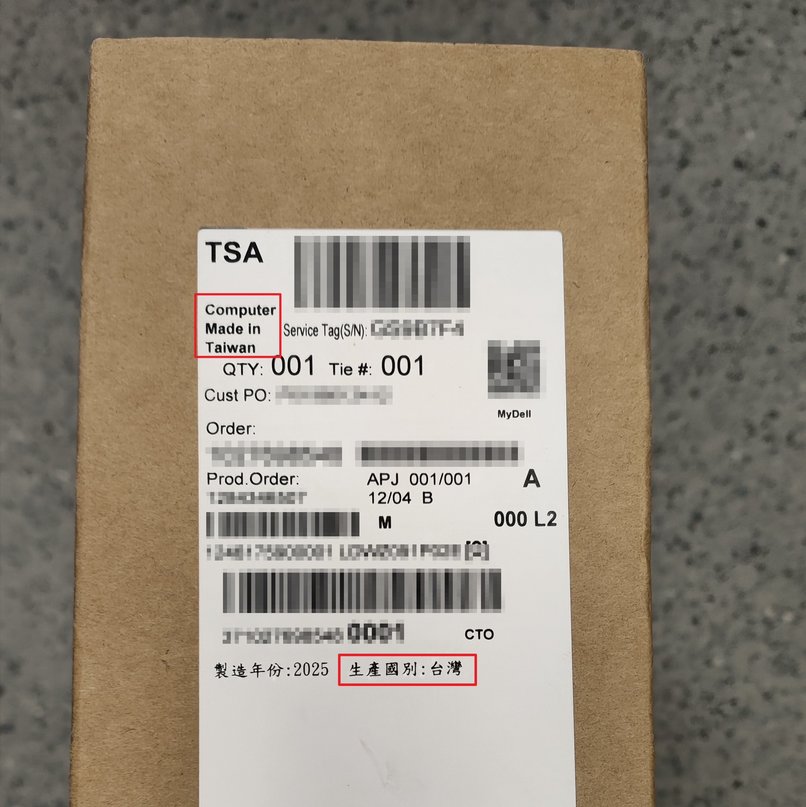
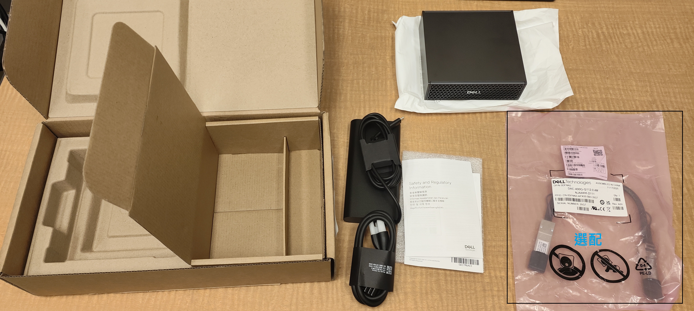
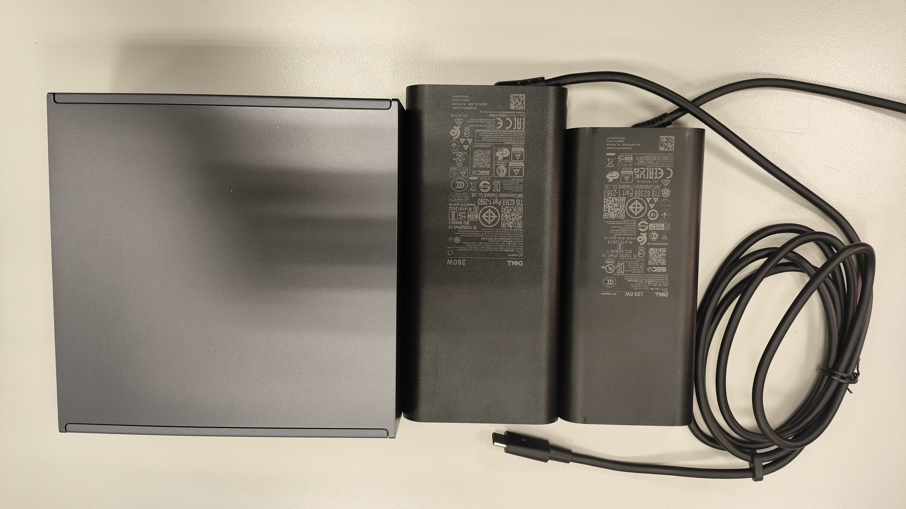
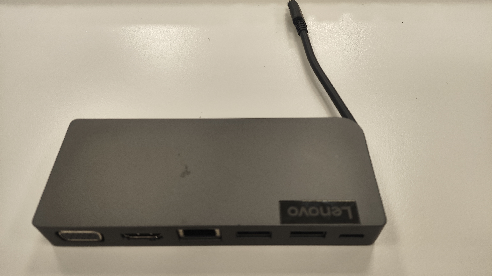
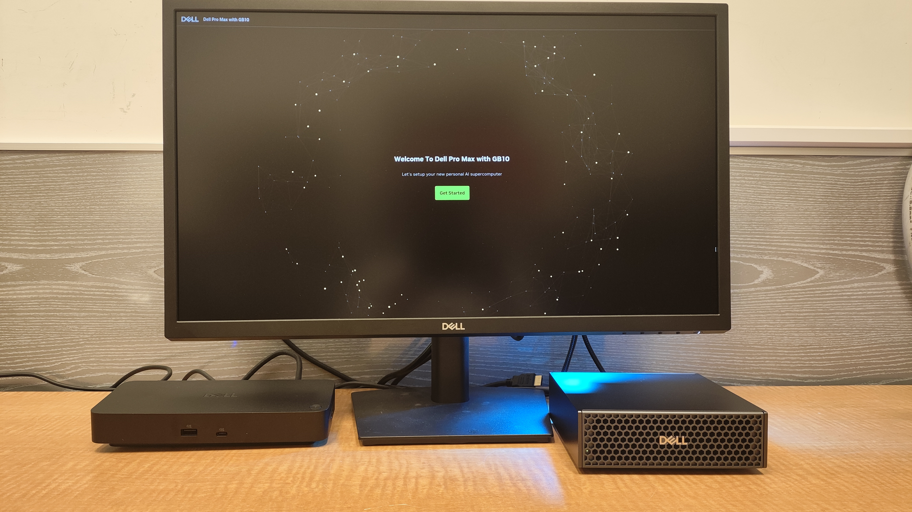
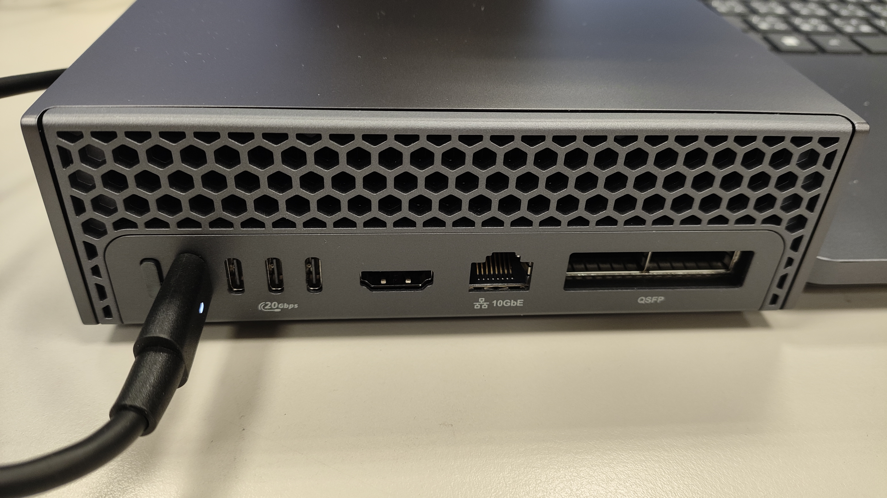

# Dell Pro MAX GB10 硬體開箱

Dell Pro Max GB10（代號 FCM1253）外箱為 Dell 一貫簡約風格，如下圖所示。

實際尺寸與比例參考如下：

---

## 生產資訊

- 生產國別：目前檢查（2025～2026）出貨版本多為 **台灣**
  

---

## 內容物

盒內包含以下項目：

- Dell Pro Max GB10 主機
- 280W Type-C 電源供應器（與主機尺寸相近）
- （標準包裝 **不包含** 右下 400G DAC 纜線）

---

## 配件說明與溫度特性

由右到左依序為：

- Dell Pro Max GB10
- 280W Type-C 電源供應器
- 130W Type-C 電源供應器（這是Dell Pro MAX 16 NB 用的拿來當對照組）  

補充說明：

- GB10 輕量運作時本體運作時幾乎不產生明顯熱量 nvidia-smi 有溫度顯示 另外如果風扇拉高度運作時是會有聲音-差不多是NB速度運作的噪音程度
- 280W 電源供應器會有輕微溫熱感,一般辦公環境下約 **40～45°C（體感估算）
- 建議避免與其他高熱設備長時間堆疊

---

## 初始設定方式

Dell Pro Max GB10 / NVIDIA DGX Spark 類型設備僅提供 **Type-C 接口**

機身後側左邊第一個 Type-C 連接孔為 **電源輸入**

---

### 初始設定有兩種方式：

#### 方式 1：無線熱點設定（建議快速安裝）

1. 使用 PC / NB 連接 GB10 初始建立的 Wi-Fi 熱點
2. 進入設定介面
3. 再切換連接至正式 Wi-Fi 網路

#### 方式 2：有線完整初始化（較穩定）

1. HDMI 連接螢幕
2. Type-C HUB 連接鍵盤與滑鼠
3. 接上有線網路
4. 完成初始化流程（約 10～20 分鐘）
5. 需穩定 Internet 連線

---

📌 官方初始設定文件：
https://www.dell.com/support/kbdoc/zh-tw/000398800/dell-pro-max-with-gb-10-fcm1253-initial-setup-out-of-the-box-experience?lang=en

---

## 注意事項

- 若使用方式 1（Wi-Fi 熱點）不穩定
  👉 建議改用方式 2（有線初始化）

---

## Type-C Hub 相容性測試

以下為實測可用 / 不可用設備：

- Dell Pro 擴充基座 WD25 → ✅ 正常
- Dell DA200 方型旅行 HUB → ❌ 不相容
- Dell DA300 圓型旅行 HUB → ✅ 正常
- 無品牌 USB HUB + Type-C 轉接 → ✅ 我的正常....你的我不敢保證
---

補充測試：
- Lenovo USB-C Travel HUB → ✅ 正常

---

## 開機與指示燈

- 電源指示燈位置：
  - 機身前方左側
  - 由下往上第三排第一格（六角形區域內）
  - 顯示小型綠燈

- 初始化畫面如下：

---

## 機構與拆解提醒

- GB10 / DGX Spark 類產品底部採 **磁吸式底座設計**
- 若需開啟需使用專用小工具

⚠️ 本文不提供拆解教學  
拆機存在風險，請務必參考：

👉 `user-manual` 目錄內  
**Dell Pro Max with GB10 FCM1253 Owner's Manual**

作者不負責任何拆解造成的損壞

---

## 底部與背部說明

- 底部含磁吸結構
- Service Tag（序號）通常位於遮蔽或馬賽克區域
- 報修與保固需使用該序號

產品規格：

- SSD 容量：2TB / 4TB 可選
- 保固：1～3 年方案可選

---

## 後方連接與散熱設計

Dell Pro Max GB10 最簡化連接狀態如下：

- 電源輸入
- 網路（或 Wi-Fi）
- Type-C 擴充使用
- 支援 SSH / Remote Desktop 遠端操作

設計重點：

- 最左側為電源按鍵
- 依序為電源輸入接口
- 上方六角形為排風口
- 前後皆為進氣 / 排氣通道

⚠️ 請勿遮擋散熱區域

---

