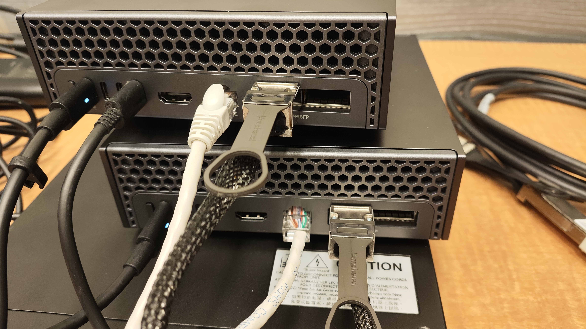
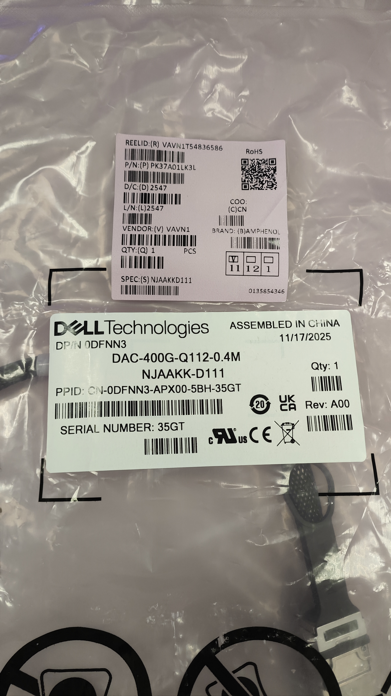
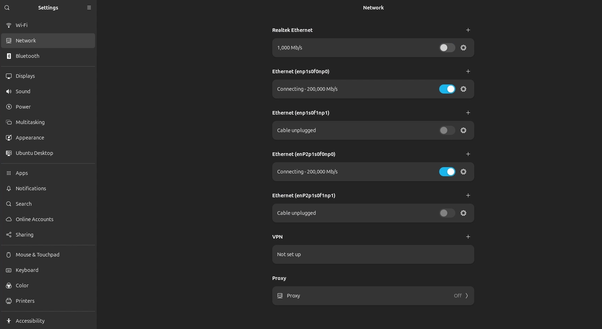
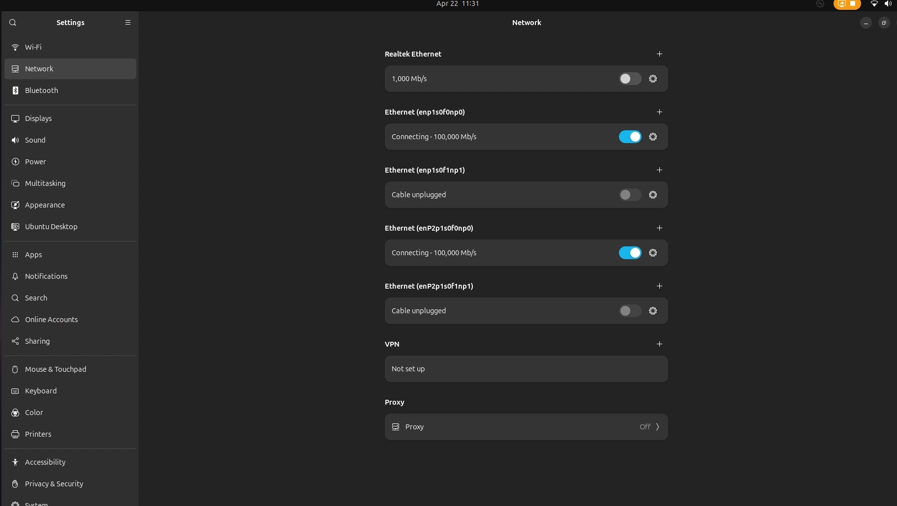
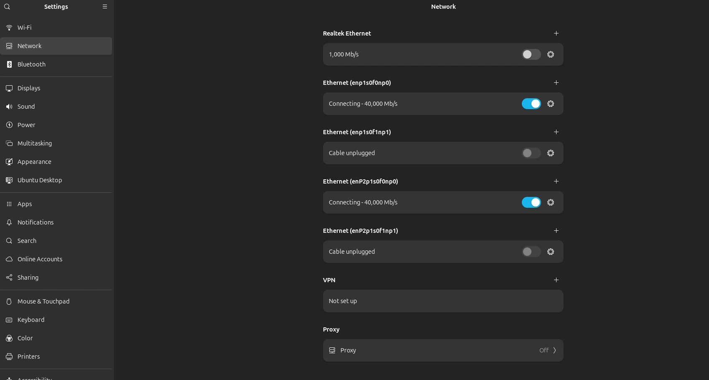

本章節描述 GB10 實體網路相關

Dell Pro MAX GB10 網路採用晶片分別是 
1.Realtek RTL8127-CG for 1/10GbE 
2.NVIDIA ConnectX-7 for QSFP 

為驗證GB10 ConnectX-7 QSFP的適合、匹配所以翻出手上全數有的QSFP纜線,一一進行連接與測試,至於多台GB10連接請留待後續章節 ,因為第二台已經不在手邊

品項列表 
1.GB10 兩台  
2.Dell S4112F-ON 一台 
3.DAC-400G-Q112 Cable 
4.DAC-40G QSFP 
5.DAC-100G QSFP28 
GB10有兩個QSFP Port , Dell S4112F-ON switch 也有3個100G QSFP 到底可不可以接起來?

這是兩台GB10使用DAC 對接,實際的作業要等到這一篇...........
6a	(集群與網路)	6a-Connect Two Sparks	Connect two Spark devices and setup them up for inference and fine-tuning	連接兩個 Spark 設備並設定它們以進行推理和微調

 
400G Q112 DAC

 
DAC 400G Q112 與一般的 DAC QSFP28 有什麼不一樣？
這兩者在技術規格上有著「代差級」的區別。QSFP28 是針對 100G 時代設計的，而 QSFP112 (Q112) 則是為了 400G 及更高的 AI/HPC 運算需求而生。
以下是兩者的核心差異對比：
 
1. 頻寬與通道速率 (最本質的差異)
 
•	QSFP28 DAC： 
•	總頻寬： 100 Gb/s。 
•	通道數： 4 個通道 (Lanes)。 
•	單通道速率： 25 Gb/s，採用 NRZ 調變技術。 
 
•	QSFP112 DAC： 
•	總頻寬： 400 Gb/s。 
•	通道數： 同樣是 4 個通道。 
•	單通道速率： 112 Gb/s，採用 PAM4 調變技術。 
•	註：這意味著 Q112 在相同的通道數量下，傳輸效率是 QSFP28 的 4 倍。 
 
2. 調變方式：NRZ vs. PAM4 
•	NRZ (Non-Return to Zero)： 傳統的二進位制（0 或 1），每訊號週期傳輸 1 bit。 
•	PAM4 (Pulse Amplitude Modulation 4-level)： 透過 4 個電壓階層，每訊號週期可傳輸 2 bits。 
•	Q112 使用 PAM4 來達成極高的資料密度，但也因此對訊號衰減更敏感，對線材品質要求極高。 
 
3. 物理結構與向下相容性 
•	QSFP28： 這是目前資料中心最普及的標準，接口物理結構穩定。 
•	QSFP112： 它是 QSFP 系列的最新演進版本。 
•	物理兼容： 接口外形與 QSFP28 非常相似，理論上可以物理插拔。 
•	電氣兼容： 雖然可以插進去，但由於訊號速率從 25G 噴發到 112G，且電壓定義不同，舊的 QSFP28 設備無法直接驅動 Q112 線材達成 400G 速率。 
 
4. 傳輸距離與線徑 (DAC 的限制) 
由於 Q112 的訊號頻率極高，銅纜的物理特性限制非常明顯： 
•	QSFP28 DAC： 傳輸距離可達 3 到 5 公尺，且線材相對較軟。 
•	QSFP112 DAC： 為了維持訊號完整性，傳輸距離通常被限制在 1.5 到 2 公尺 以內。 
•	如果超過這個距離，通常需要改用 AOC (主動式光纜) 或光纖模組，否則訊號誤碼率 (BER) 會過高。 
 
規格對比表 
特性	QSFP28 (一般 100G)	QSFP112 (400G Q112)
總吞吐量	100 Gbps	400 Gbps
單通道速度	25 Gbps	112 Gbps
編碼方式	NRZ	PAM4
 
常見應用	一般伺服器上聯、25G/100G 交換機	ConnectX-7 網卡、AI GPU 伺服器
典型線長 (DAC)	3m - 5m	1m - 2m
________________________________________ 
專業部署建議 
在您的工作環境中（如部署 Dell PowerEdge R660 或與 NVIDIA ConnectX-7 介接時）： 
1.	確認接口類型： 如果網卡是 ConnectX-7 (NDR)，它通常支持 OSFP 或 QSFP112。
# 請務必確認交換機端也是 QSFP112 規格，否則速度會掉回 100G 或甚至無法連通。 
2.	線材彎折： Q112 DAC 的銅線為了屏蔽訊號干擾通常較硬，且彎折半徑要求較高，機櫃理線時要特別留心，避免損傷線材內部的對絞結構導致訊號不穩。 
補充： 為什麼叫 Q112？因為它是 QSFP 結構且單通道跑 112G，這就是它名字的由來。 
  

觀察這一條 40cm  Q112 DAC 其實內部還滿細的, 但常未深入研究 , 因為它已不在手邊.  

未來看有沒有機會有 QSFP <--->QSFP 100G 112 的轉換器透過 光纖樣式的連接再補充 
 
這是作業系統內的網卡狀態-200G 

 
這是作業系統內的網卡狀態-100G 

 
這是作業系統內的網卡狀態-40G 

  

目前針對 interface 名稱未深入留待後續補充
 
另外附了S4112F-ON switch config 在此子目錄 scripts/S4112F-ON-CONFIG.txt
