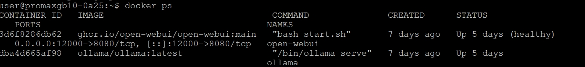

## docker 說明
在 Linux 上，Docker 透過容器技術把應用程式與其相依環境一起打包，利用作業系統核心（kernel）共享資源，實現快速部署、環境一致性與輕量化運行，比傳統虛擬機更省資源且啟動更快。<br>
在 Linux 上，Docker 透過容器技術將應用程式、函式庫與設定一起打包成映像檔（image），執行時以隔離的容器（container）運行，並共享同一個系統核心（kernel），
因此具備**快速啟動、資源占用低、跨環境一致（開發/測試/正式）與易於擴展（scaling）**等優點；同時可搭配映像版本控管與自動化部署，大幅提升系統維運與開發效率。<br>
舉例：在一個作業系統之下 , ollama 是一個 docker , Openweb UI 是一個 docker .

```text
docker ps
```


💻🗄️🧩 簡單理解 docker-compose.yml 設定檔,  Docker Compose 使用的設定檔，用來定義並一次啟動多個 Docker 容器服務。<br>
👉 它就像「服務的藍圖」<br>
把一整個系統（例如：Web + DB + Cache）寫在一個檔案裡，一鍵啟動。<br>
📦 主要功能<br>
定義多個服務（services）<br>
設定映像（image）或建置方式（build）<br>
設定網路（network）<br>
掛載資料（volume）<br>
控制啟動順序與依賴<br>

🚀 常用指令<br>
docker-compose up -d     # 啟動全部服務<br>
docker-compose down      # 停止並刪除<br>
docker-compose logs      # 查看 log<br>
<br>

👉 docker-compose.yml 不會決定「檔案實際在主機哪個路徑」<br>
👉 它只決定「容器內的路徑」與「是否用 volume 保存」<br>

🧩 你的這份設定，資料實際在哪？<br>
你現在用的是 named volume（不是 bind mount）：<br>
volumes:  - open-webui:/app/backend/data  - open-webui-ollama:/root/.ollama<br>
👉 這代表資料會被 Docker 存在主機的：<br>
/var/lib/docker/volumes/<br>

📂 對應實際路徑<br>
🔹 ollama 模型資料<br>
/var/lib/docker/volumes/open-webui-ollama/_data/<br>
👉 對應容器內：<br>
/root/.ollama<br>

🔹 open-webui 資料<br>
/var/lib/docker/volumes/open-webui/_data/<br>
👉 對應容器內：<br>
/app/backend/data<br>

🔍 如何確認（實際查）<br>
你可以用：docker volume inspect open-webui<br>
會看到類似：
"Mountpoint": "/var/lib/docker/volumes/open-webui/_data"<br>

⚠️ 很重要的觀念<br>
❌ 不是這樣
很多人以為：
~/openwebui/
會存資料 ❌<br>
👉 其實 這個目錄只放 docker-compose.yml

✅ 真正資料在<br>
👉 Docker 自己管理的 volume 路徑<br>
（/var/lib/docker/...）

🧠 如果你想「自己控制路徑」<br>
可以改成 bind mount：<br>
volumes:  - ./ollama:/root/.ollama  - ./data:/app/backend/data
👉 這樣資料就會在 ~/openwebui/ollama~/openwebui/data
📌 好處：<br>
容易備份<br>
看得到檔案<br>
可直接操作<br>

📌 壞處：<br>
權限要自己管<br>
比較容易誤刪<br>

🧾 總結<br>
你目前這份設定：<br>
👉 資料實際位置<br>
/var/lib/docker/volumes/<br>
👉 compose 檔所在位置<br>
~/openwebui/docker-compose.yml<br>
👉 兩者是分開的！<br>
