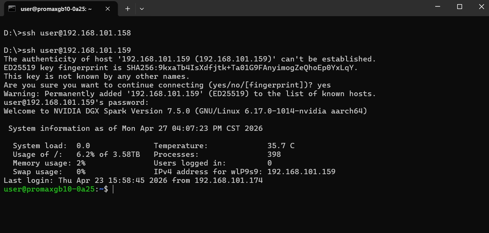
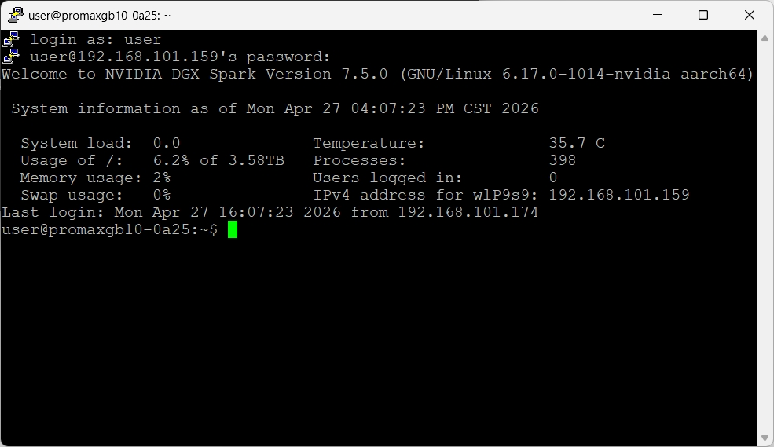
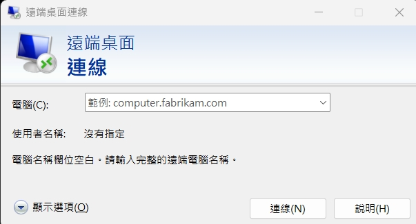
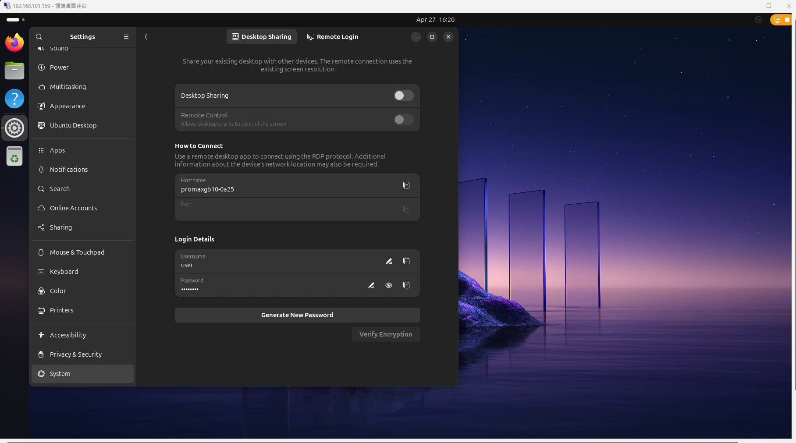
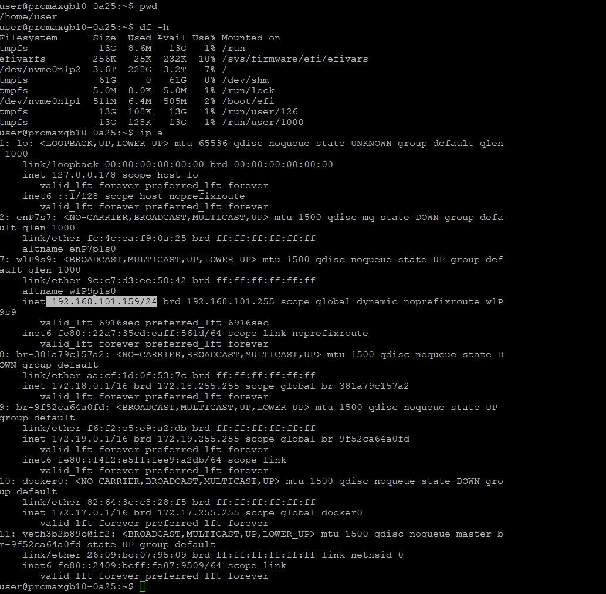
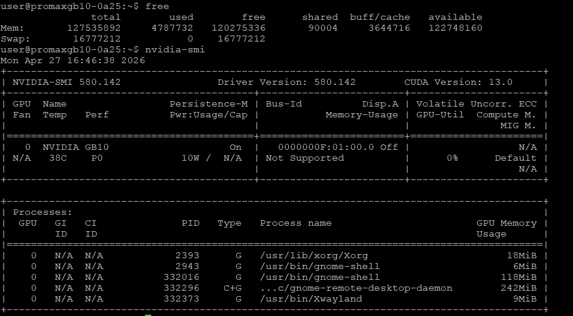
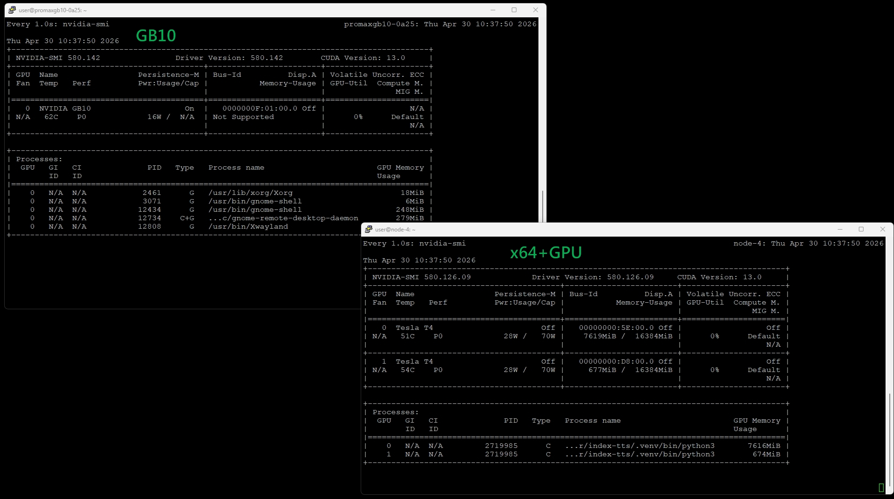

## NVIDIA DGX Spark（Dell Pro MAX GB10）的作業系統 NVIDIA DGX OS，這是一個基於 Linux 並經過深度優化的作業系統,在閅始應用之前有些基本環境與指令需要理解<br>

# 💻 連接
1. ssh
2. 遠端桌面連線
3. WEB 瀏覽器
## 1.SSH 
🔐 SSH 連線程式說明
🧩 SSH 是什麼？
SSH（Secure Shell）是一種**安全的遠端連線協定與工具**，用來在不安全的網路（例如網際網路）上，安全地登入另一台電腦或伺服器並進行操作。
常見工具
- Linux / macOS：內建 `ssh`
- Windows：PuTTY 或 PowerShell（內建 SSH）
使用windows內建指令列ssh指令 

使用putty終端機連線程式  putty程式下載網站 https://www.chiark.greenend.org.uk/~sgtatham/putty/latest.html 


⚙️ SSH 連線基本原理
1️⃣ 建立連線
從本機（Client）連到遠端主機（Server）
```bash
ssh 使用者名稱@GB10 IP位址
```
## 2. 遠端桌面連線
🌐 遠端桌面連線（簡單說明）
🧩 什麼是遠端桌面？
遠端桌面就是：
👉 在自己的電腦上，**操作另一台電腦的畫面**
就像你「坐在那台電腦前面使用它」一樣。
🖥️ 白話理解
- 你的電腦 = 控制端（Client）
- 遠端電腦 = 被控制（Server）
你會看到：
- 對方電腦的桌面
- 可以用滑鼠、鍵盤操作
- 開程式、改設定、跑工作
🔧 常見工具
- Windows：遠端桌面（RDP）
⚙️ 基本流程
1. 開啟遠端電腦的遠端桌面功能  
2. 輸入對方 IP 或電腦名稱  
3. 登入帳號密碼  
4. 成功後看到對方桌面

開啟windows內建 遠端桌面連線到GB10的IP , 注意這邊認證要選 其它選擇,使用其它帳戶,再依序輸入使用者名稱/密碼


GB10這這個設定如果沒有啟動是連不上的 GB10 Settings,System,Desktop Sharing,在login Details重新確認Username,Password,<br>
這個圖就是windows使用遠端桌面連線到GB10所顯示的桌面.



# 💻 Linux 生態指令
🧩pwd 指令列目前所在的目錄路徑            <br>
🧩df -h 查看目前作業系統目錄容量使用率    <br>
🧩ip a  查看網路卡狀態                  <br>
<br>

<br>
🧩watch -n 1 接上你要下的指令 ; 每秒下一次指令連續更新畫面輸出,參數1這個是代表每秒跑一次 , 如果不想再行 Ctrl+c複合鍵中斷跳出執行<br>
watch -n 1 free         ; free是顯示目前記憶體使用量<br>
watch -n 1 nvidia-smi   ; nvidia-smi是顯示目前GPU記憶體使用量<br>
不想每秒跑一次就直接下指令,不需要輸入 watch -n 1  , <br>
 <br>

GB10與一般 x64+GPU 在 nviaia-smi的輸出比對(看出差異了嗎？提示 GPU 記憶體 ) , 另外目前nvitop 在GB10系統是跑不起來的

 <br>


🧩Linux 命令列下的純文字編輯器 , vi , nano 這兩種呈式選一種,把存檔/離開,這兩個功能鍵記起來<br>

🧩docker 容器相關的指令很多,獨立一個說明檔. <br>


