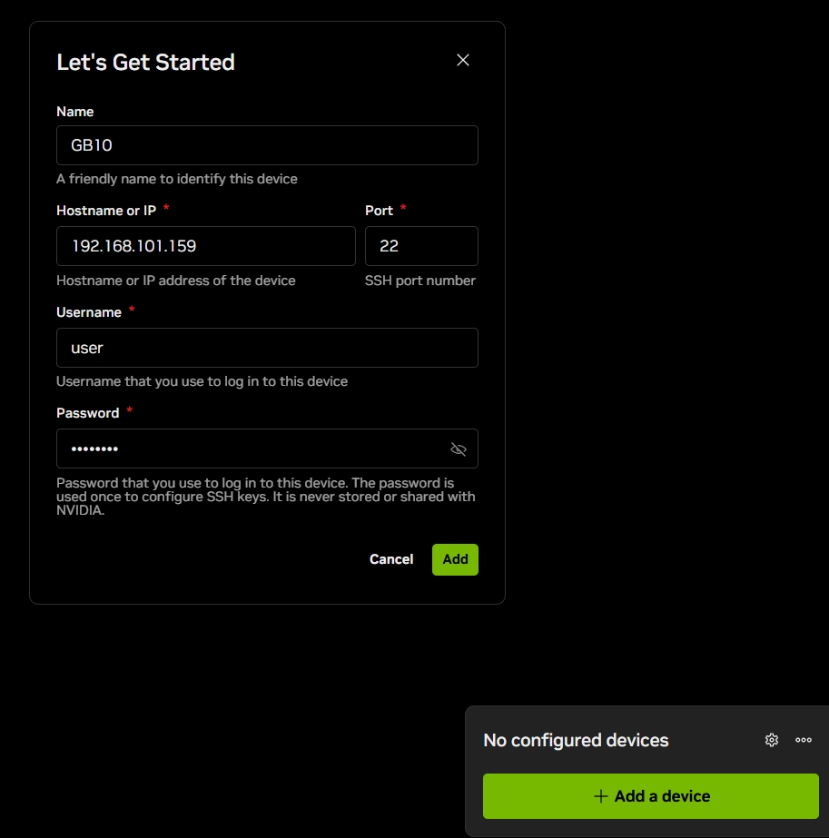
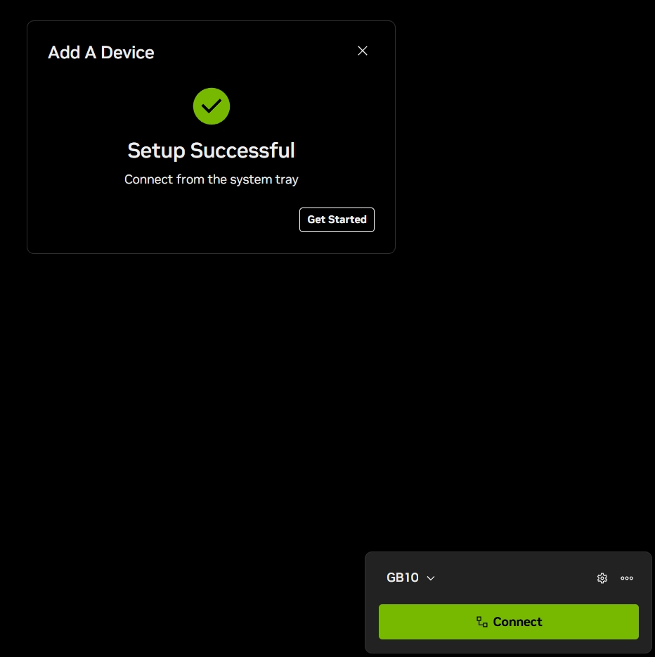
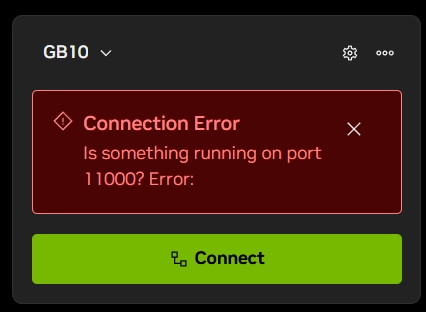
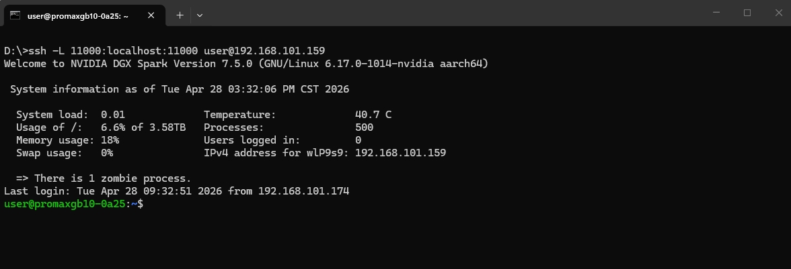
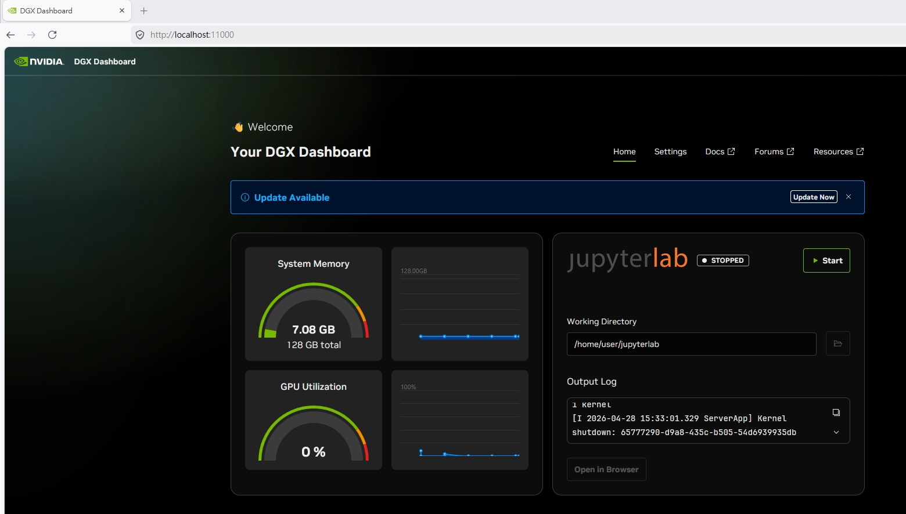
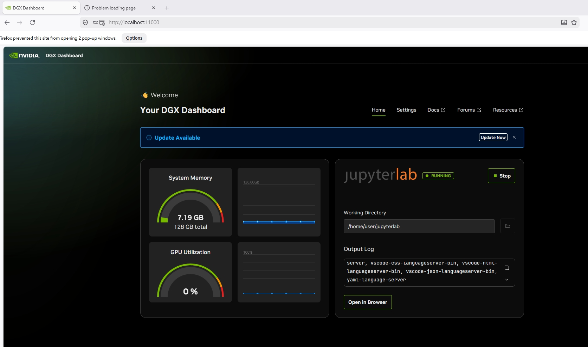
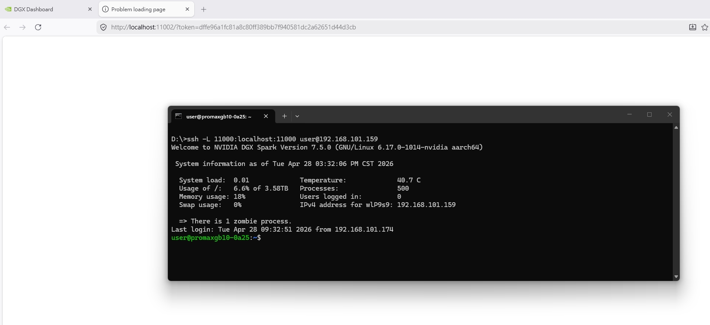
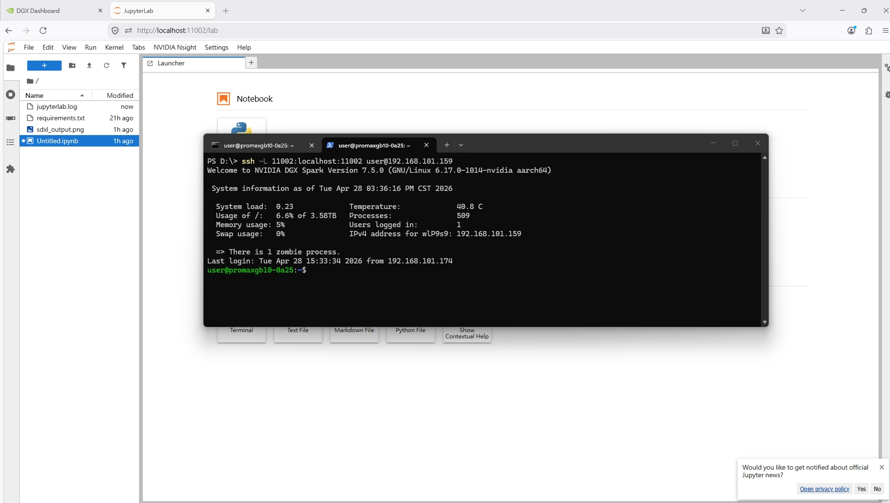
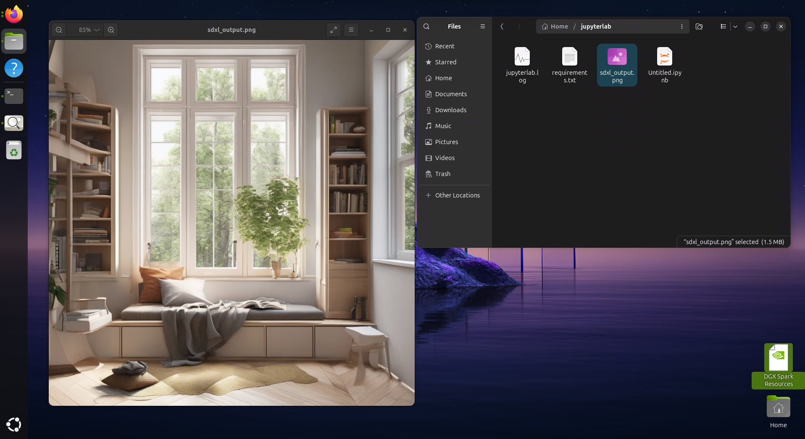

# DGX 控制面板存取指南
> 原文參考：https://build.nvidia.com/spark/dgx-dashboard/instructions
---


## 步驟 1：存取 DGX 控制面板

DGX 控制面板（Dashboard）提供三種連線方式，請依照您的環境選擇最適合的方式。

---

### 選項 A：桌面捷徑（本機直接操作）

> 適合：可直接操作 DGX Spark 實體設備的使用者（接螢幕鍵盤，或透過遠端桌面）

1. 登入 DGX Spark 裝置上的 **Ubuntu 桌面環境**
2. 點擊螢幕左下角，開啟 **Ubuntu 應用程式啟動器**
3. 在啟動器中找到並點擊 **DGX 控制面板** 捷徑
4. 控制面板將在預設瀏覽器中開啟，網址為：

```
http://localhost:11000
```

---

### 選項 B：NVIDIA Sync（推薦遠端存取方式）

> 適合：已在自己電腦上安裝 NVIDIA Sync 的使用者

1. 點擊系統托盤中的 **NVIDIA Sync 圖示**
2. 從裝置清單中選擇您的 **DGX Spark 設備**
3. 點擊「**連接（Connect）**」
4. 點擊「**DGX 控制面板**」啟動控制面板
5. 控制面板將透過自動 SSH 隧道，在預設瀏覽器中開啟，網址為：

```
http://localhost:11000
```

> 💡 尚未安裝 NVIDIA Sync？請至此下載：  
> https://build.nvidia.com/spark/connect-to-your-spark/sync

**啟動 NVIDIA Sync：**

<br>

**加入 GB10 的 IP 與帳號：**

<br>

**⚠️ 常見錯誤提示**  
啟動 NVIDIA Sync 時若出現錯誤，請先確認是否有重複執行的程序；若問題持續，請改用下方「選項 C」手動建立 SSH 隧道。

<br>

---

### 選項 C：手動建立 SSH 隧道

> 適合：未安裝 NVIDIA Sync，需要手動遠端連線的使用者

**背景說明：**  
SSH 隧道（Tunnel）的作用是將遠端設備的某個連接埠（Port）「對映」到你自己電腦的本機連接埠，讓你的瀏覽器可以像存取本機一樣存取遠端服務。

您需要為以下服務各開一條隧道：
- **DGX Dashboard**：使用連接埠 `11000`
- **JupyterLab**：每個使用者帳號有各自對應的連接埠號碼

**步驟：在本機開啟終端機（CMD / Terminal），輸入以下指令：**

```text
ssh -L 11000:localhost:11000 user@GB10-IP
```

> 請將 `user` 替換為您的帳號，`GB10-IP` 替換為設備的實際 IP 位址。

此指令會將 GB10 的 Port 11000 對映到你本機電腦的 Port 11000。

<br>

---

## 步驟 2：開啟 DGX Dashboard 並啟動 JupyterLab

連線成功後，在瀏覽器中開啟 `http://localhost:11000`，即可看到 **DGX Dashboard 主畫面**。

> 注意：網址列顯示的是本機 `localhost`，但實際上已透過 SSH 隧道連到 GB10。

接著點擊「**Start**」來啟動 JupyterLab：

<br>

啟動後，點擊「**Open in Browser**」：

<br>

---

## 步驟 3：JupyterLab 網頁空白？補開 Port 對映

**若開啟的網頁是空白頁**，原因是 JupyterLab 使用的 Port（例如 `11002`）尚未透過 SSH 對映到本機。

<br>

**解決方法：再開一個新的終端機視窗（CMD），執行以下指令補加對映：**

```text
ssh -L 11002:localhost:11002 user@GB10-IP
```

> 請依實際分配的 JupyterLab Port 號碼調整指令中的數字。

補加對映後，**重新整理網頁**，JupyterLab 工作區即會正常顯示：

<br>

---

## 步驟 4：在 JupyterLab 中建立 Python Notebook

在 JupyterLab 工作區中，點擊「**新增 Python Notebook**」：

<br>

---

## 步驟 5：測試 AI 工作負載（SDXL 圖像生成）

> 參考來源：https://build.nvidia.com/spark/dgx-dashboard/instructions（Step 4）

### 程式說明

此範例程式將執行以下操作：
1. 載入 **Stable Diffusion XL（SDXL）** 模型
2. 自動偵測並使用 **GPU（CUDA）** 或 CPU 執行
3. 根據文字提示（Prompt）生成一張 **1024×1024 高品質 AI 圖像**
4. 在 Notebook 中顯示圖片，並儲存為 `sdxl_output.png`

### 範例程式碼

將以下程式碼貼入 Notebook 的儲存格中：

```python
import warnings
warnings.filterwarnings('ignore', message='.*cuda capability.*')
import tqdm.auto
tqdm.auto.tqdm = tqdm.std.tqdm

from diffusers import DiffusionPipeline
import torch
from PIL import Image
from datetime import datetime
from IPython.display import display

# --- 模型設定 ---
MODEL_ID = "stabilityai/stable-diffusion-xl-base-1.0"
dtype = torch.float16 if torch.cuda.is_available() else torch.float32

pipe = DiffusionPipeline.from_pretrained(
    MODEL_ID,
    torch_dtype=dtype,
    variant="fp16" if dtype==torch.float16 else None,
)
pipe = pipe.to("cuda" if torch.cuda.is_available() else "cpu")

# --- 文字提示設定 ---
prompt = "一個舒適的現代閱讀角落，配有大窗戶，柔和的自然光，照片級真實感"
negative_prompt = "low quality, blurry, distorted, text, watermark"

# --- 生成參數設定 ---
height = 1024
width = 1024
steps = 30
guidance = 7.0

# --- 執行生成 ---
result = pipe(
    prompt=prompt,
    negative_prompt=negative_prompt,
    num_inference_steps=steps,
    guidance_scale=guidance,
    height=height,
    width=width,
)

# --- 顯示並儲存圖片 ---
image: Image.Image = result.images[0]
display(image)
image.save(f"sdxl_output.png")
print(f"Saved image as sdxl_output.png")
```

貼上 SDXL 範例後的畫面：

<br>

執行程式，開始生成圖片：

<br>

生成完成後，確認圖片儲存的目錄位置並開啟圖片：

<br>

---

## 後續步驟

完成 DGX Dashboard 設定後，您可以進一步：

- 為不同的 AI 專案建立額外的 JupyterLab 環境
- 使用 DGX Dashboard 管理系統維護與更新
