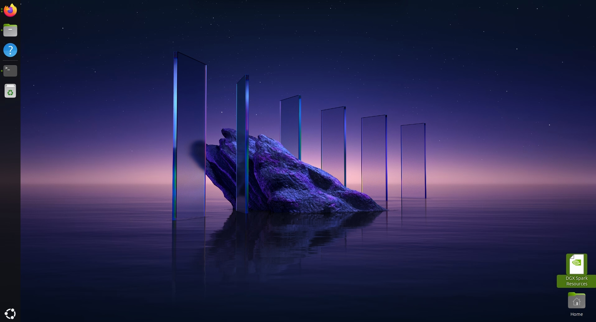
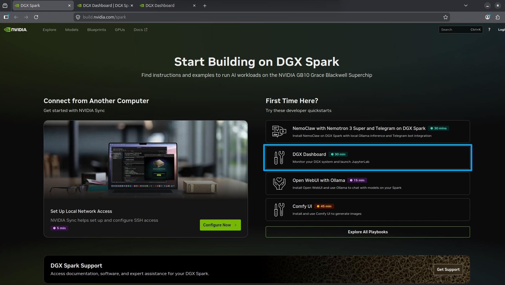
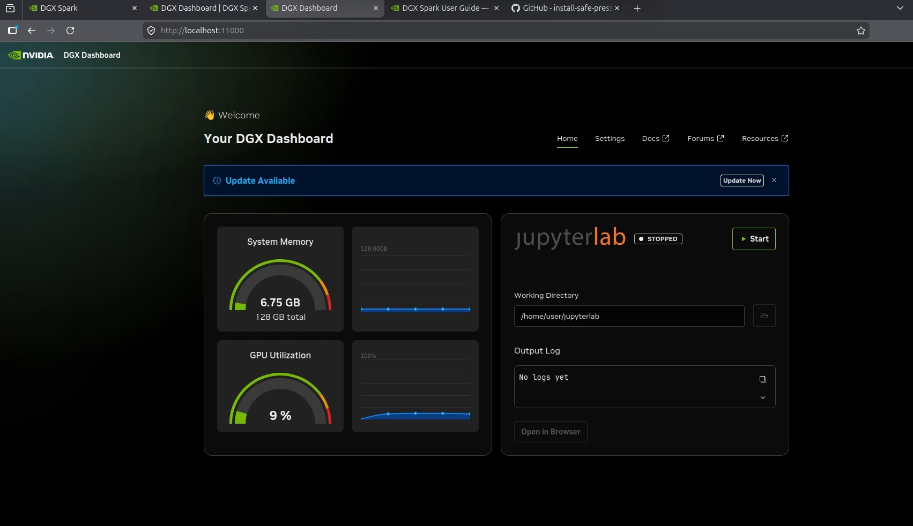
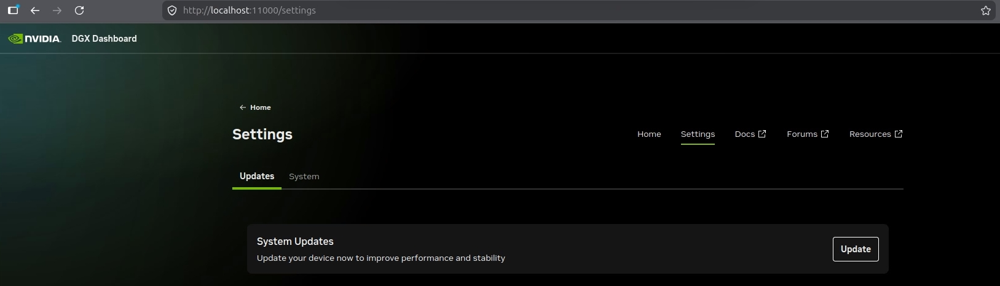
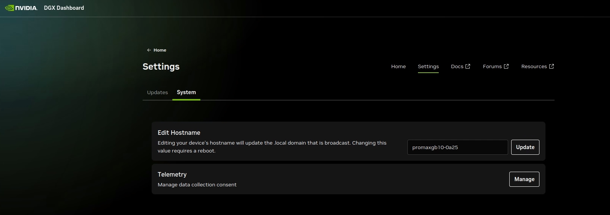
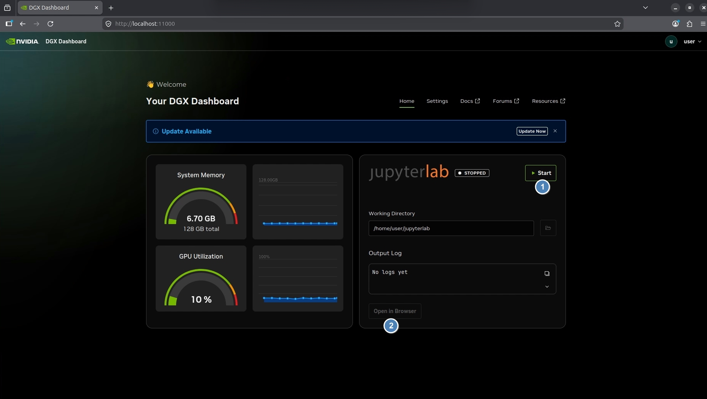
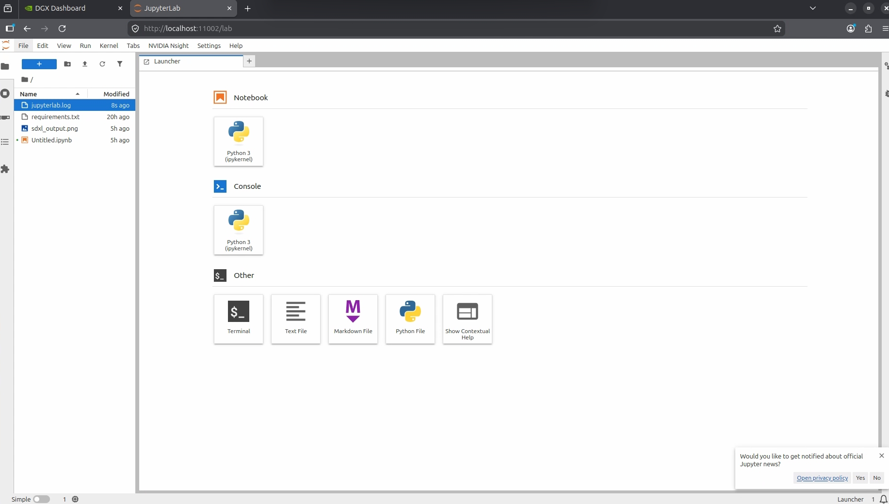
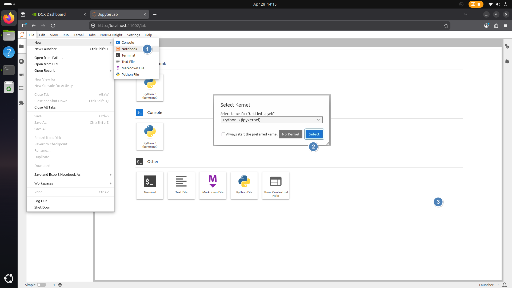
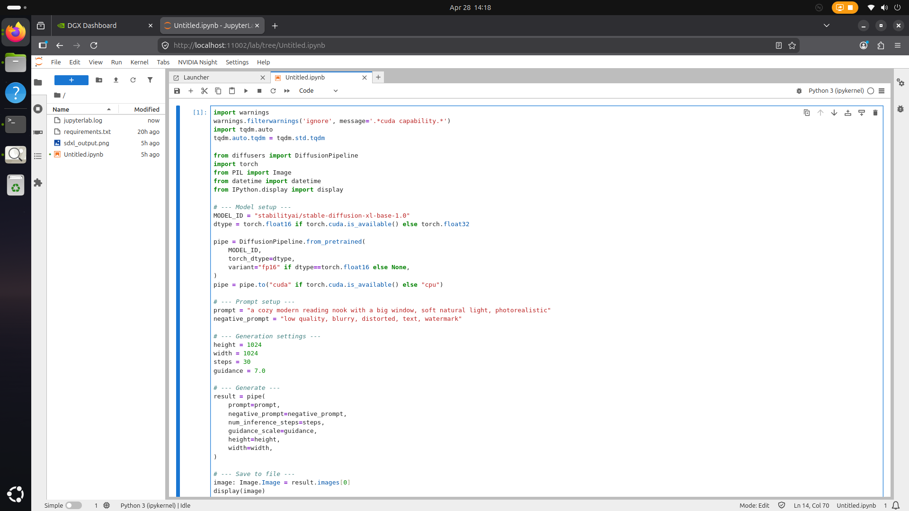
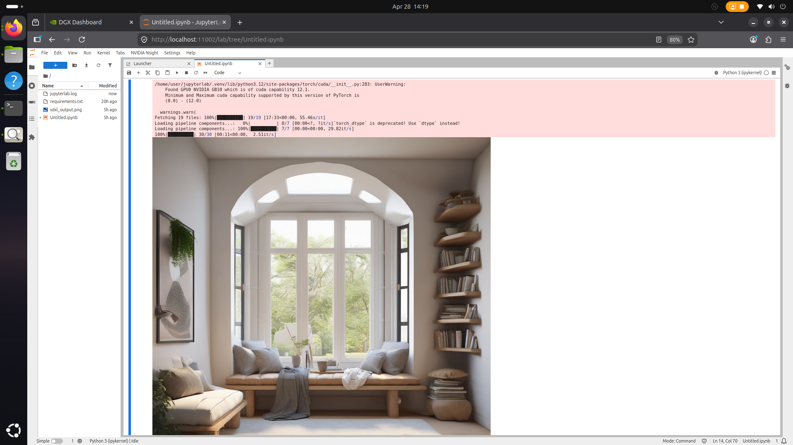

## DGX Dashboard Monitor your DGX system and launch JupyterLab 

1.DGX Dashboard Monitor: WEB式GPU與記憶體用量儀錶板 
2.啟用 JupyterLab 互動式開發環境（IDE）專為資料科學、AI 開發、Python 編程與研究工作設計.  

GB10系統桌面有一個捷徑-DGX Spark Resources,點擊之禝就是開啟網頁 https://build.nvidia.com/spark  
 
進入DGX Dashboard項目
 

1.DGX Dashboard Monitor: WEB式GPU與記憶體用量儀錶板的操作說明就是指引開啟本地11000 port在網頁顯示圖形化的儀錶板  
 
Settings提供系統更新update功能
 
如果要改系統名稱可在Settings > System Edit Hostname 
 

Docs是開啟DGX Spark使用手冊  https://docs.nvidia.com/dgx/dgx-spark/    
Forums是開啟Nvidia 開發者討論區  https://forums.developer.nvidia.com/c/accelerated-computing/dgx-spark-gb10/  
注意:這些操作都是開啟本機localhost資源,是從別台要開啟請參考DGX Dashboard-Instructions.md 文件說明 

2.啟用 JupyterLab 互動式開發環境在這個環境之中直接進行程式開發作業 
按JupyterLab Start啟動服務,第一次執行需要等待一些時間,完成時按下Open in Browser開啟新增 JupyterLab 的網頁

Launch JupyterLab instance  
 
進入JupyterLab作業區 
 
開一個新的python Notebook 
 

Test with sample AI workload , 貼上SDXL範例 prompt = "一個舒適的現代閱讀角落，配有大窗戶，柔和的自然光，照片級真實感"    
 
執行SDXL範例生成圖片 
 

Stable Diffusion XL（簡稱 SDXL）是由 Stability AI 推出的高階文字生成圖片（Text-to-Image）AI 模型
本地 AI 圖像工作站GB10 透過 SDXL 輸入文字 → 自動生成高品質圖像
常見用途

👍創作者：
插畫
封面設計
YouTube 縮圖
Logo 草圖

👍商業應用：
商品圖
廣告素材
行銷視覺

👍技術玩家：
本地 GPU 部署
AI 工作站
自架圖片生成平台

在執行的過程中可切換至DGX Dashboard觀察資源使用量
