## Dell Pro Max GB10 系統重灌初始化
警語:Dell Pro Max GB10 系統重灌初始資料會全部不見,如有重要資料請先進行備份
程序參考文件：<br>
系統重灌ISO檔案： <br>
https://www.dell.com/support/product-details/en-us/product/dell-pro-max-fcm1253-micro/drivers <br>
系統重灌原廠說明：<br>
https://www.dell.com/support/kbdoc/en-us/000382042/how-to-reinstall-the-nvidia-dgx-operating-system-on-dell-pro-max-with-grace-blackwell-systems <br>
系統更新原廠說明：<br>
https://www.dell.com/support/kbdoc/en-us/000379162/how-to-upgrade-the-bios-and-the-firmware-on-a-dell-pro-max-with-the-grace-blackwell-system <br>
Dell Pro Max with GB10 重灌步驟記錄
| 階段 | 主要內容 | 操作時間 |
|------|----------|----------|
| 0. 下載 Image | 下載9GB Image iso | （ 視網路速度 約 10 分鐘） |
| 1. 燒錄 Recovery Image | 使用 `dd` 將 DGX OS7 OTA3 復原映像檔寫入 USB，並執行 `sync` 確保資料確實寫入完成 | （約 10 分鐘） |
| 2. 使用USB開機 | 開機按F7 選擇USB開機Recovery Image 程序 | （約 30~ 分鐘） |
| 3. 初始GB10 | 使用機身旁的貼紙 WIFI熱點連接 初始設定 | （約 30~ 分鐘） |
| 4. 完成初始化，進入系統 | OOBE 更新流程跑完，機器正常進入桌面，確認可連外 | （約 5~ 分鐘） |
| 5. 更新系統 | 檢查與更新系統含fwupdmgr   | （約 5 分鐘） |

詳細步驟說明
0. 下載 Image 
到Dell 網站https://www.dell.com/support/product-details/en-us/product/dell-pro-max-fcm1253-micro/drivers <br>
下載 Recovery_Image.iso 檔名Dell_Pro_Max_with_GB10_FCM1253_WW_DGX_OS7_OTA3_Recovery_Image.iso <br>
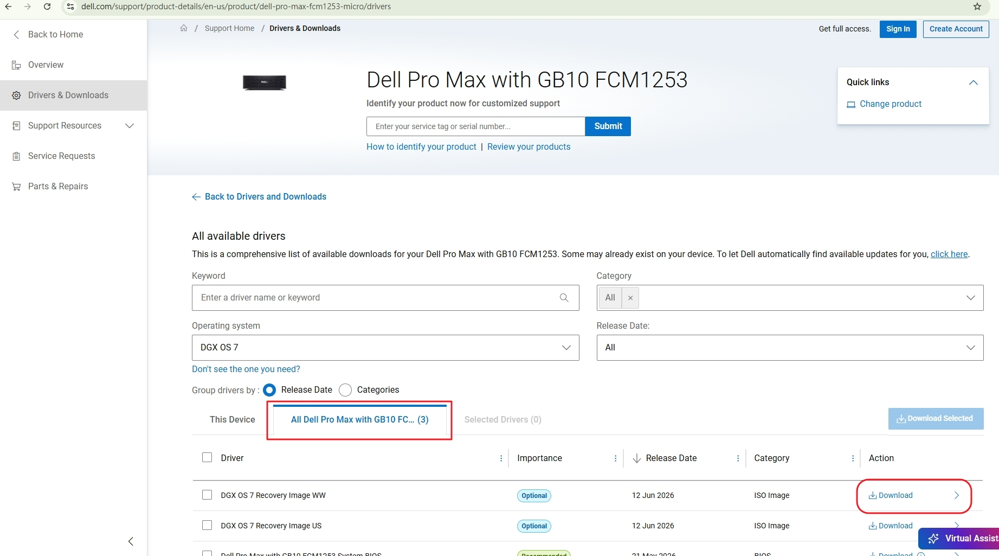  <br>
下載完成後查驗檔案完整性
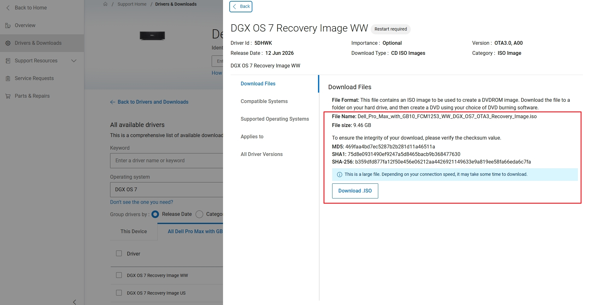
使用md5sum 檔案的checksum必需一致
```
md5sum Dell_Pro_Max_with_GB10_FCM1253_WW_DGX_OS7_OTA3_Recovery_Image.iso
```
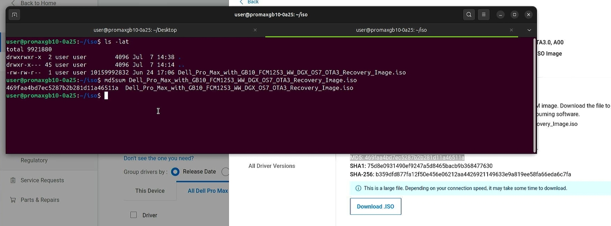

1. 燒錄 Recovery Image
GB10插上 USB 隨身碟,(要大於16G)
```
lsblk
```
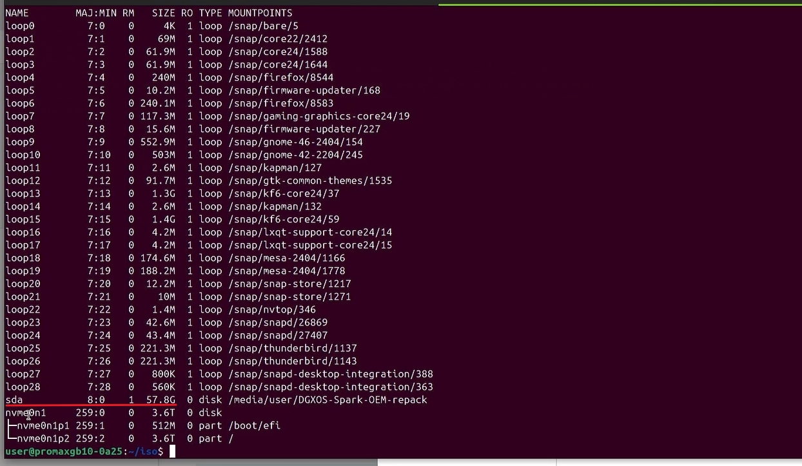
指令lsblk 確認USB的裝置代號顯示 為 /dev/sda

```
sudo dd if=Dell_Pro_Max_with_GB10_FCM1253_WW_DGX_OS7_OTA3_Recovery_Image.iso bs=2048 of=/dev/sda
```
使用 dd 指令將ISO寫入USB 隨身碟 
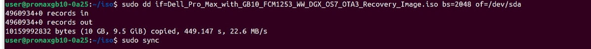

當寫入完成時再用 sync 指令確認寫入完成
```
sudo sync
```
#以上程序必需耐心等待 一定要確認執行完成且磁碟無寫入動作了
可同時開啟另一CLI 使用 iostat 進行磁碟動作觀察裝置 /dev/sda
```
iostat 1
```
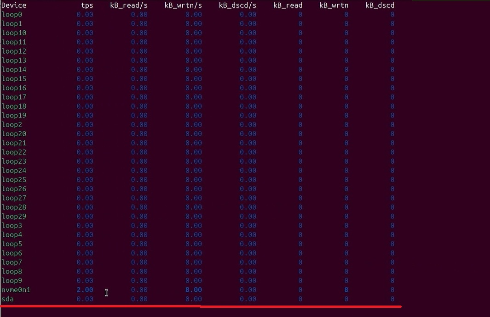


2. 先接上螢幕鍵盤,重啟GB10 REBOOT , 使用USB開機 | 開機按F7 選擇USB開機Recovery Image 程序
```
sudo reboot
```
重新開機在黑螢幕狀態時就要按下鍵盤上的 F7 按鍵 才會啟動開機選單
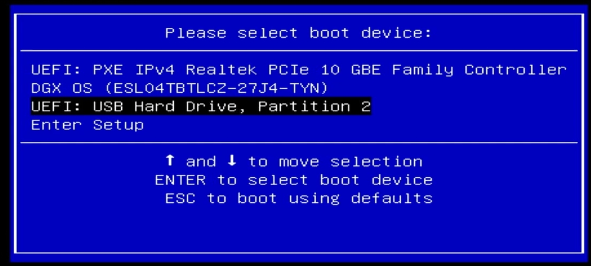
使用上下鍵移動到 UEFI： USB .......... 這個選單按下 Enter  之後不要再任何動作讓它自動跑下去
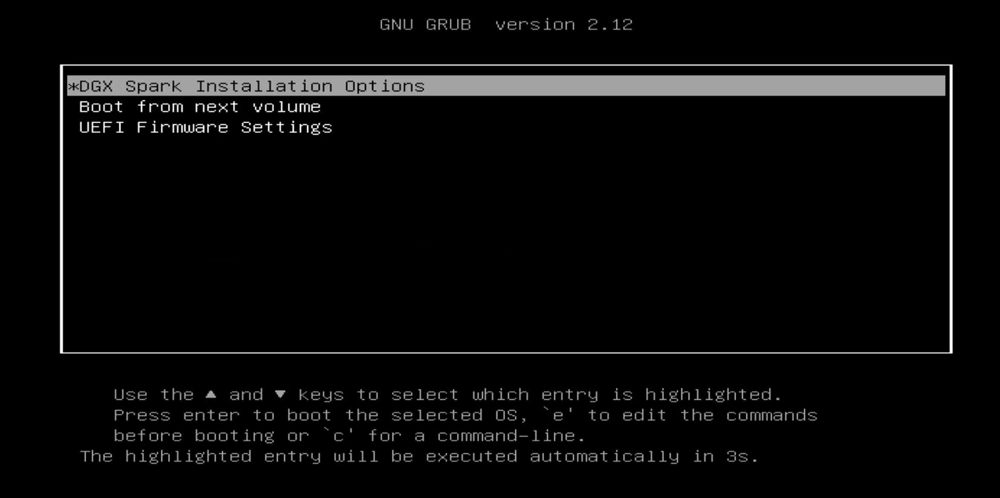
進行DGX Spark Installation Options 作業
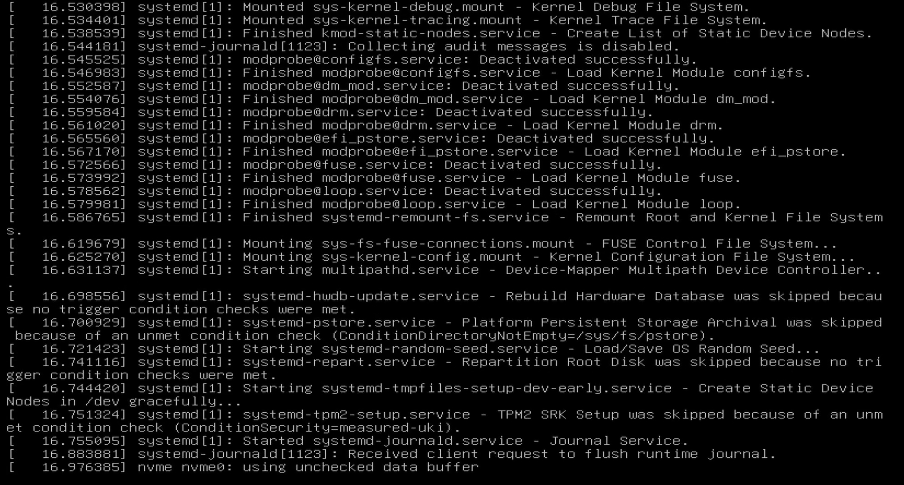
解析度比較低的字體畫面要跑一陣子大約20分鐘，過程會有重新開機

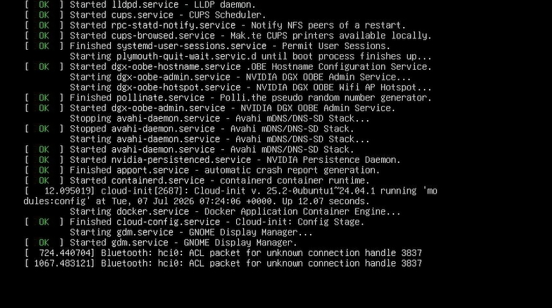
如果到這種畫面 , 表示已經進入系統 , 建議也接上網路線備
如果螢幕畫面沒有進入到初始GUI 改使用WIFI進行初始 

3. 初始GB10 | 使用機身旁的貼紙 WIFI熱點連接 初始設定
使用另一台設備連接GB10的初始WIFI ,使用機身旁的貼紙 WIFI熱點連接初始設定

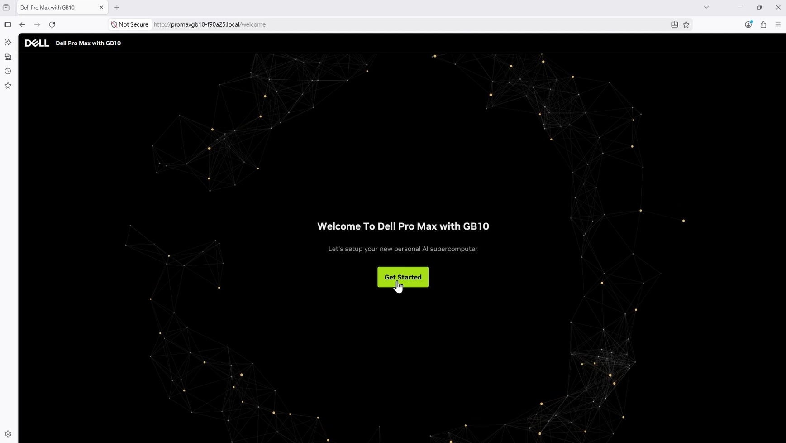

4. 完成初始化會重新開機，進入系統
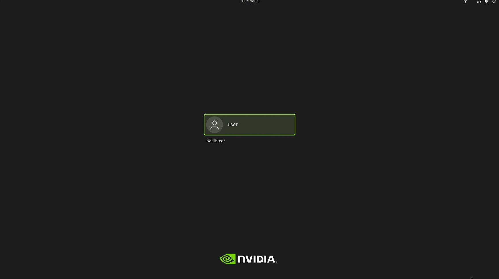
   
5. 更新系統
系統更新原廠說明：<br>
https://www.dell.com/support/kbdoc/en-us/000379162/how-to-upgrade-the-bios-and-the-firmware-on-a-dell-pro-max-with-the-grace-blackwell-system <br>
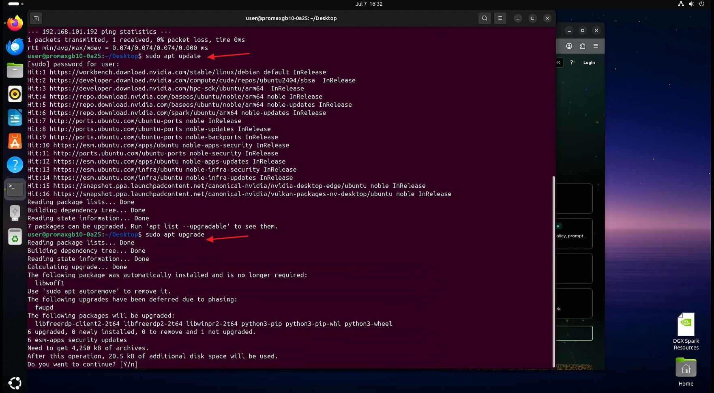
使用Linux系統下常見的更新動作
```
sudo update
```
```
sudo upgrade
```
進行 Firmware 更新
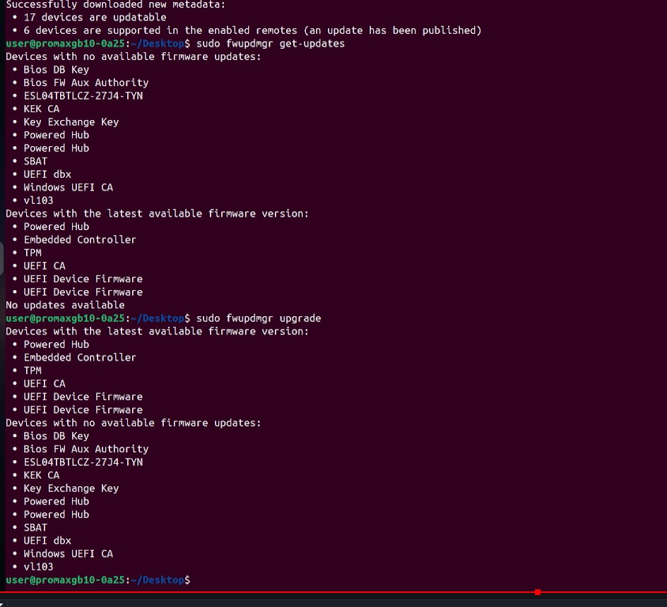
```
sudo fwupdmgr refresh
```
```
sudo fwupdmgr upgrade
```

如果過程中有下列圖示問題？ 如何解決？

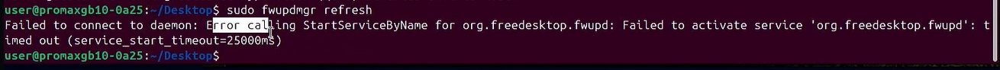

遇到 fwupd 版本不匹配問題  <br>
執行 sudo fwupdmgr refresh / upgrade 時出現錯誤：<br>
  Failed to connect to daemon: Error calling StartServiceByName for org.freedesktop.fwupd<br>
用 systemctl status fwupd.service 確認服務 failed (exit-code)<br>
用 sudo /usr/libexec/fwupd/fwupd --verbose 找出真正原因：<br>
  libfwupd version 1.9.34 does not match daemon 1.9.33<br>
用 dpkg -l | grep fwupd 確認版本不一致：<br>
fwupd：1.9.33<br>
libfwupd2：1.9.34<br>
修復版本不匹配<br>
用 apt-cache policy fwupd 發現 Ubuntu repo 裡已有新版 fwupd 2.0.20，但因 phased rollout（分階段推送，0%） 被暫時擋住<br>
手動指定版本強制安裝：<br>
  sudo apt install fwupd=2.0.20-1ubuntu2~24.04.1<br>
安裝過程自動將舊的 libfwupd2 換成新的 libfwupd3，順利升級完成<br>
驗證修復結果<br>

sudo fwupdmgr refresh 執行成功，無版本錯誤<br>
sudo fwupdmgr refresh --force 成功刷新韌體資料庫（LVFS metadata）<br>
sudo fwupdmgr get-updates 與 sudo fwupdmgr upgrade 確認：所有裝置韌體皆為最新版本，無需更新<br>

update 也可透過dgx-dashboard檢查
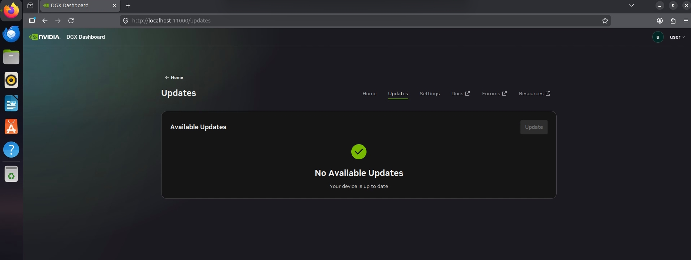 
這一版本的dgx-dashboard , update 是獨立選項 , 顯示系統無更新項目

