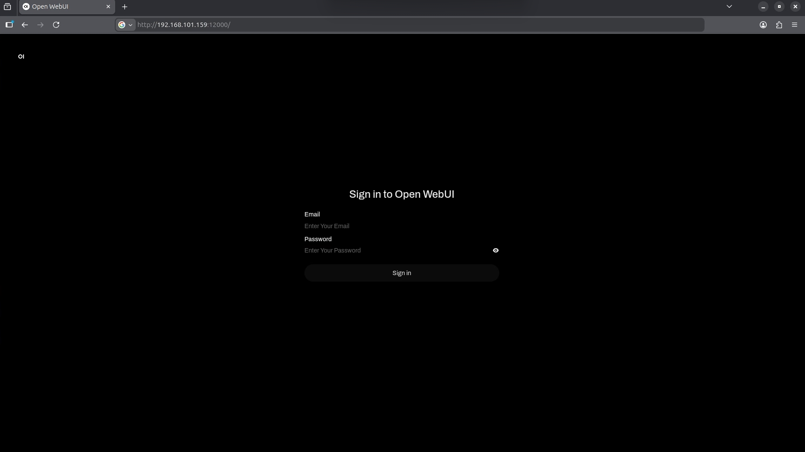
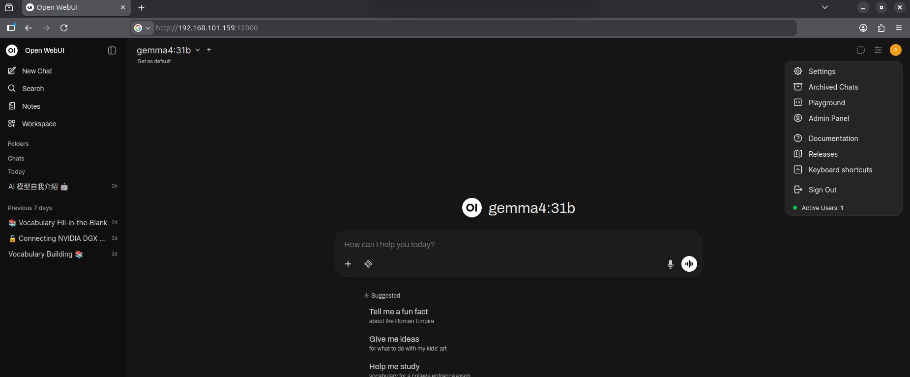
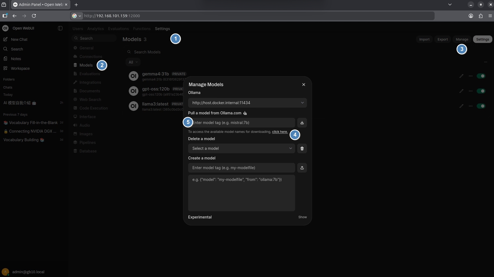
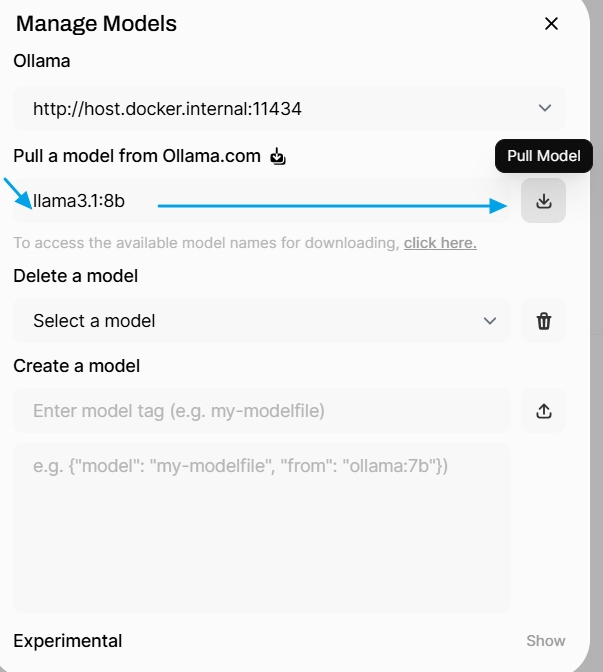
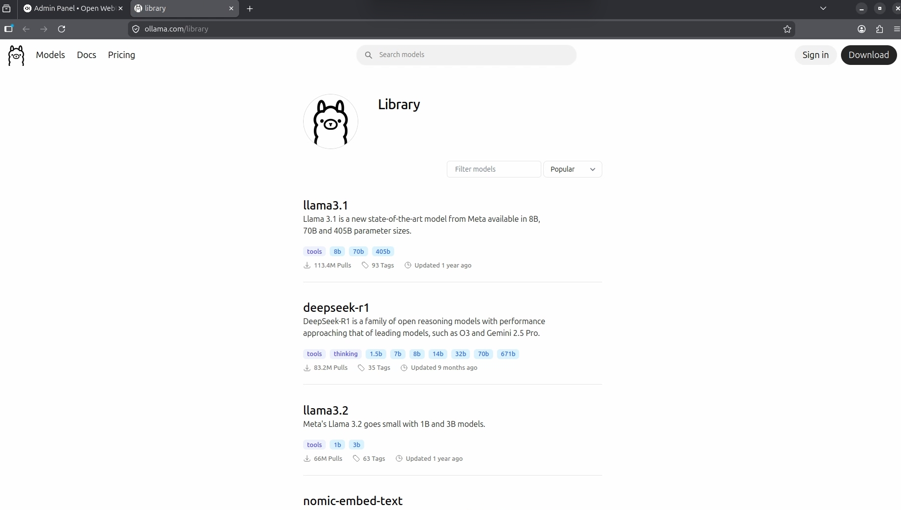
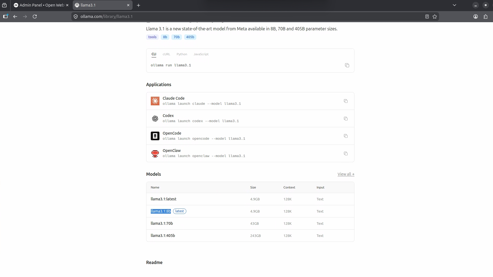
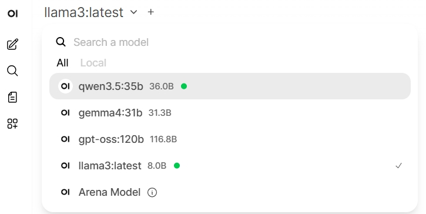

原文 https://build.nvidia.com/spark/open-webui/instructions <br>

Step 1: Configure Docker permissions (配置 Docker 權限)<br>
註解：此步驟是為了讓你不需要每次輸入 sudo 就能執行 Docker。透過將使用者加入 docker 群組，提升操作便利性。<br>

測試目前是否有權限存取 Docker 守護行程。 <br>
```text
docker ps
```
將當前使用者加入 Docker 群組,預設是沒有所以每次都要sudo所以要加下面這一行
```text
sudo usermod -aG docker $USER
```
立即套用群組變更，無需登出重新登入。
```text
newgrp docker
```

Step 2: Verify Docker setup and pull container (驗證設定並拉取映像檔)
註解：從 GitHub 伺服器下載整合了 Ollama 引擎的 Open WebUI 映像檔。這是「全功能版」，一個容器內就包含介面與模型執行環境。
```text
docker pull ghcr.io/open-webui/open-webui:ollama
```
Step 3: Start the Open WebUI container (啟動容器)


```text
docker run -d -p 8080:8080 --gpus=all \
  -v open-webui:/app/backend/data \
  -v open-webui-ollama:/root/.ollama \
  --name open-webui ghcr.io/open-webui/open-webui:ollama
```
參數註解：<br>
--gpus=all: 讓容器能使用顯示卡硬體加速，這對執行 AI 模型至關重要。<br>
-v: 建立「持久化儲存」，確保你下載的模型和對話紀錄不會在關閉容器後消失。<br>
-p 8080:8080: 開啟網頁連線門戶。<br>

如果是照上面這些指令,將啟動 Open WebUI 容器，並使其可透過瀏覽器 http://localhost:8080 開啟OpenWebUI網頁。<br>
(圖片範例是使用port 12000詳見使用docker-compose.yml佈建方式細節)<br>
<br>

Step 4: Create administrator account (建立管理員帳號)<br>
設定 Open WebUI 的初始管理員帳戶。點擊“開始使用”並填寫表單以存取主介面。<br>
註解：第一次進入網頁時需註冊。這是本地帳號，僅存存在你的電腦內，用於保護你的 Web 介面。<br>

Step 5: Download and configure a model (下載與配置模型)<br>
步驟:按右的圓圈 >選單 AdminPanel <br>
註解：在介面中輸入模型名稱，系統會自動從 Ollama 官方庫下載模型權重。<br>
步驟:按右的圓圈 >選單 AdminPanel 之後Settings >Models >右上方的Manage >Manage Models<br>
<br>
click here. 這是點擊開啟olloma網站的模型清單 https://ollama.com/library <br>

<br>
以llama3.1為例 8b模型 在標示5的這一欄位就是要輸入 llama3.1:8b <br>
<br>
https://ollama.com/library/llama3.1

<br>
<br>

在 llama3.1:8b 裡面的 8B，代表的是：
B = Billion（十億）
也就是模型大約有：
8 Billion Parameters（80億參數）
簡單理解：
參數（Parameters）可以想像成 AI 模型的大腦神經連結數量。
3B = 30億參數
7B / 8B = 70~80億參數
13B = 130億參數
70B = 700億參數
參數越大代表什麼？
優點：
理解能力更強
回答更準確
推理更好
長文處理能力提升
缺點：
吃更多 VRAM / RAM
回應速度較慢
硬體需求更高
<br>


原廠範例是用gpt-oss:20b容量大約14G下載需要一些時間等待
Click on "Select a model", type gpt-oss:20b, and click Pull from Ollama.com. Wait for the progress bar to finish.<br>

模型下載完成後左上清單模型名稱就會出現在其中<br>
<br>

Step 6: Test the model (測試模型)
註解：發送指令測試模型反應速度與正確性。若 GPU 設定正確，回覆速度會非常快。(如果選定的是比較大的模型一開始要等一下)

Enter: Write me a haiku about GPUs. in the chat area to verify the setup.


Step 7: Next steps (後續操作)
註解：說明如何更新軟體以及如何下載更多不同的模型（如 Llama 3 或 Mistral）。

Try downloading different models at https://ollama.com/library. To update the container:

Bash
docker pull ghcr.io/open-webui/open-webui:ollama
Step 8: Cleanup and rollback (清理與還原)
註解：如果你想完全移除所有內容（包含已下載的好幾 GB 模型文件），請執行這些指令。

警告：執行 volume rm 後，所有對話紀錄與模型都會被徹底刪除。

Stop and remove the Open WebUI container:

Bash
docker stop open-webui
docker rm open-webui
Remove the downloaded images and persistent data volumes:

Bash
docker rmi ghcr.io/open-webui/open-webui:ollama
docker volume rm open-webui open-webui-ollama


這種方式使用的是：All-in-One 容器
## 1. 第一種方式：All-in-One 容器
這使用的是 open-webui:ollama 這個特殊的映像檔，它將 Ollama (後端引擎) 和 Open WebUI (前端介面) 全部打包在同一個 Docker 容器裡。

架構：單一容器內執行兩個程序。

優點：

部署最簡單：一條指令就搞定所有組件。

通訊簡單：前後端在容器內部直接溝通，不需要處理複雜的網路配置。

缺點：

彈性低：你無法單獨升級 Ollama 版本或單獨升級 WebUI。

資源管理困難：如果 Ollama 當機或佔用過多資源，會直接影響到網頁介面的運作。

耦合度高：如果你想讓其他應用程式（例如另一個介面）連線到這個 Ollama，設定會比較麻煩。


## 2. 第二種方式：Docker Compose 分離部署
這使用的是標準的 微服務架構，將 Ollama 和 Open WebUI 分成兩個獨立的容器執行。
架構：兩個獨立容器，透過網路（及 host.docker.internal）通訊。

優點：
模組化：你可以隨時更換 ollama/ollama:latest 為特定版本，而不影響前端。
專業管理：透過 Docker Compose，你可以更細緻地設定 GPU 分配（deploy.resources 區塊）。
擴充性強：你的 Ollama 容器現在是一個獨立的「模型伺服器」，除了 Open WebUI，你也可以讓其他的工具同時連進來使用。
網路配置靈活：例如你將埠位改成了 12000:8080，避免了常見的 8080 埠位衝突。

缺點：
配置較複雜：需要撰寫 YAML 檔案，並正確設定環境變數（如 OLLAMA_BASE_URL）來讓兩者對接。<br>
請參考目錄下 1a-Open WebUI with Ollama-docker-compose.md 


## 總結建議
如果你只是想快速試玩，看看 AI 跑起來長什麼樣子，選第一種。但你早晚要面對事實寫docker compose yml .

如果你是想要在伺服器或工作站長期使用，且未來可能會嘗試不同的 AI 模型或介面，建議選 第二種 (Docker Compose)。這種方式更符合運維的最佳實踐，也更容易進行故障排除。
