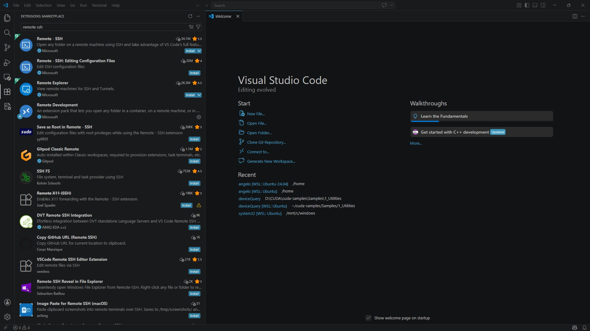
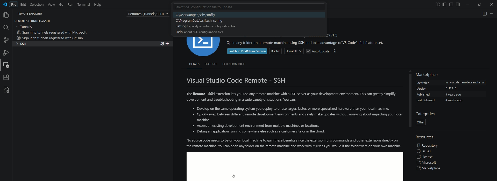
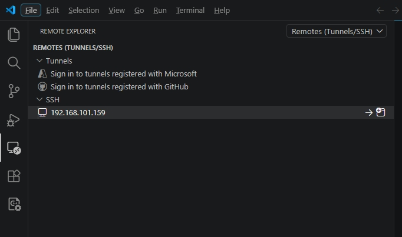
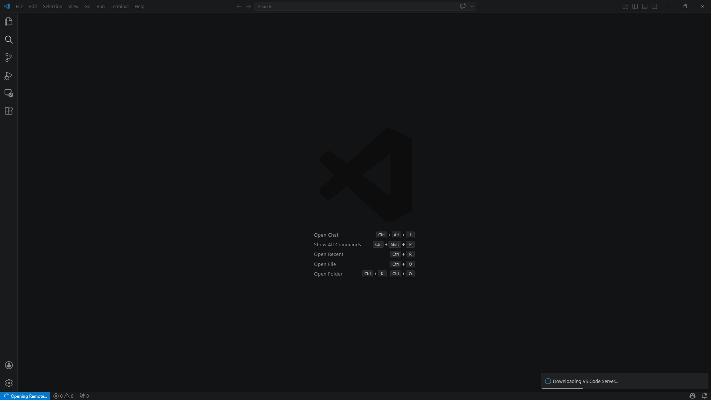
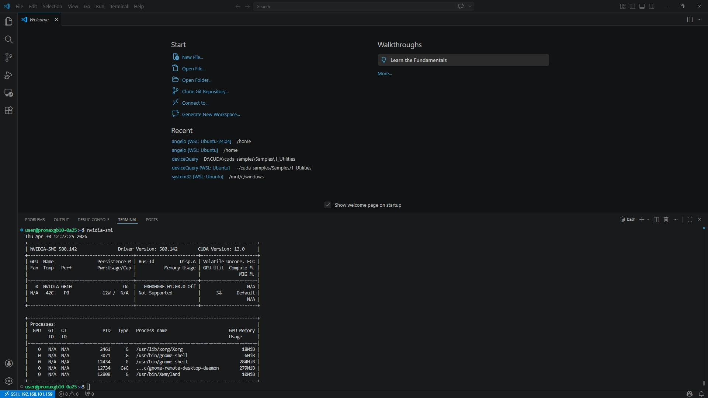
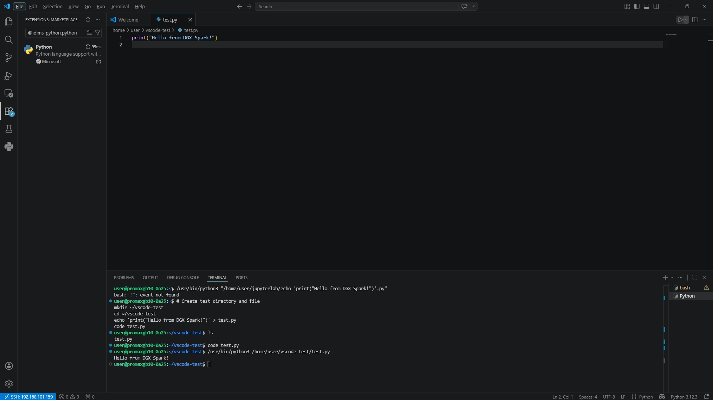

1b-VS Code	Install and use VS Code locally or remotely	本地 / 遠端開發環境
>原始內容 https://build.nvidia.com/spark/vscode
---
## 本章節內容與原始不同,主要著重於 Windows PC/NB VS Code 連線到 GB10 ; 
因為我習慣用我的Windows PC/NB 而且之前就有安裝 VS Code. 

VS Code 是什麼？VS Code（Visual Studio Code） 是一個由Microsoft 開發的免費程式碼編輯器。
你可以把它理解成：一個「專門寫程式用的超強記事本」
下載點 https://code.visualstudio.com/download 

Windows PC/NB VS Code安裝完成

---

## Windows VS Code 透過 Remote SSH 連接 GB10

### 前置準備

確認你知道 GB10 的：
- IP 位址（例如 `192.168.101.159`）
- 登入帳號與密碼

---

### Step 1：安裝 VS Code 擴充套件

在 VS Code 左側 Extensions（`Ctrl+Shift+X`）搜尋並安裝：

```
Remote - SSH
```
> 作者是 Microsoft，安裝後左側會出現一個電腦螢幕圖示。

<br>
---

### Step 2：新增 SSH 連線設定

1. 按 `Ctrl+Shift+P` 開啟命令列
2. 輸入並選擇：`Remote-SSH: Add New SSH Host`
3. 輸入連線指令：

```bash
ssh your-username@192.168.x.x
```

4. 選擇儲存到：`C:\Users\你的帳號\.ssh\config`

---

### Step 3：連線到 GB10
<br>

1. 按 `Ctrl+Shift+P` → 選 `Remote-SSH: Connect to Host`
2. 選擇剛才新增的 GB10 主機
3. 彈出視窗選擇平台：選 **Linux**
4. 輸入 GB10 的**登入密碼**
5. 連線成功後，VS Code 左下角會顯示：

```
SSH: 192.168.x.x
```

---

### Step 4：開啟 GB10 上的資料夾

1. 點左側 **Explorer**（`Ctrl+Shift+E`）
2. 點「**Open Folder**」
3. 選擇你想開啟的目錄（例如 `/home/your-username`）
4. 再次輸入密碼確認

---

### Step 5：安裝遠端 Python 環境套件

連線成功後，在 VS Code 的 Extensions 頁面，搜尋 `Python` 並點「**Install in SSH: GB10**」，這樣 VS Code 才能在遠端執行與偵錯 Python。
<br>
---

### Step 6：開啟終端機測試

按 `` Ctrl+` `` 開啟終端機，這個終端機是**直接跑在 GB10 上的**，試輸入：

```bash
nvidia-smi
```

看到 GPU 資訊就代表完全連線成功 ✅
<br>
---

# Create test directory and file
參照原廠範例 Step 6 Validate setup and test functionality,寫一段簡單的python並執行,在下方的終端機貼上 , 在右上的 Run Python File 點擊執行（長的像三角形▶️那個）
```text
mkdir ~/vscode-test
cd ~/vscode-test
echo 'print("Hello from DGX Spark!")' > test.py
code test.py
```

<br>


### 💡 小提示

| 情境 | 做法 |
|------|------|
| 每次連線都要打密碼很煩 | 之後可以設定 SSH 金鑰，一次搞定免密碼 |
| 想跑 Jupyter Notebook | VS Code 內建支援 `.ipynb`，直接在遠端開啟即可 |
| 想用 GPU 跑程式 | 選好 Python Interpreter 後直接 `Run`，會自動使用 GB10 的 GPU |
