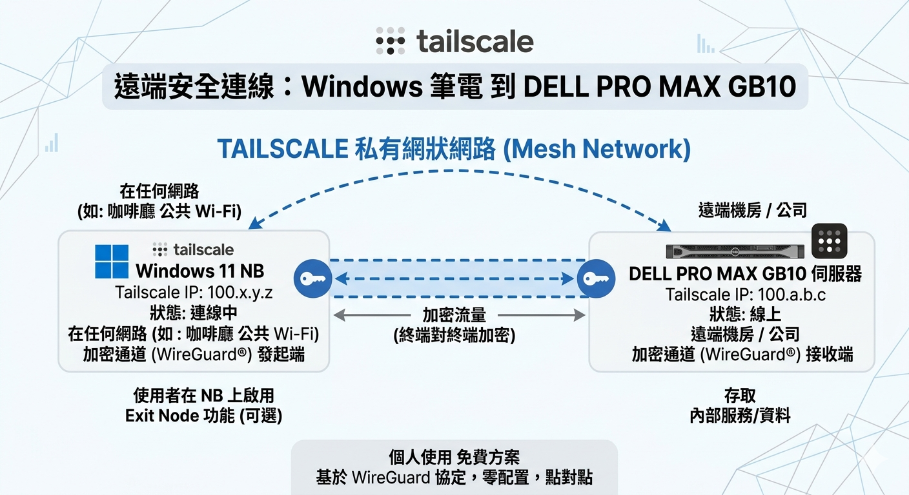

# 1c｜透過 Tailscale 從外部連線到 GB10

> 原始參考：https://build.nvidia.com/spark/tailscale

---

## 什麼是 Tailscale？

**Tailscale** 是一款基於 **WireGuard®** 協議的現代化 VPN 服務，核心目標是「**讓聯網變得簡單且安全**」。

你可以把它理解成：不管你人在哪裡（家裡、咖啡廳、公司），只要雙方設備都安裝了 Tailscale 並登入同一個帳號，這些裝置就會自動連在一起，就像插在同一個 Wi-Fi 路由器下一樣。

---

## Tailscale 的核心功能

### 1. 零配置虛擬內網（Mesh VPN）

這是 Tailscale 最核心的功能。

只要在任何裝置（電腦、手機、NAS、伺服器）上安裝並登入同一個 Tailscale 帳號，每台裝置就會獲得一個**固定的內部 IP（Tailscale IP）**，讓裝置之間可以直接互連。

**兩大關鍵優勢：**

- **突破 NAT 與防火牆：** 即使裝置在不同路由器後方，或位於公司、咖啡廳的防火牆內，通常**不需要設定 Port Forwarding** 就能直接連通。
- **全網狀（Mesh）連接：** 裝置之間是**直接點對點傳輸**，流量不經過中央伺服器，延遲更低、速度更快。

---

### 2. Taildrop（跨平台檔案傳輸）

類似 Apple 的 AirDrop，但**不受限於同一個區域網路**。

只要裝置都安裝了 Tailscale 並登入，就可以在 **Android、iOS、Windows、Linux、macOS** 之間互相傳送圖片或檔案，不論人在哪裡。

---

## 為什麼選擇 Tailscale？

> 如果你需要：
> - 從外部遠端連回 GB10 進行開發
> - 在公司或咖啡廳連回家裡的設備
> - 一個設定門檻極低、穩定可靠的跨裝置連網方案
>
> Tailscale 目前是公認**門檻最低且最穩定**的選擇之一。

 

---

## 本章節目標

完成本章節的操作後，你將能夠透過 Tailscale **從外部網路連線到 GB10**，不論人在哪裡都能遠端存取你的設備。
