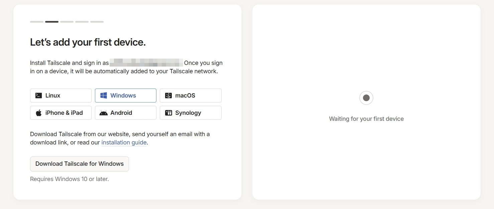
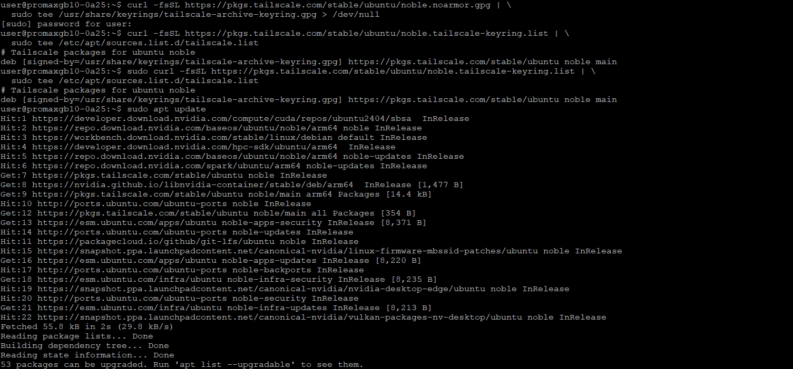
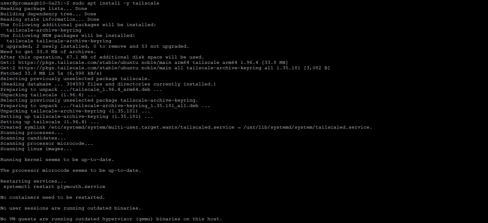
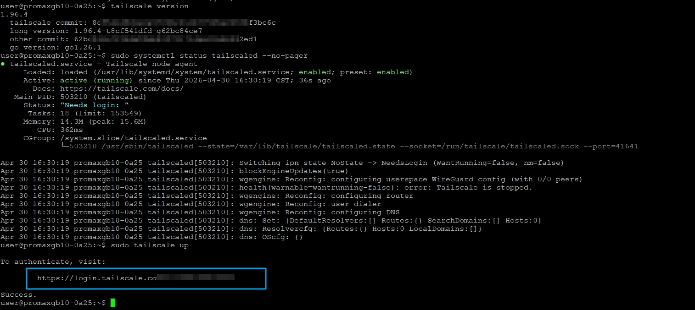
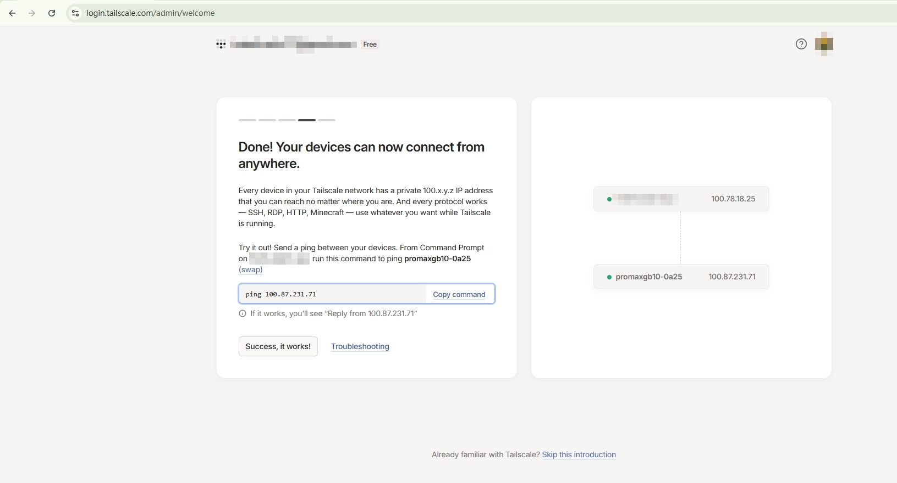
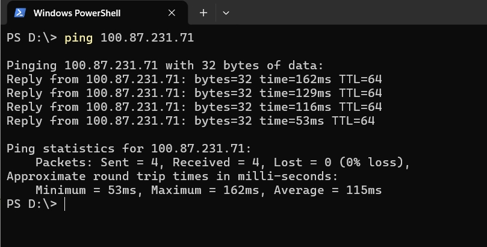
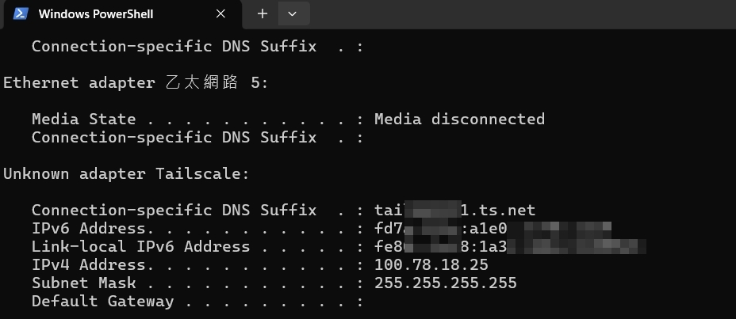

# 佈建你的 Tailscale 虛擬網路

> 原始說明：https://build.nvidia.com/spark/tailscale/instructions

---

## 整體流程概覽

| 步驟 | 說明 | 執行位置 |
|------|------|----------|
| 1 | 註冊 Tailscale 帳號 | 瀏覽器 |
| 2 | 在 Windows PC／NB 安裝 Tailscale | Windows |
| 3～7 | 在 GB10 安裝並啟動 Tailscale | GB10 終端機 |

---

## 1. 註冊 Tailscale 帳號

前往 https://tailscale.com   網站點擊右上角「**Get Started - it's free**」註冊免費帳號。

<br>

---

## 2. 在 Windows PC／NB 安裝 Tailscale

下載對應你作業系統的安裝檔並執行安裝：**Download Tailscale for Windows**

<br>

---

## 3. 在 GB10 上安裝 Tailscale

以下步驟 3～7 均在 **GB10 的終端機**上執行。

---

### Step 3-1：驗證系統需求

先確認 GB10 的 Ubuntu 版本符合需求，並確保網路與 sudo 權限正常。

**檢查 Ubuntu 版本（需為 20.04 或更新）：**

```bash
lsb_release -a
```

**測試網路連線：**

```bash
ping -c 3 google.com
```

**確認 sudo 權限：**

```bash
sudo whoami
```

> 三個指令都正常回應即可繼續。

---

### Step 3-2：確認 SSH 伺服器正在執行

Tailscale 負責提供網路連線，但遠端存取 GB10 仍需透過 SSH。先確認 SSH 服務是否運作：

```bash
systemctl status ssh --no-pager
```

> 💡 如果你是照本教學章節順序操作，SSH 應該早已安裝完成，這步驟通常可以直接略過。

**若 SSH 未安裝或未啟動，執行以下指令：**

```bash
sudo apt update
sudo apt install -y openssh-server
sudo systemctl enable ssh --now --no-pager
systemctl status ssh --no-pager
```

---

### Step 3-3：安裝 Tailscale

依序執行以下指令，將 Tailscale 官方軟體庫加入系統並完成安裝：

**更新套件清單：**

```bash
sudo apt update
```

**安裝必要工具：**

```bash
sudo apt install -y curl gnupg
```

**加入 Tailscale 簽署金鑰：**

```bash
curl -fsSL https://pkgs.tailscale.com/stable/ubuntu/noble.noarmor.gpg | \
  sudo tee /usr/share/keyrings/tailscale-archive-keyring.gpg > /dev/null
```

**加入 Tailscale 軟體庫：**

```bash
curl -fsSL https://pkgs.tailscale.com/stable/ubuntu/noble.tailscale-keyring.list | \
  sudo tee /etc/apt/sources.list.d/tailscale.list
```

**更新套件清單（含新加入的軟體庫）：**

```bash
sudo apt update
```

**安裝 Tailscale：**

```bash
sudo apt install -y tailscale
```

---

### Step 3-4：驗證安裝是否成功

<br>

<br>

**確認 Tailscale 版本：**

```bash
tailscale version
```

**確認 Tailscale 服務狀態：**

```bash
sudo systemctl status tailscaled --no-pager
```

> 看到版本號與服務狀態為 `active (running)` 即代表安裝成功 ✅

---

### Step 3-5：將 GB10 連接到你的 Tailscale 網路

執行以下指令啟動 Tailscale 並開始身份驗證：

```bash
sudo tailscale up
```

<br>


> 指令執行後會產生一段 **認證 URL**，將這段網址複製並貼到瀏覽器中開啟，完成 Tailscale 帳號綁定。

<br>
會看到已經註冊的兩台裝置已經建之連線(互通)

---

## 4. 驗證兩端裝置是否互連

完成認證後，你的 Windows PC 和 GB10 應該都會出現在同一個 Tailscale 網路中。

使用 `ping` 測試兩端是否能互相連通：

<br>

**在 Windows CMD 查詢本機的 Tailscale IP：**

```bash
ipconfig
```

<br>

**在 GB10 查詢 Tailscale IP：**

```bash
ip a
```

> 兩台裝置各自會有一個 Tailscale 分配的 IP 位址（通常為 `100.x.x.x`），看到這兩個對映 IP 即代表虛擬網路建立成功 ✅

---

## 5. 開始使用

設定完成後，你可以透過 Tailscale 分配給 GB10 的 IP，從任何地方以下列方式連線：

| 連線方式 | 說明 |
|----------|------|
| **SSH** | 遠端終端機存取，指令開發 |
| **RDP** | 遠端桌面，圖形介面操作 |
| **HTTP** | 存取 GB10 上的網頁服務（如 JupyterLab） |

---

## 6. 進階管理

更多裝置管理、權限設定、連線紀錄等功能，請前往 Tailscale 管理後台：

```
https://login.tailscale.com/admin/machines
```
