# 安裝並使用 ComfyUI 產生圖像

---

## 整體安裝流程概覽

| 步驟 | 說明 |
|------|------|
| Step 1 | 驗證系統先決條件 |
| Step 2 | 建立 Python 虛擬環境 |
| Step 3 | 安裝支援 CUDA 的 PyTorch |
| Step 4 | 下載 ComfyUI 原始碼 |
| Step 5 | 安裝 ComfyUI 相依套件 |
| Step 6 | 下載 Stable Diffusion 模型 |
| Step 7 | 啟動 ComfyUI 伺服器 |
| Step 8 | 驗證安裝是否成功 |

---

## Step 1：驗證系統先決條件

安裝前，先確認 GB10 上所有必要工具都已就緒：

```bash
python3 --version
pip3 --version
nvcc --version
nvidia-smi
```
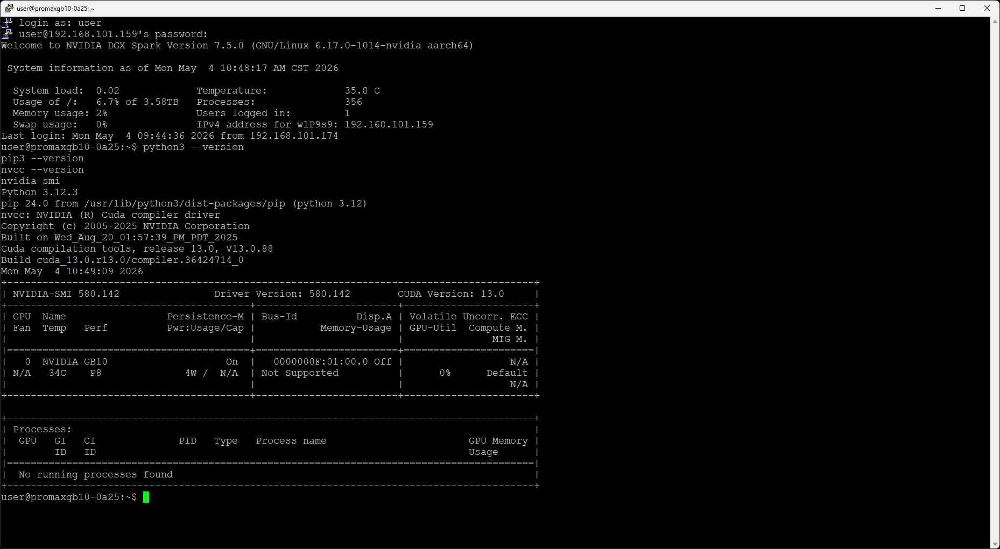<br>

**預期結果：**
- `python3` 顯示 3.8 以上版本
- `pip3` 正常回應版本號
- `nvcc` 顯示 CUDA 工具包版本
- `nvidia-smi` 顯示 GPU 偵測資訊

---


## Step 2：建立 Python 虛擬環境

> **為什麼需要虛擬環境？**  
> 虛擬環境是一個獨立的 Python 空間，讓 ComfyUI 的套件與系統原有套件完全隔離，避免版本衝突。

**建立並啟動虛擬環境：**

```bash
python3 -m venv comfyui-env
source comfyui-env/bin/activate
```

**確認啟動成功：**  
命令提示字元的開頭應會出現 `(comfyui-env)`，例如：

```
(comfyui-env) user@GB10:~$
```

看到這個前綴就代表虛擬環境已正確啟動 ✅

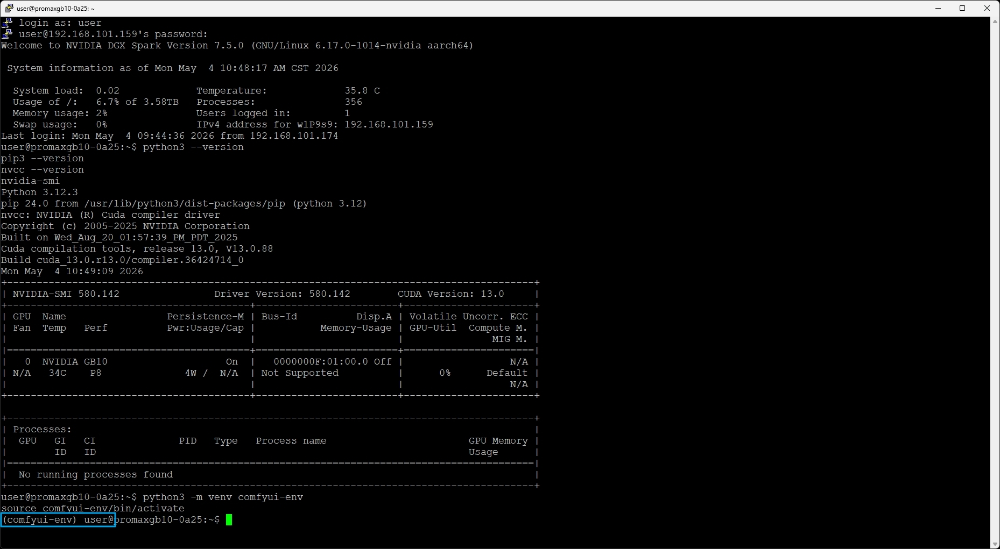<br>
---

## Step 3：安裝支援 CUDA 的 PyTorch

安裝與 Blackwell 架構 GPU 相容的 PyTorch（支援 CUDA 13.0）：

```bash
pip3 install torch torchvision --index-url https://download.pytorch.org/whl/cu130
```

> 此版本專為 GB10 的 Blackwell 架構 GPU 與 CUDA 13.0 設計，請勿替換為其他版本。

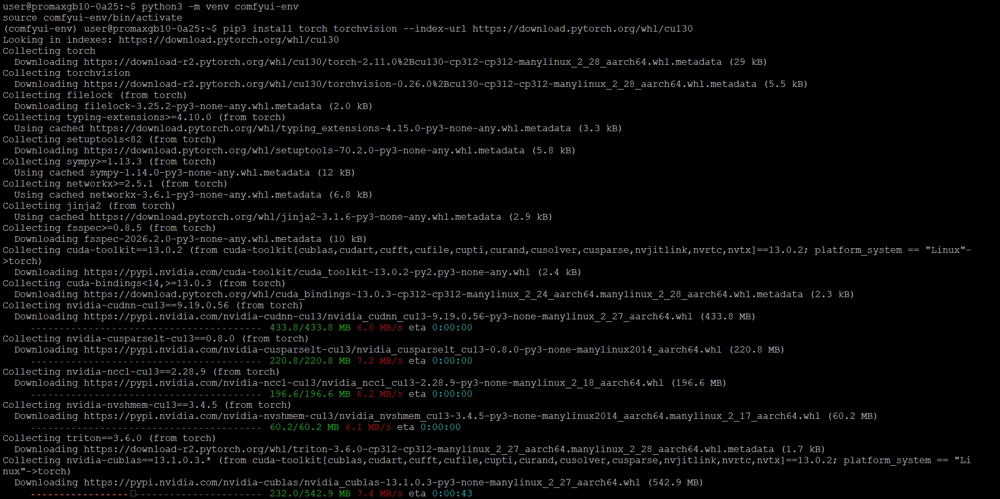<br>
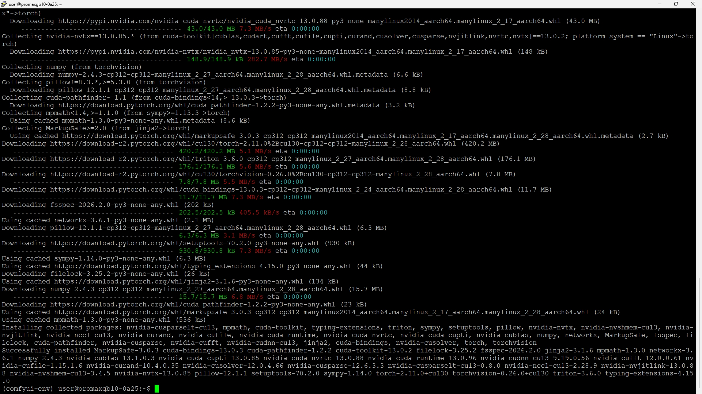<br>
---

## Step 4：下載 ComfyUI 原始碼

從官方 GitHub 下載 ComfyUI：

```bash
git clone https://github.com/comfyanonymous/ComfyUI.git
cd ComfyUI/
```

> 執行完成後，你的工作目錄會切換到 `ComfyUI/` 資料夾內，後續步驟都在此目錄中執行。

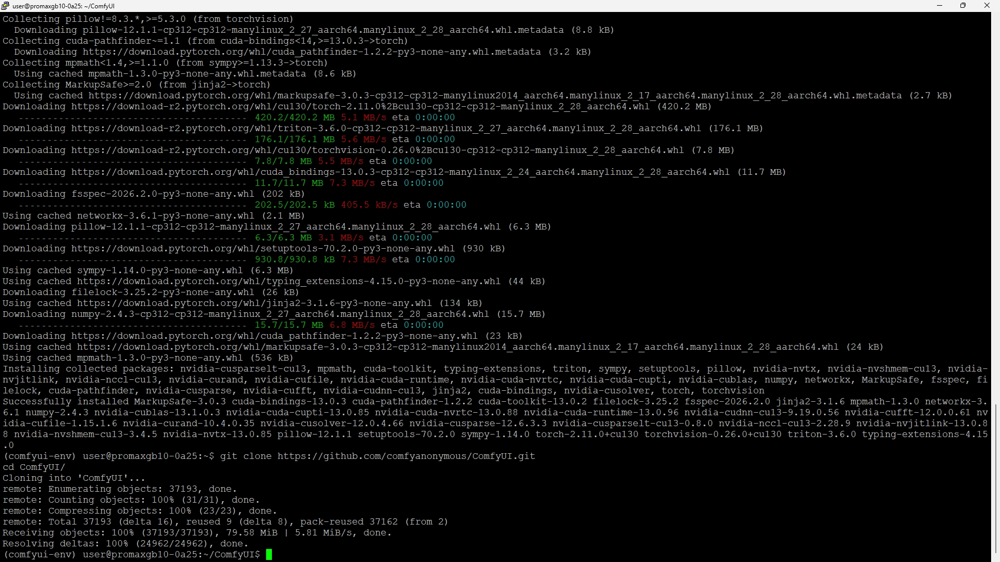<br>
---

## Step 5：安裝 ComfyUI 相依套件

安裝 ComfyUI 運作所需的所有 Python 套件：

```bash
pip install -r requirements.txt
```

> 這會自動安裝所有必要元件，包含網頁介面元件與模型處理函式庫，視網路速度需要幾分鐘。

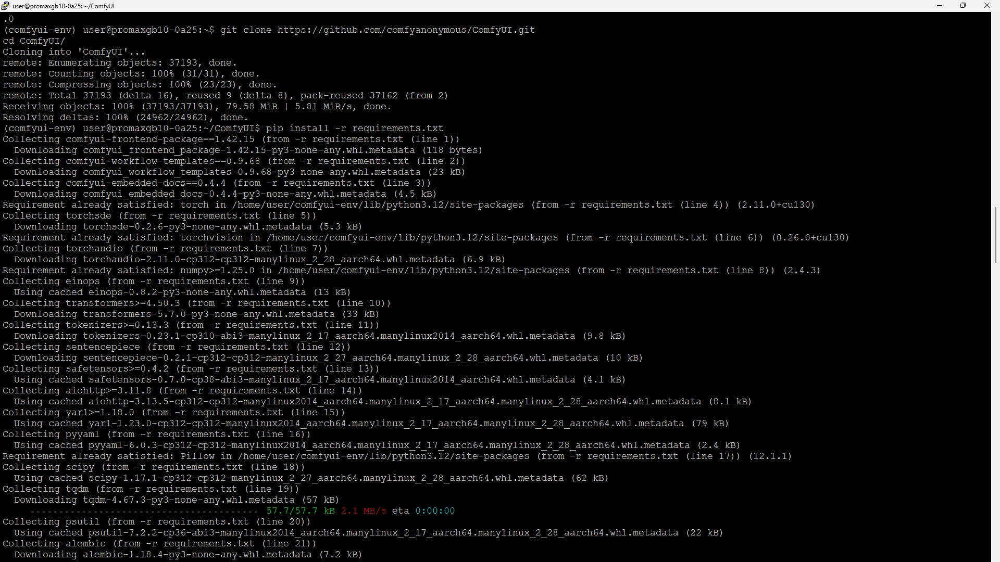<br>
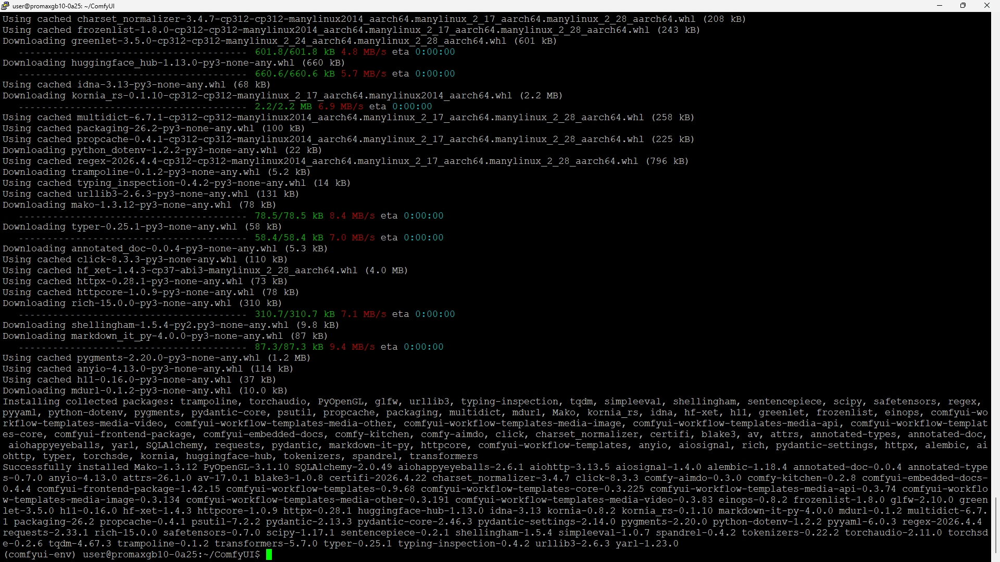<br>
---

## Step 6：下載 Stable Diffusion 模型

切換到模型目錄並下載 Stable Diffusion 1.5 模型：

```bash
cd models/checkpoints/
wget https://huggingface.co/Comfy-Org/stable-diffusion-v1-5-archive/resolve/main/v1-5-pruned-emaonly-fp16.safetensors
cd ../../
```

> 📦 檔案大小約 **2GB**，下載時間視網路速度而定，請耐心等待。  
> 下載完成後，`cd ../../` 會將目錄切回 `ComfyUI/` 根目錄。

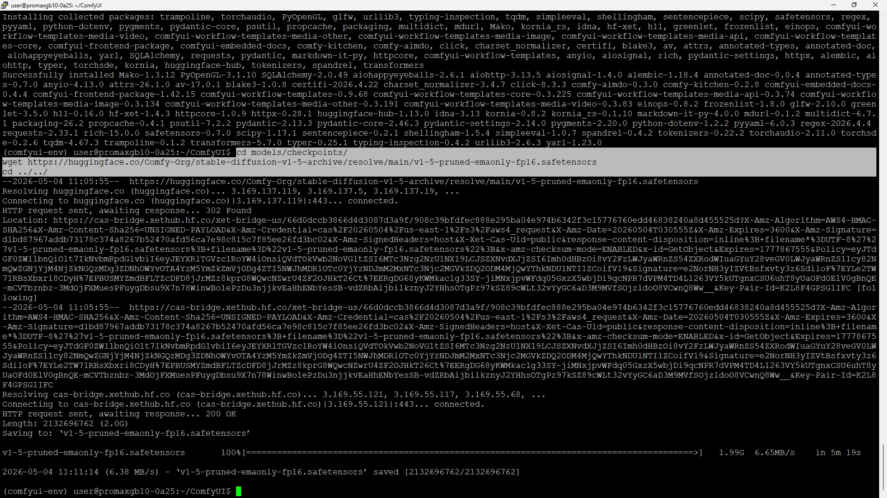<br>
---

## Step 7：啟動 ComfyUI 伺服器

啟動 ComfyUI 網頁伺服器，並允許從其他裝置連線：

```bash
python main.py --listen 0.0.0.0
```
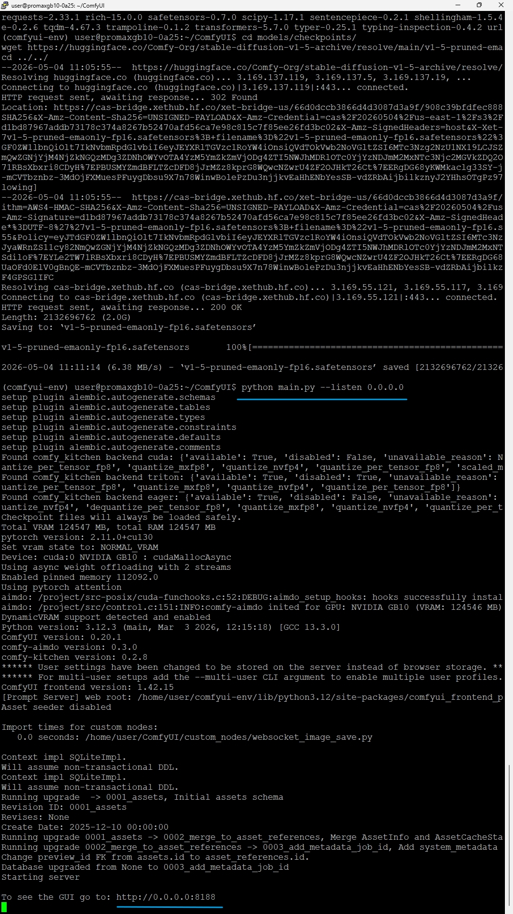<br>

> `--listen 0.0.0.0` 表示伺服器會監聽所有網路介面，讓你能從 Windows PC 的瀏覽器連入。  
> 伺服器預設使用 **Port 8188**。

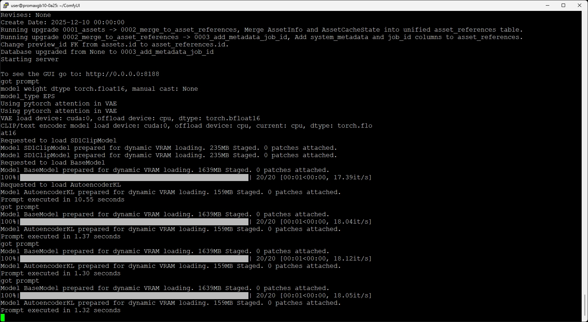<br>

---

## Step 8：驗證安裝是否成功

**方法一：用指令測試伺服器是否正在執行（在另一個終端機視窗執行）：**

```bash
curl -I http://localhost:8188
```

預期回應應包含 `HTTP/1.1 200 OK`，代表伺服器正常運作 ✅

**方法二：直接用瀏覽器開啟：**

在你的 Windows PC 瀏覽器輸入：

```
http://<GB_IP>:8188
```

> 將 `<GB10_IP>` 替換為 GB10 的實際 IP 位址（例如 `192.168.101.159`）。  
> 若使用 Tailscale，則替換為 Tailscale 分配的 IP。
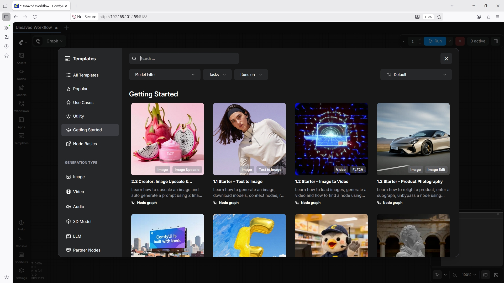<br>

---

Comfy UI程式中斷與離開: ssh cli 文字界面Ctrl+c 中斷離開 WEB 8188 就會失效

## Step 9（選用）：清理與還原

> **⚠️ 警告：** 執行以下指令將刪除所有已安裝的套件與已下載的模型，且無法還原。

**完整移除 ComfyUI：刪除虛擬環境。 **

```bash
deactivate
rm -rf comfyui-env/
rm -rf ComfyUI/
```


---

## Step 10（選用）：產生你的第一張圖片

安裝完成後，試著用預設工作流程生成第一張圖像：

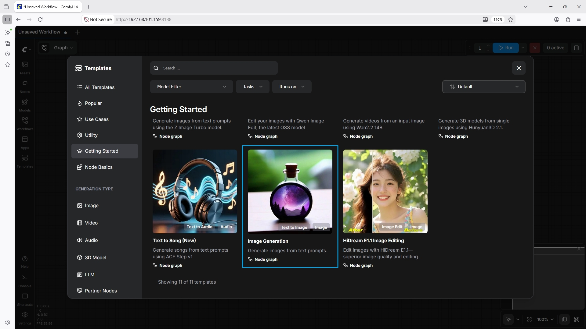<br>

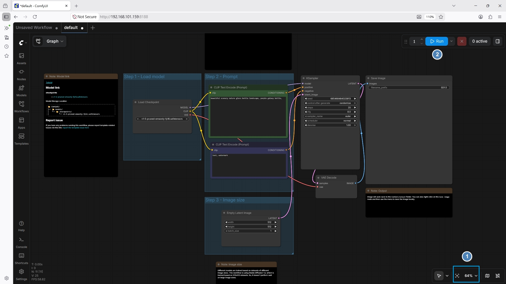<br>

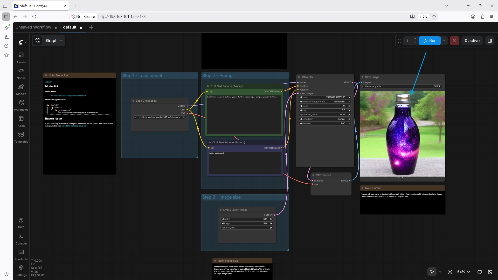<br>

1. 在瀏覽器開啟 `http://<GB10_IP>:8188`
2. 進入介面後，**預設工作流程應自動載入**
3. 點擊「**Queue Prompt**（執行）」開始生成
4. 在另一個終端機視窗執行以下指令，監控 GPU 使用狀況：

```bash
nvidia-smi
```
> ⏱️ 圖像生成通常在 **30～60 秒**內完成，實際時間視模型大小與硬體配置而定。

跳離 Comfy  , Ctrl + C 

再次進入 Comfy   ~/ComfyUI$目錄下

```
source comfyui-env/bin/activate
```

(comfyui-env) user@promaxgb10-0a25:~/ComfyUI$ 
```
python main.py --listen 0.0.0.0
```
。。。
To see the GUI go to: http://0.0.0.0:8188
```

跳離 Comfy  , Ctrl + C  之後要 離開 venv 
```
deactivate
```
原本：
(comfyui-env) user@promaxgb10-0a25:~/ComfyUI$
會變成：
user@promaxgb10-0a25:~/ComfyUI$
代表已退出虛擬環境。


ComfyUI有很多模型與工作流 有興趣的可以參考以下
| [https://comfyui-wiki.com) | 有關於ComfyUI 相關推薦 |

---
## 相關資源

| 資源 | 說明 |
|------|------|
| [ComfyUI 官方文件](https://github.com/comfyanonymous/ComfyUI) | 使用說明與進階功能 |
| [DGX Spark 文件](https://docs.nvidia.com/dgx-spark) | 硬體與系統設定參考 |
| [DGX Spark 論壇](https://forums.developer.nvidia.com) | 社群問答與討論 |
| [DGX Spark 使用者效能指南](https://build.nvidia.com/spark) | 效能優化建議 |


