# 安裝並使用 LM Studio（llmster）操作步驟

>原始出處 https://build.nvidia.com/spark/lm-studio/instructions 
注意：本文件後半段與原始程序不同
---

## 整體流程概覽

| 步驟 | 說明 | 執行位置 |
|------|------|----------|
| Step 1 | 安裝 llmster | GB10 終端機 |
| Step 2 | ~~下載輔助腳本~~（本說明改採 LM Link 方案） | — |
| Step 3 | 啟動 LM Studio API 伺服器 | GB10 終端機 |
| Step 4 | 在 Windows NB 安裝 LM Studio GUI | Windows 筆電 |
| Step 5 | 下載 AI 模型到 GB10 | GB10 終端機 |
| Step 6 | 載入模型 | GB10 終端機 |
| Step 7 | 設定 LM Link 加密連線（Windows NB ↔ GB10） | GB10 + 筆電 |
| Step 8 | 後續擴充與比較 | — |
| Step 9 | 清理與移除 | GB10 終端機 |

---

## Step 1：在 GB10 上安裝 llmster

**llmster** 是 LM Studio 的**終端機版本（無圖形介面）**，適合安裝在伺服器或沒有螢幕的機器上。安裝完成後，你就可以透過 API 從筆電連線到 GB10 上的 LLM。

**在 GB10 終端機執行：**

```bash
curl -fsSL https://lmstudio.ai/install.sh | bash
```

安裝完成後，請依照終端機輸出的說明，將 `lms` 加入 **PATH 環境變數**，這樣你才能在任何目錄下直接執行 `lms` 指令。

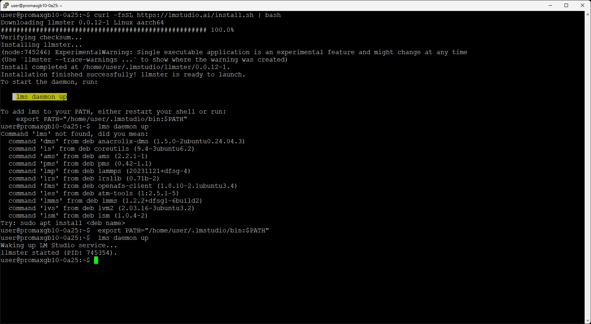<br>

> 💡 **`lms` 是什麼？**  
> 這是 LM Studio 的命令列工具（CLI），後續所有操作（下載模型、啟動伺服器、載入模型）都會用到它。

---

## Step 3：啟動 LM Studio API 伺服器

在 **GB10 終端機**上，使用 `lms` 指令啟動 API 伺服器，並開放區域網路存取：

```bash
lms server start --bind 0.0.0.0 --port 1234
```

> `--bind 0.0.0.0` 表示允許同一區域網路內的所有裝置連線。請確認連線的裝置都是你信任的裝置。

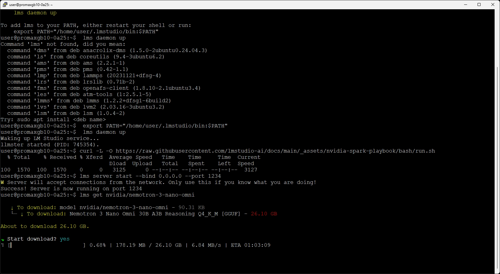<br>

**測試筆電是否能連上 GB10：**

在筆電開啟瀏覽器，輸入以下網址（將 `<GB10_IP>` 替換為 GB10 的實際 IP）：

```
http://<GB10_IP>:1234/api/v1/models
```

回傳模型清單即代表連線正常 ✅

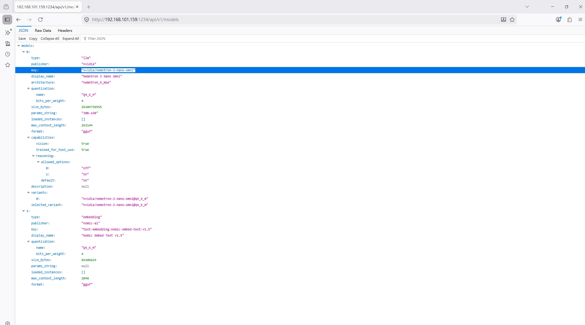<br>

---

## Step 4：在 Windows 筆電安裝 LM Studio GUI

前往 https://lmstudio.ai 下載並安裝 Windows 版 LM Studio 桌面應用程式。

安裝完成後開啟 LM Studio，後續將透過 LM Link 連線到 GB10。

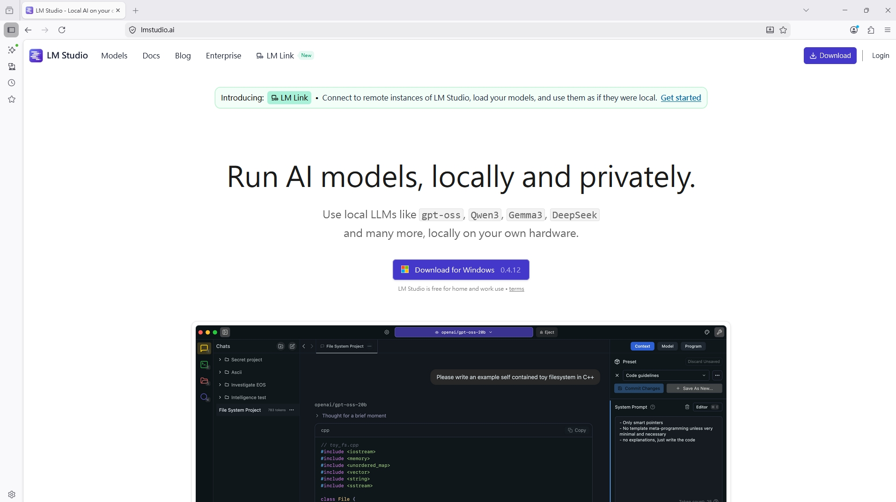<br>

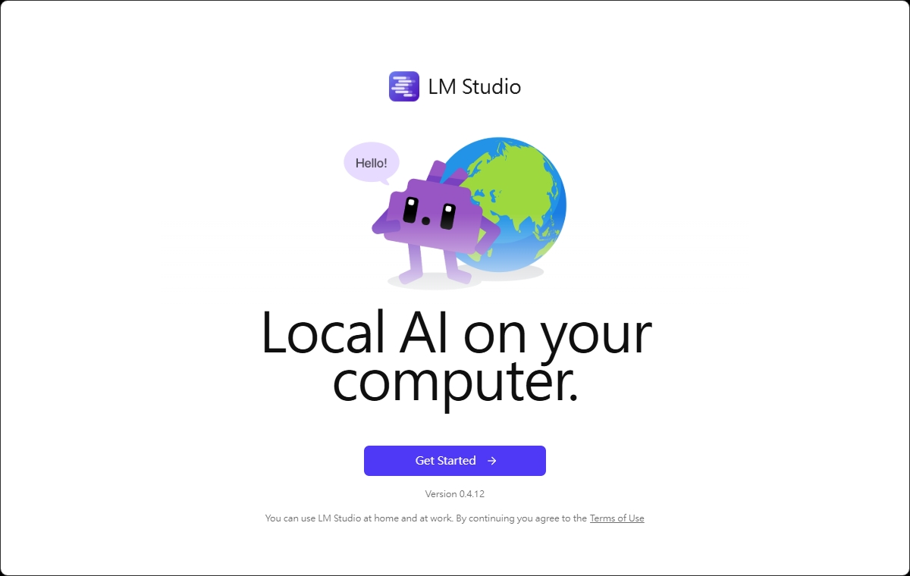<br>

---

## Step 5：下載 AI 模型到 GB10

以 **NVIDIA Nemotron 3 Nano Omni** 為範例，在 GB10 終端機執行：

```bash
lms get nvidia/nemotron-3-nano-omni
```

> 📦 模型檔案約 **26GB**，下載需要一段時間，請耐心等待。

<br>

---

### 模型檔案存放在哪裡？

下載完成的模型會以 **GGUF 格式**儲存在本機：

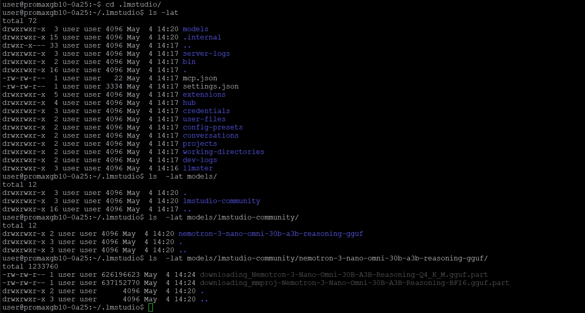<br>

> **什麼是 GGUF 格式？**  
> GGUF（GPT-Generated Unified Format）是專為量化後的 LLM 設計的單一檔案格式，特色是載入速度快、相容性高，能在 CPU+GPU 混合環境下高效運行。

---

### 關於 Nemotron 3 Nano Omni 模型

**NVIDIA Nemotron 3 Nano Omni 30B A3B Reasoning** 是一款開源多模態推理大型語言模型，適合企業 AI Agent、文件理解、影音分析與本地部署。

**名稱拆解：**

| 名稱片段 | 說明 |
|----------|------|
| Nemotron 3 | 第三代 Nemotron 模型家族 |
| Nano | 高效率小型化版本 |
| Omni | 支援多模態（文字、圖片、音訊、影片） |
| 30B | 總參數量約 300 億 |
| A3B | 每次推理約啟用 30 億有效參數（MoE 架構） |
| Reasoning | 具備思考鏈與複雜推理能力 |

**核心特色：**
- 多模態輸入：文字 / 圖像 / 音訊 / 影片
- MoE 混合專家架構：降低硬體需求，提高推理效率
- 長上下文支援，適合處理超大型文件
- 開放權重，可商業應用
- 支援 Ollama、llama.cpp、TensorRT 等本地部署工具

**適合用途：**
本地企業 AI 助理、文件與 PDF 智能分析、視覺 + 語音客服 Agent、私有化知識庫 / RAG 系統

**硬體需求（大致）：**

| 精度 | 所需 VRAM / RAM |
|------|----------------|
| 4-bit 量化 | 約 24～32GB |
| FP8 / BF16 | 需高階 GPU（RTX 5090 / A100 / H100） |

> 一句話總結：**高效率、多模態、本地企業級 AI Agent 模型。**

---

**下載完成後，在 GB10 確認模型已存在：**

```bash
lms ls
```

看到模型名稱出現在清單中即代表下載成功 ✅

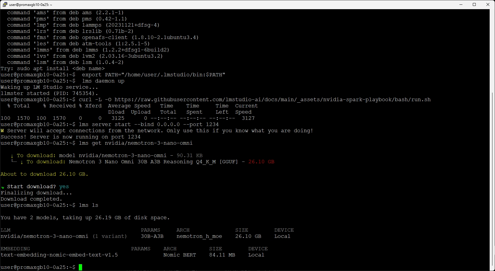<br>

---

## Step 6：載入模型

將模型載入記憶體，使其準備好回應來自筆電的請求：

```bash
lms load nvidia/nemotron-3-nano-omni
```

> 載入完成後，模型即處於待機狀態，可以開始接收推理請求。

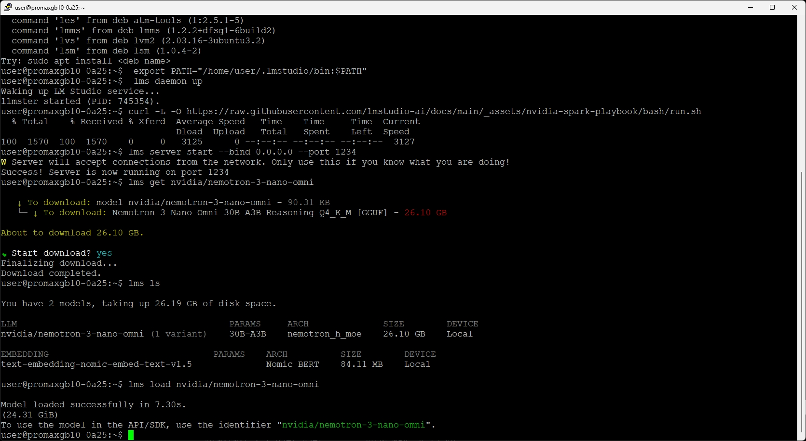<br>

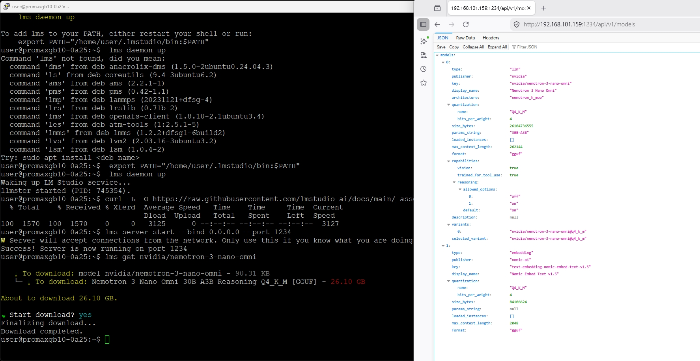<br>

---

## Step 7：設定 LM Link（Windows NB ↔ GB10 加密連線）

> 使用 **LM Link** 可以讓筆電透過端對端加密連線存取 GB10 上的模型，即使不在同一個區域網路也能使用。

### 7-1. 註冊並建立 LM Link 網路

先在瀏覽器前往 https://lmstudio.ai 註冊帳號並登入，再前往：

```
https://lmstudio.ai/link
```

依照「**建立你的連結（Create your Link）**」步驟建立私人 LM Link 網路。

### 7-2. 在 GB10 上登入並啟用 LM Link

在 **GB10 終端機**依序執行：

**登入帳號：**

```bash
lms login
```

**在瀏覽器開啟配對頁面：**

```
https://lmstudio.ai/pairing
```

將終端機顯示的**配對字串（圖中標示 3 的欄位）**貼入網頁完成配對。

**啟用 LM Link：**

```bash
lms link enable
```

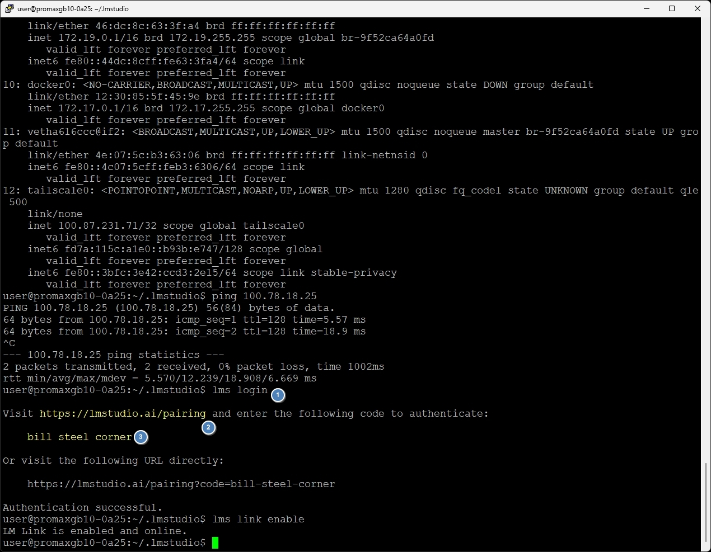<br>

### 7-3. 在 Windows LM Studio 確認連線

開啟 Windows LM Studio，點擊左下角的**電腦小圖示**：

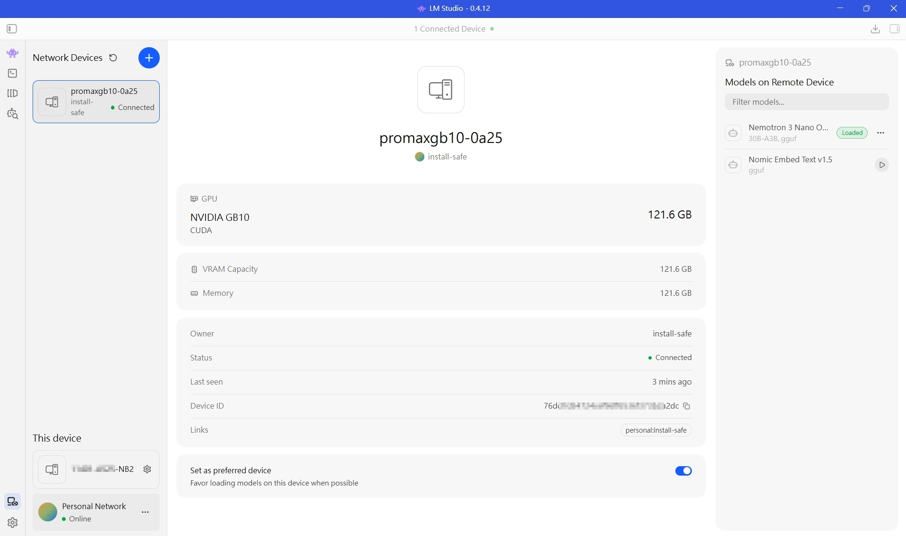<br>

確認 Windows 筆電與 GB10 都已成功加入同一個 Link：

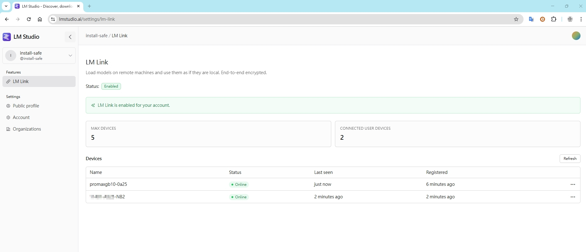<br>

### 7-4. 開始與 GB10 模型對話

LM Link 連線成功後，在 Windows LM Studio 的模型選擇器中即可看到 GB10 上的 **Nemotron 3 Nano Omni** 模型，直接選用即可開始對話。

所有工具只需指向 `localhost:1234` 即可使用 GB10 上的模型，**不需要修改任何端點設定**。

相容工具包括：LM Studio SDK、Codex、Claude Code、OpenCode 等。

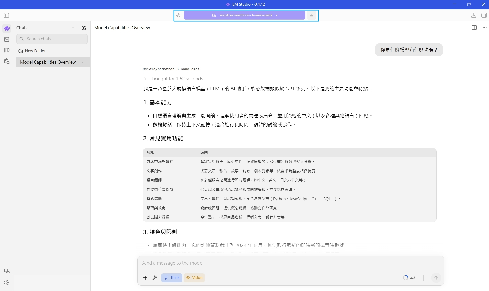<br>

> 📋 **目前限制（預覽版）：** 最多 2 位使用者免費，每位最多 5 台裝置（共 10 台）。

---

## Step 8：後續擴充

### Windows LM Studio + GB10 vs Open WebUI + Ollama

這兩種方案都可以在本地執行 LLM，但操作體驗不同：

| 項目 | Windows LM Studio + GB10 | Open WebUI + Ollama |
|------|--------------------------|---------------------|
| 操作介面 | 原生 GUI 桌面應用 | 瀏覽器網頁介面 |
| 連線方式 | LM Link（加密）/ 直連 API | HTTP / 本機網路 |
| 跨網路存取 | ✅（LM Link 內建支援） | 需額外設定 |
| 模型管理 | 圖形化介面 | 指令 + 網頁 |

### LM Studio 還可以串接哪些工具？

除了 Windows GUI APP 直接連 GB10 之外，GB10 的 `lms` API 也相容以下工具：

Open WebUI、AnythingLLM、Python 腳本、LangChain、Flowise、VS Code 插件、自製應用程式

**繼續探索：**
- 前往 [LM Studio 模型目錄](https://lmstudio.ai/models) 下載並試用不同的模型
- 使用 **LM Link** 連接更多裝置，從任何地方透過加密連線存取 GB10 上的模型

---

## Step 9：清理與移除

> **⚠️ 注意：** LM Studio 將模型與應用程式**分開儲存**。卸載 llmster 本身**不會**自動刪除已下載的模型，需手動清除。

| 要移除的項目 | 操作方式 |
|-------------|----------|
| llmster 應用程式 | 刪除資料夾 `~/.lmstudio/llmster` |
| 已下載的模型 | 刪除資料夾內容 `~/.lmstudio/models/` |
| 桌面版 LM Studio（Windows） | 先從系統托盤退出，再將應用程式移至垃圾桶 |

---
使用後下載其它模型

```
lmstudio$ lms get  qwen3.6
```
get 之後搭配關鍵字 會有列表讓人手動選擇

Searching staff picks with the term qwen3.6
No exact match found. Please choose a model from the list below.

✔ Select a model to download qwen/qwen3.6-35b-a3b

   ↓ To download: model qwen/qwen3.6-35b-a3b - 173.20 KB
   └─ ↓ To download: Qwen3.6 35B A3B Q4_K_M [GGUF] - 22.07 GB

About to download 22.07 GB.


## 相關資源

| 資源 | 說明 |
|------|------|
| [LM Studio 文件](https://lmstudio.ai/docs) | 官方安裝與使用說明 |
| [LM Link](https://lmstudio.ai/link) | 遠端使用本機模型 |
| [DGX Spark 文件](https://docs.nvidia.com/dgx-spark) | 硬體與系統參考 |
| [DGX Spark 論壇](https://forums.developer.nvidia.com) | 社群問答 |
| [LM Studio Discord](https://discord.gg/lmstudio) | 即時社群支援 |

## Q&A
可以在GB10上創建WEB UI 對LM 進行操作嗎？ A: 使用OpenWebUI對接<br>
可以在Windows 上安裝LM Studio APP下載模型嗎？ A: 可以,如果你的資源夠大<br> 
