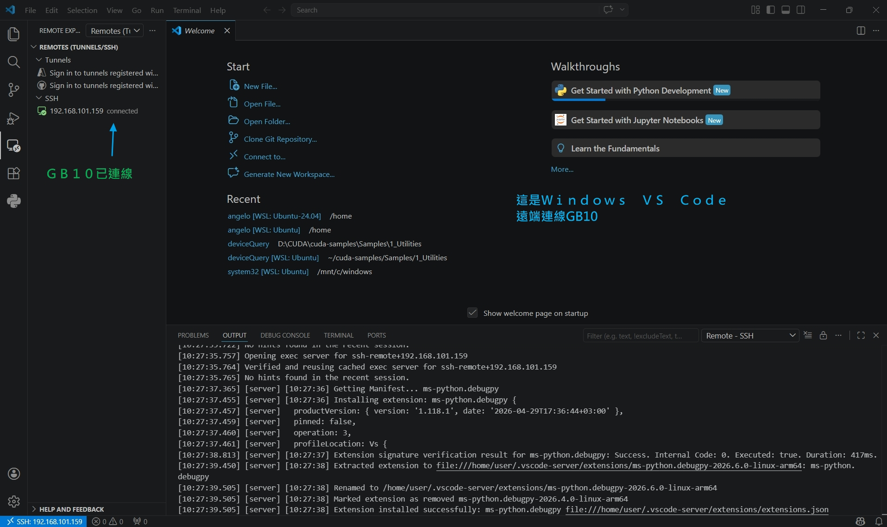
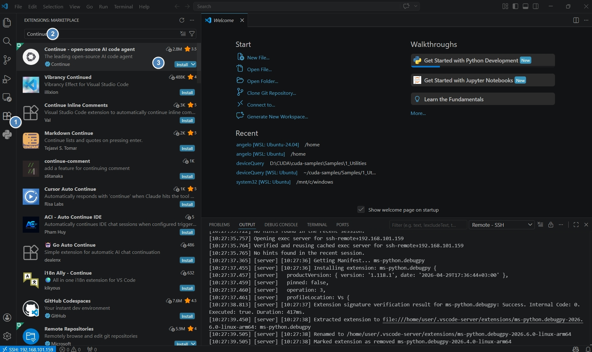
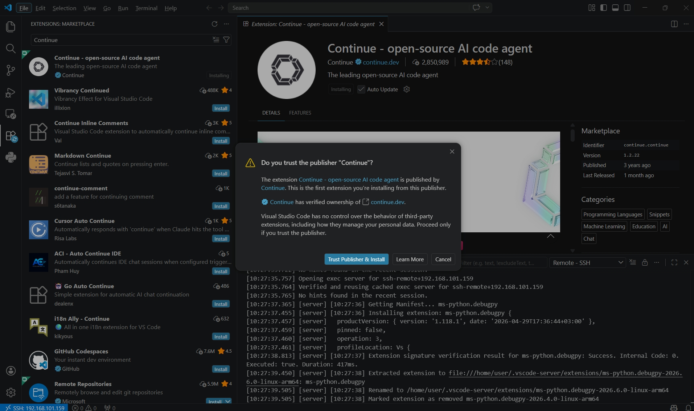
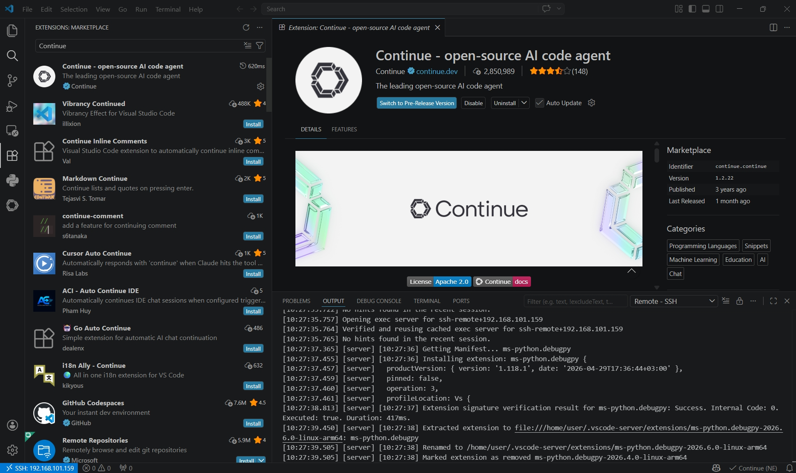
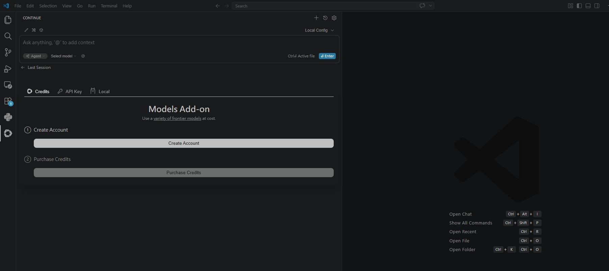
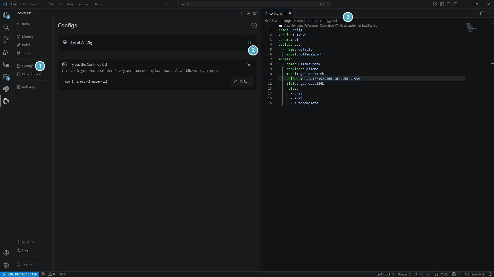
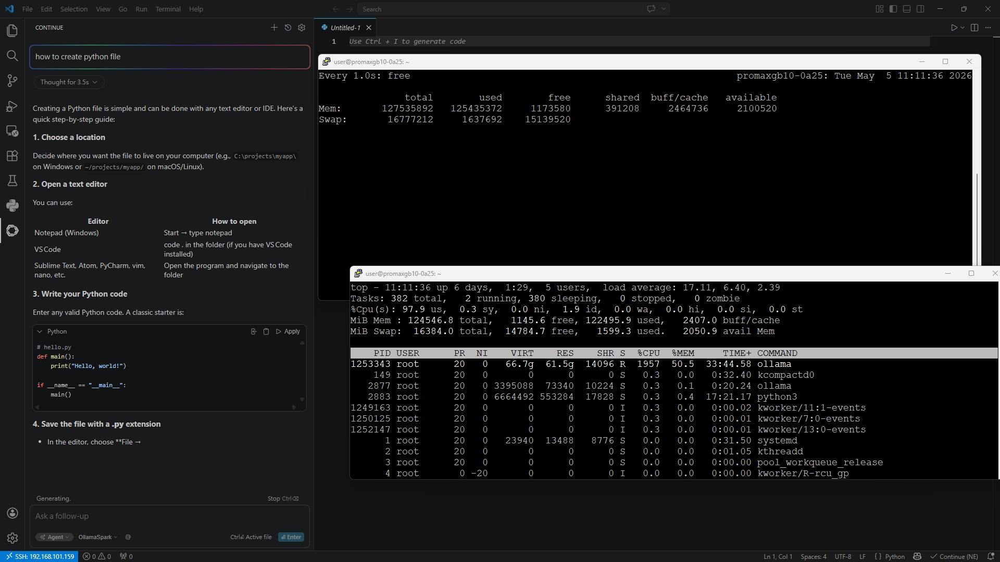

# Vibe Coding 安裝與設定步驟

---
## 整體流程概覽

| 步驟 | 說明 | 執行位置 |
|------|------|----------|
| Step 1 | 安裝 Ollama 並下載模型 | GB10 終端機 |
| Step 2 | （選用）啟用遠端存取 | GB10 終端機 |
| Step 3 | 安裝 VS Code | GB10 或 Windows 筆電 |
| Step 4 | 安裝 Continue.dev 擴充套件 | VS Code |
| Step 5 | 設定本機推理（本地使用） | VS Code（GB10 上） |
| Step 6 | 設定工作站連線到 GB10 Ollama（遠端使用） | VS Code（Windows 筆電） |

---

## Step 1：安裝 Ollama 並下載模型 （之前就做完了省略）

在 **GB10 終端機**執行以下指令，安裝最新版 Ollama：

```bash
curl -fsSL https://ollama.com/install.sh | sh
```

安裝完成、服務啟動後，下載程式碼助手所需的模型：

```bash
ollama pull gpt-oss:120b
```

> 📦 `gpt-oss:120b` 是一個 120B 參數的大型模型，檔案較大，下載需要一段時間，請耐心等待。

---

## Step 2（採用這種模式）：啟用遠端存取

> 如果你只打算在 GB10 本機使用 VS Code，可以跳過此步驟。  
> 若要從 Windows 筆電的 VS Code 遠端連線到 GB10 的 Ollama，則必須完成此步驟。
<br>


### 2-1. 修改 Ollama 服務設定 （之前就做完了省略）

```bash
sudo systemctl edit ollama
```

在編輯器中，於註解說明文字**下方**加入以下內容：

```ini
[Service]
Environment="OLLAMA_HOST=0.0.0.0:11434"
Environment="OLLAMA_ORIGINS=*"
```

儲存後離開編輯器。

### 2-2. 重新載入並重啟服務 （之前就做完了省略）

```bash
sudo systemctl daemon-reload
sudo systemctl restart ollama
```

### 2-3. 開放防火牆連接埠（如有啟用防火牆）

```bash
sudo ufw allow 11434/tcp
```

### 2-4. 從筆電測試連線是否成功

在筆電的終端機執行（將 `YOUR_SPARK_IP` 替換為 GB10 的實際 IP）：

```bash
curl -v http://YOUR_SPARK_IP:11434/api/version
```

> 成功回應即代表筆電可以連線到 GB10 的 Ollama 伺服器 ✅  
> 若連線失敗，請參閱本頁末的「故障排除」章節。

---

## Step 3：安裝 VS Code （之前就做完了省略--裝在Windows）

### 在 GB10 上安裝（ARM64 架構）

前往 https://code.visualstudio.com/download，下載 **Linux ARM64** 版本的安裝包。

下載完成後，在 GB10 終端機執行（將 `DOWNLOADED_PACKAGE_NAME` 替換為實際檔名）：

```bash
sudo dpkg -i DOWNLOADED_PACKAGE_NAME
```

### 在 Windows 筆電上安裝（遠端使用） （之前就做完了省略）

同樣前往上方下載頁面，選擇對應你系統架構的版本安裝即可。

---

## Step 4：安裝 Continue.dev 擴充套件

1. 開啟 VS Code
2. 點擊左側的「**Extensions（擴充功能）**」圖示（或按 `Ctrl+Shift+X`）
3. 搜尋 `Continue`
4. 選擇由 **Continue.dev** 發布的擴充套件，點擊「**Install**」安裝
5. 安裝完成後，點擊右側欄出現的 **Continue 圖示**進入設定

---

## Step 5：設定本機推理（在 GB10 本地使用）

在 GB10 上的 VS Code 中完成以下設定，讓 Continue 使用 GB10 本地的 Ollama 模型：

1. 點擊「**Or, configure your own models**」
2. 點擊「**Click here to view more providers**」
3. 選擇 **Ollama** 作為提供者
4. 模型選擇 **Autodetect**（自動偵測）
5. 發送一個測試提示，確認 AI 有正確回應

> 自動偵測完成後，你下載的模型（例如 `gpt-oss:120b`）就會成為預設的推理模型 ✅


---

## Step 6：設定 Windows 筆電連線到 GB10 Ollama（遠端使用）

> 此步驟在 **Windows 筆電的 VS Code** 中執行，讓筆電的 Continue 使用 GB10 上的 Ollama 模型。

### 6-1. 安裝 Continue 擴充套件

依照 Step 4 的說明，在筆電的 VS Code 中也安裝 Continue 擴充套件。
<br>
<br>
<br>


### 6-2. 進入設定

1. 點擊 Continue 左側面板的圖示
2. 點擊「**Or, configure your own models**」
3. 點擊「**Click here to view more providers**」
4. 選擇 **Ollama**，模型選 **Autodetect**

> ⚠️ 此時 Continue 會顯示無法偵測到模型，這是正常的——因為模型在 GB10 上，不在筆電本機。
看不懂上面這一段對不對！ 對我也看不懂 別管6-2 直接做 6-3


### 6-3. 手動編輯設定檔

1. 點擊 Continue 視窗右上角的**齒輪圖示**
2. 在左側面板點擊「**Models（模型）**」
3. 在「Chat」下方的第一個下拉選單旁邊，點擊**齒輪圖示**
4. `config.yaml` 設定檔會自動開啟

<br>


### 6-4. 貼上以下設定內容

將 `config.yaml` 的內容**完整替換**為以下設定，並將 `YOUR_SPARK_IP` 替換為 GB10 的實際 IP 位址：

```yaml
name: Config
version: 1.0.0
schema: v1
assistants:
  - name: default
    model: OllamaSpark
models:
  - name: OllamaSpark
    provider: ollama
    model: gpt-oss:120b
    apiBase: http://YOUR_SPARK_IP:11434
    title: gpt-oss:120b
    roles:
      - chat
      - edit
      - autocomplete
```


儲存後，Continue 就會透過網路連線到 GB10 的 Ollama 伺服器。

<br>


> 💡 如果想使用 GB10 上其他的 Ollama 模型，只需在 `models` 區塊中新增額外的模型條目即可。

vs code 多了個Continue 插件視窗 , 開始交談  第一次回應比較慢 

<br>

---

輸出結果（底下URL請開啟新視窗）
https://github.com/install-safe-press/gb10-playbooks/blob/main/1f-Vibe%20Coding%20in%20VS%20Code/images/vsocde-vibe-30fps-1920.gif
同時使用 free , top  驗證ollama啟動作業 gpt-oss:120b 有吃記憶體。


## 故障排除

| 症狀 | 可能原因 | 解決方式 |
|------|----------|----------|
| Ollama 無法啟動 | GPU 驅動程式未正確安裝 | 執行 `nvidia-smi`；若指令失敗，請至 DGX Dashboard 確認系統更新狀態 |
| Continue 無法透過網路連線 | Port 11434 未開放或無法存取 | 執行 `ss -tuln \| grep 11434`，確認輸出包含 `tcp LISTEN 0 4096 *:11434 *:*`；若不符，請重新執行 Step 2 的防火牆指令 |
| Continue 無法偵測到本地 Ollama 模型 | 設定未正確套用 | 確認 `/etc/systemd/system/ollama.service.d/override.conf` 中的 `OLLAMA_HOST` 與 `OLLAMA_ORIGINS` 設定正確 |
| 記憶體使用率過高 | 模型太大，或同時有其他模型在執行 | 確認沒有其他大型模型或容器在運行；若需要釋放記憶體，執行以下指令清除緩衝區快取 |

**清除緩衝區快取（釋放記憶體）：**

```bash
sudo sh -c 'sync; echo 3 > /proc/sys/vm/drop_caches'
```

---

## 相關資源

| 資源 | 說明 |
|------|------|
| [DGX Spark 文件](https://docs.nvidia.com/dgx-spark) | 硬體與系統參考 |
| [Ollama 文件](https://ollama.com/docs) | Ollama 安裝與使用說明 |
| [VS Code 下載](https://code.visualstudio.com/download) | VS Code 各平台安裝包 |
| [Continue.dev](https://www.continue.dev/) | Continue 擴充套件官網 |
| [DGX Spark 論壇](https://forums.developer.nvidia.com) | 社群問答與討論 |
