部署 Portainer ，讓你的 GB10 現在具備完整圖形化 Docker 管理能力。

Portainer CE 就像是 Docker 的「網頁控制台」，把原本需要輸入指令的管理工作改成圖形化操作。

Portainer 可以做什麼？
1. 管理容器（Containers）

你可以直接：

啟動 / 停止
重啟
刪除
查看日誌
進入 Console（類似 SSH 到容器內）
2. 管理映像檔（Images）
拉取新 Image
刪除舊版
更新版本
查看容量使用
3. 管理 Volume（資料卷）
查看資料儲存位置
建立永久儲存
刪除未使用 Volume
4. 管理 Network（網路）
查看容器互聯方式
建立自訂網段
排查 Port 問題

| 功能         | Docker CLI  | Portainer |
| ---------- | ----------- | --------- |
| 查看容器       | docker ps   | Web UI    |
| 停止容器       | docker stop | 按鈕        |
| 查看日誌       | docker logs | 圖形化       |
| Compose 部署 | CLI         | Web 表單    |
| 資源監控       | 指令          | Dashboard |


最大優勢
初學者：

不用背指令。

進階使用者：

集中管理多服務、多主機。

Portainer 讓你用瀏覽器就能完整控制 Docker 生態，特別適合 GB10、本地 AI Server、NAS 與 HomeLab。

>原廠站站 https://www.portainer.io/
---
開始在GB以容器的方式佈署portainer 

1.建立portainer目錄
```bash
mkdir portainer
```
2.進入portainer目錄
```bash
cd portainer/
```
3.使用任意編輯器 vi / nano 建立 docker-compose.yml 內容如下
```text
version: "3.8"

services:
  portainer:
    image: portainer/portainer-ce:latest
    container_name: portainer
    restart: always
    ports:
      - "8000:8000"
      - "9443:9443"
    volumes:
      - /var/run/docker.sock:/var/run/docker.sock
      - portainer_data:/data

volumes:
  portainer_data:
```
4.佈署啟動
```bash
 docker compose up -d
```
5.確認docker啟動狀態
```bash
 docker ps
```
6.查看portainer啟動的log
```bash
 docker logs portainer
```

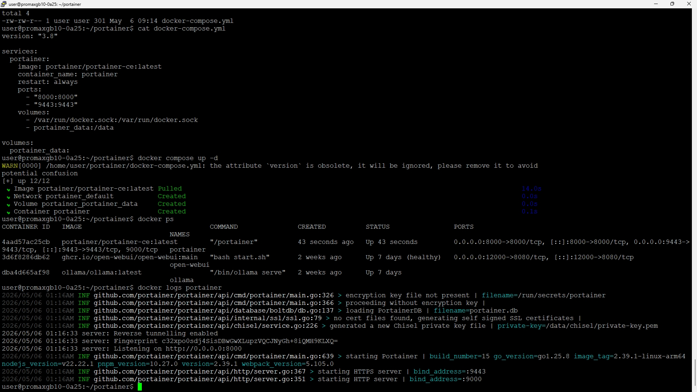<br>

7.開啟portainer web https://GB10_IP:/9443 
第一次要設定 admin密碼

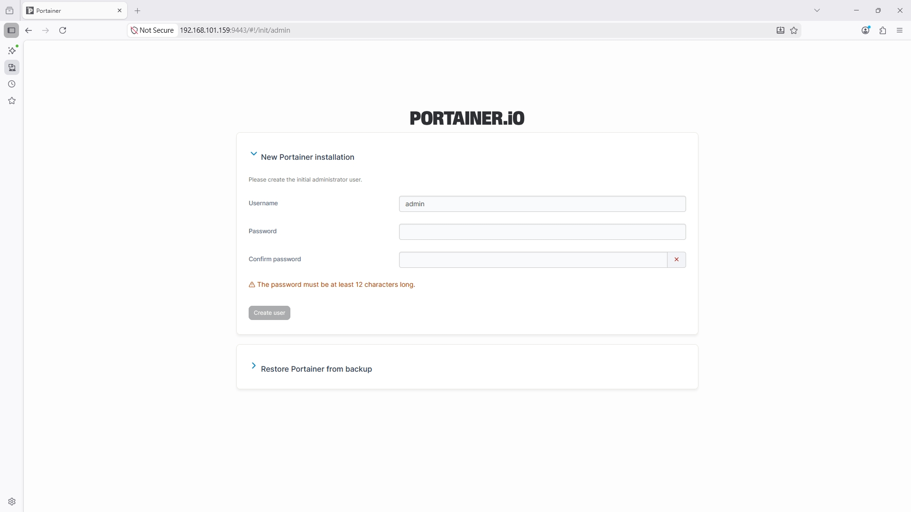<br>

portainer 的Quick  start > Environment Wizard > Get Started 
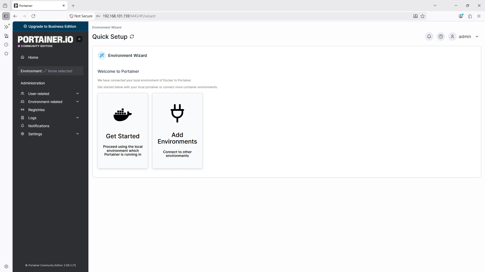<br>

畫面顯示的是local本地docker的狀態 > Live connect 進入本地環境的資訊狀態Dashboard
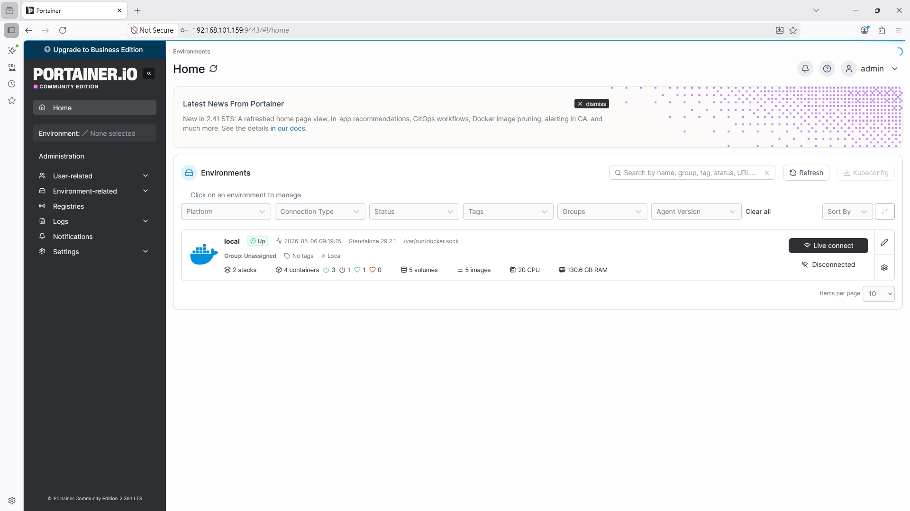<br>

Dashboard , Environment info . 發現有4個Containers , 點進去看細節
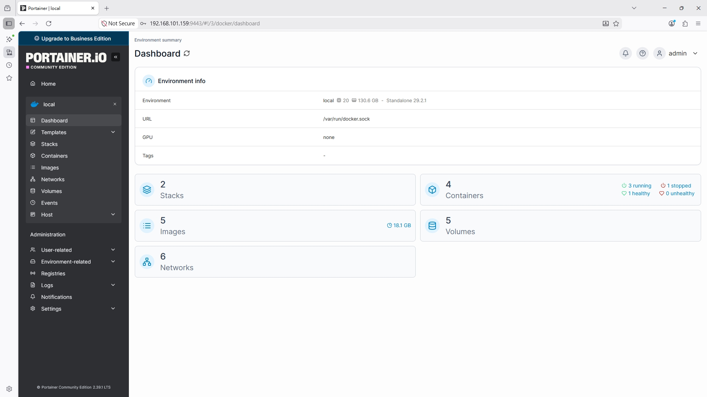<br>

Containers 列表 , 有沒有很像 docker ps 所呈現出來的樣子
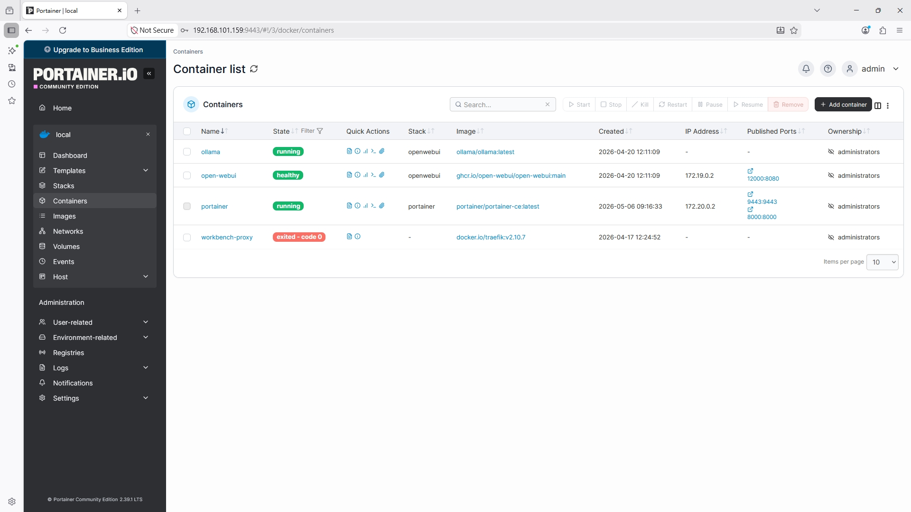<br>

進入ollama 這個容器, 可以看狀態或進行操作  >_ Console 進入這個容器的指令操作 
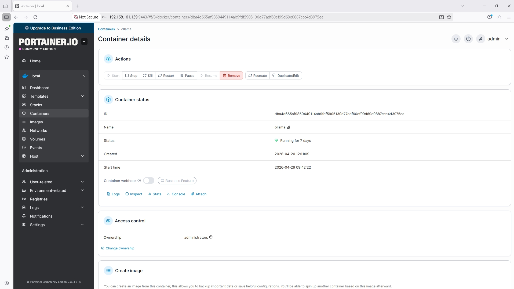<br>

Connect 進入這個容器的cli console
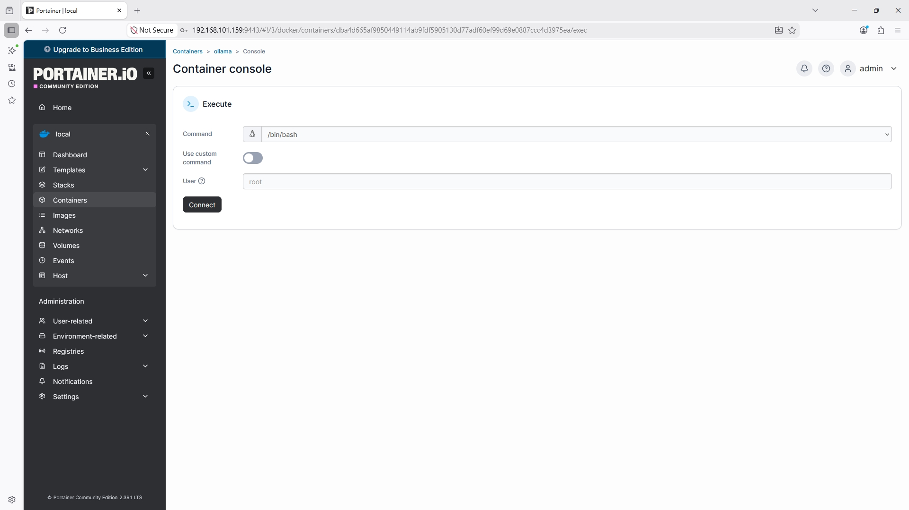<br>

進入這個容器的cli console 命令列的樣子就可以在這個畫面下指令
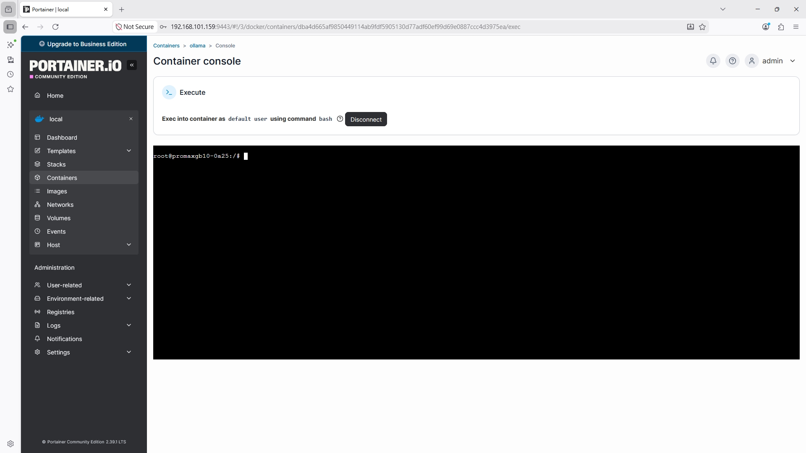<br>

試一下 ollama list 指令 , 列出現在裡面的模型
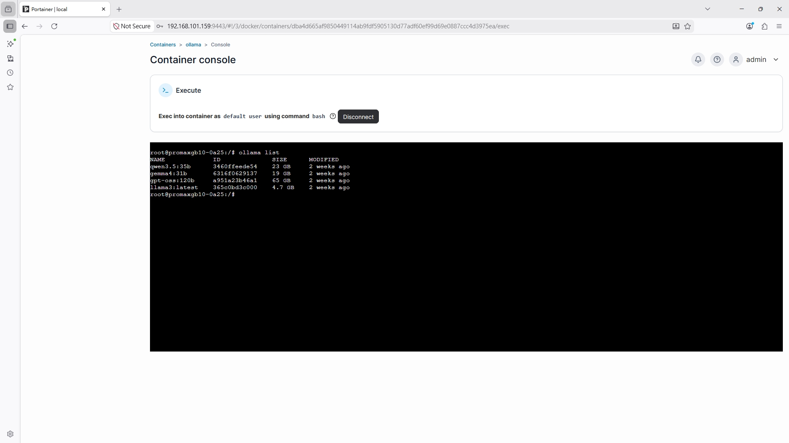<br>

df-h 看現在磁碟空間容量
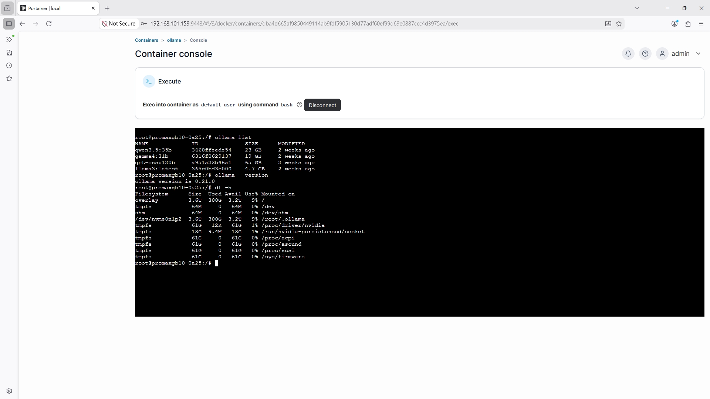<br>

