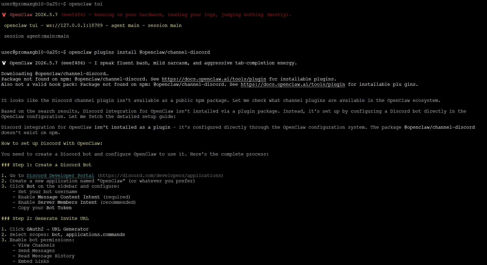
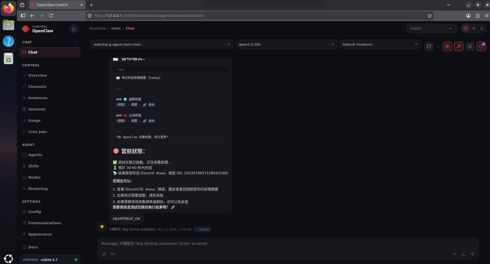
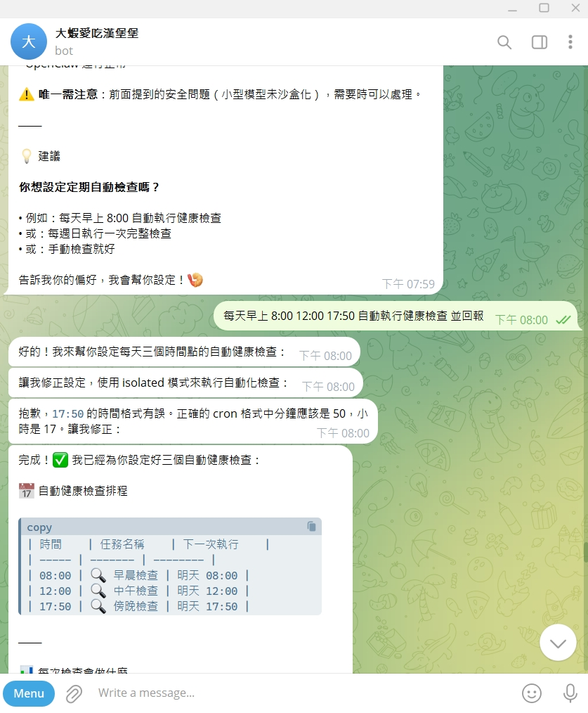
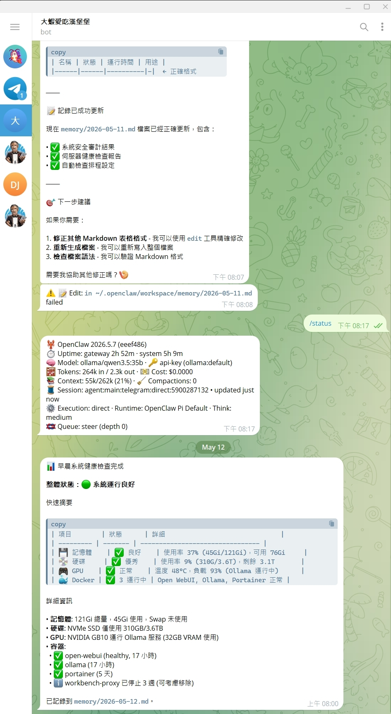
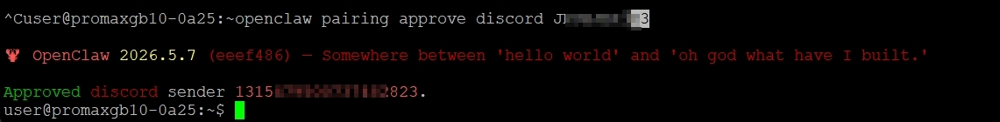
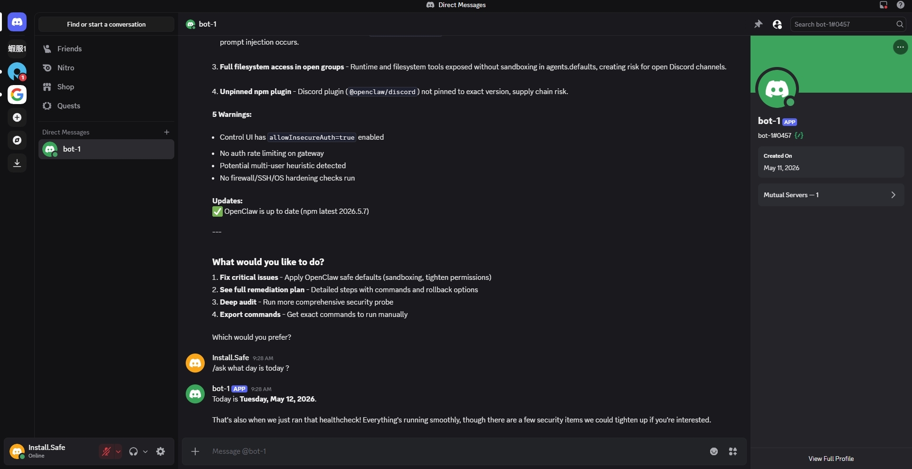

### 使用 Dell Pro MAX GB10 佈建 openclaw<br>

前提  1a-Open WebUI with Ollama  已使用 Docker 佈建 <br>
作業  於外層作業系統直接佈建openclaw 並存取 ollama 模型<br>
應用  透過Telegram 進行系統的指令 , 其它應用就交給各位大神們進階發揮,大叔引進門 修行在各人 你一定可以做的更好。
## 注意 Openclaw 所引發之系統或個人資訊安全性 不在本章節討論

準備作業-1：<br>
在外層確認 ollama 有使用到 GPU,跑作ollama查詢接下來   docker exec ollama ollama ps<br>


## 沒用到 GPU
```
user@promaxgb10-0a25:~/Desktop$ docker exec ollama ollama ps
NAME           ID              SIZE     PROCESSOR    CONTEXT    UNTIL              
qwen3.5:35b    3460ffeede54    32 GB    100% CPU     262144     3 minutes from now    
user@promaxgb10-0a25:~/Desktop$
```

## 有用到 GPU
```
user@promaxgb10-0a25:~/openwebui$ docker exec ollama ollama ps
NAME           ID              SIZE     PROCESSOR    CONTEXT    UNTIL              
qwen3.5:35b    3460ffeede54    34 GB    100% GPU     262144     4 minutes from now    
user@promaxgb10-0a25:~/openwebui$
```

## 問題在於 docker compose yml 
   deploy:
      resources:
        reservations:
          devices:
            - driver: nvidia
              count: all
              capabilities: [gpu]

Config 有 GPU 設定，但 container 沒有重建過。執行：
```
bashcd ~/openwebui
docker compose down
docker compose up -d
```
等個30秒再檢查一次
```
docker exec ollama ollama ps 
```

準備作業-2：確認可以對外連網 , 回到 Home 目錄 .
## 佈建openclaw於本機底下只要下這行指令   v2026.5.7 版本為示範

```
 curl -fsSL https://openclaw.ai/install.sh | bash
```
底下開始輸出訊息與佈署程序
Preparing installer interface...<br>

  🦞 OpenClaw Installer<br>
  Your terminal just grew claws—type something and let the bot pinch the busywork.<br>

✓ Detected: linux<br>

Install plan<br>
OS: linux<br>
Install method: npm<br>
Requested version: latest<br>

[1/3] Preparing environment<br>
✓ Node.js v22.22.2 found<br>
· Active Node.js: v22.22.2 (/usr/bin/node)<br>
· Active npm: 10.9.7 (/usr/bin/npm)<br>
· Using Node.js runtime at /usr/bin/node<br>
· Using Node.js runtime at /usr/bin/node<br>

[2/3] Installing OpenClaw<br>
✓ Git already installed<br>
· Installing OpenClaw v2026.5.7<br>
✓ OpenClaw npm package installed<br>
✓ OpenClaw installed<br>

[3/3] Finalizing setup<br>
· Refreshing loaded gateway service<br>
· Refreshing gateway service<br>
✓ Gateway service metadata refreshed<br>
· Restarting gateway service<br>
✗ Restarting gateway service failed — re-run with --verbose for details<br>
Restarted systemd service: openclaw-gateway.service<br>
Gateway restart failed after 13s: service stayed stopped and port 18789 stayed free.<br>
Service runtime: status=stopped, state=failed, lastExit=78<br>
Gateway port 18789 status: free.<br>
Gateway restart failed after 13s: service stayed stopped and health checks never came up.<br>
Tip: openclaw gateway status --deep<br>
Tip: openclaw doctor<br>
! Gateway service restart failed; continuing<br>

🦞 OpenClaw installed successfully (2026.5.7)!<br>
Installation complete. Your productivity is about to get weird.<br>

· Config already present; running doctor<br>
· Running doctor to migrate settings<br>
· Running doctor<br>
✓ Doctor complete<br>
· Config already present; skipping onboarding<br>
· Starting setup<br>


🦞 OpenClaw 2026.5.7 (eeef486) — Greetings, Professor Falken<br>


▄▄▄▄▄▄▄▄▄▄▄▄▄▄▄▄▄▄▄▄▄▄▄▄▄▄▄▄▄▄▄▄▄▄▄▄▄▄▄▄▄▄▄▄▄▄▄▄▄▄▄▄<br>
██░▄▄▄░██░▄▄░██░▄▄▄██░▀██░██░▄▄▀██░████░▄▄▀██░███░██<br>
██░███░██░▀▀░██░▄▄▄██░█░█░██░█████░████░▀▀░██░█░█░██<br>
██░▀▀▀░██░█████░▀▀▀██░██▄░██░▀▀▄██░▀▀░█░██░██▄▀▄▀▄██<br>
▀▀▀▀▀▀▀▀▀▀▀▀▀▀▀▀▀▀▀▀▀▀▀▀▀▀▀▀▀▀▀▀▀▀▀▀▀▀▀▀▀▀▀▀▀▀▀▀▀▀▀▀<br>
                  🦞 OPENCLAW 🦞<br>
```
┌  OpenClaw setup
│
◇  Security disclaimer ──────────────────────────────────────────────────────────────────────╮
│                                                                                            │
│  OpenClaw is a hobby project and still in beta. Expect sharp edges.                        │
│  By default, OpenClaw is a personal agent: one trusted operator boundary.                  │
│  This bot can read files and run actions if tools are enabled.                             │
│  A bad prompt can trick it into doing unsafe things.                                       │
│                                                                                            │
│  OpenClaw is not a hostile multi-tenant boundary by default.                               │
│  If multiple users can message one tool-enabled agent, they share that delegated tool      │
│  authority.                                                                                │
│                                                                                            │
│  If you’re not comfortable with security hardening and access control, don’t run           │
│  OpenClaw.                                                                                 │
│  Ask someone experienced to help before enabling tools or exposing it to the internet.     │
│                                                                                            │
│  Recommended baseline                                                                      │
│  - Pairing/allowlists + mention gating.                                                    │
│  - Multi-user/shared inbox: split trust boundaries (separate gateway/credentials, ideally  │
│    separate OS users/hosts).                                                               │
│  - Sandbox + least-privilege tools.                                                        │
│  - Shared inboxes: isolate DM sessions (session.dmScope: per-channel-peer) and keep tool   │
│    access minimal.                                                                         │
│  - Keep secrets out of the agent’s reachable filesystem.                                   │
│  - Use the strongest available model for any bot with tools or untrusted inboxes.          │
│                                                                                            │
│  Run regularly                                                                             │
│  openclaw security audit --deep                                                            │
│  openclaw security audit --fix                                                             │
│                                                                                            │
│  Learn more                                                                                │
│  - https://docs.openclaw.ai/gateway/security                                               │
│                                                                                            │
├────────────────────────────────────────────────────────────────────────────────────────────╯
```
│
◇  I understand this is personal-by-default and shared/multi-user use requires lock-down. Continue?<br>
│  Yes   使用左右鍵移動來選擇快定之後按下ENTER <br>
│<br>
  Create Session store dir at ~/.openclaw/agents/main/sessions?  設定檔位置<br>
│  ● Yes / ○ No<br>


◆  Setup mode 快速設定或手動詳細模式   <br>
│  ● QuickStart (Configure details later via openclaw configure.)<br>
│  ○ Manual<br>

```
 Model/auth provider    要連接的模型
│
│  Search:
│  ○ Anthropic
│  ○ Arcee AI
│  ○ BytePlus
│  ○ Cerebras
│  ○ Chutes
│  ○ Cloudflare AI Gateway
│  ○ Codex
│  ○ Copilot
│  ○ Custom Provider
│  ○ DeepInfra
│  ○ DeepSeek
│  ○ Fireworks
│  ○ Google
│  ○ Google Vertex
│  ○ Groq
│  ○ Hugging Face
│  ○ Kilo Gateway
│  ○ LiteLLM
│  ○ LM Studio
│  ○ Microsoft Foundry
│  ○ MiniMax
│  ○ Mistral AI
│  ○ Moonshot AI (Kimi K2.6)
│  ○ NVIDIA
│  ● Ollama (Cloud and local open models)  << 本地 ollama 系統
│  ○ OpenAI
│  ○ OpenAI Codex
│  ○ OpenCode
│  ○ OpenRouter
│  ○ Qianfan
│  ○ Qwen Cloud
│  ○ SGLang
│  ○ Stepfun
│  ○ Stepfun Plan
│  ○ Synthetic
│  ○ Tencent Cloud
│  ○ Together AI
│  ○ Venice AI
│  ○ Vercel AI Gateway
│  ○ vLLM
│  ○ Volcano Engine
│  ○ xAI (Grok)
│  ○ Xiaomi
│  ...
│  ↑/↓ to select • Enter: confirm • Type: to search
```

```
  Model/auth provider
│  Ollama
│
◆  Ollama mode
│  ○ Cloud + Local
│  ○ Cloud only
│  ● Local only (Local models only)  <<本地
```
```
 Ollama base URL
│  http://127.0.0.1:11434█    <<自動帶入本機URL
└
 Default model  << 模型選擇
│  ○ Keep current (default: ollama/gemma4) 
│  ○ Enter model manually 
│  ● Browse all models  << 列出全部來選擇

 ● Browse all models (loads provider catalogs)
```
```
 Loading available models
│
◆  Default model
│
│  Search:
│  ○ Keep current (default: ollama/gemma4)
│  ○ Enter model manually
│  ○ ollama/gemma4
│  ○ ollama/gemma4:31b
│  ○ ollama/gpt-oss:120b
│  ○ ollama/llama3:latest
│  ● ollama/qwen3.5:35b (ctx 256k · reasoning)   << 本示範採用千問3.5 35b模型
│  ↑/↓ to select • Enter: confirm • Type: to search
```
 Default model<br>
│  ollama/qwen3.5:35b<br>

```
 How channels work ───────────────────────────────────────────────────────────────────────╮
│                                                                                           │
│  DM security: default is pairing; unknown DMs get a pairing code.                         │
│  Approve with: openclaw pairing approve <channel> <code>                                  │
│  Public DMs require dmPolicy="open" + allowFrom=["*"].                                    │
│  Multi-user DMs: run: openclaw config set session.dmScope "per-channel-peer" (or          │
│  "per-account-channel-peer" for multi-account channels) to isolate sessions.              │
│  Docs: channels/pairing                                                                   │
│                                                                                           │
│  Feishu: 飞书/Lark enterprise messaging with doc/wiki/drive tools.                        │
│  WeCom: Enterprise messaging and documents, scheduling, task tools.                       │
│  Google Chat: Google Workspace Chat app with HTTP webhook.                                │
│  Nostr: Decentralized protocol; encrypted DMs via NIP-04.                                 │
│  Microsoft Teams: Teams SDK; enterprise support.                                          │
│  Mattermost: self-hosted Slack-style chat; install the plugin to enable.                  │
│  Nextcloud Talk: Self-hosted chat via Nextcloud Talk webhook bots.                        │
│  Matrix: open protocol; install the plugin to enable.                                     │
│  BlueBubbles: iMessage via the BlueBubbles mac app + REST API.                            │
│  LINE: LINE Messaging API webhook bot.                                                    │
│  Zalo: Vietnam-focused messaging platform with Bot API.                                   │
│  Yuanbao: Tencent Yuanbao AI assistant conversation channel.                              │
│  Zalo Personal: Zalo personal account via QR code login.                                  │
│  Synology Chat: Connect your Synology NAS Chat to OpenClaw with full agent capabilities.  │
│  Tlon: decentralized messaging on Urbit; install the plugin to enable.                    │
│  Discord: very well supported right now.                                                  │
│  iMessage: this is still a work in progress.                                              │
│  IRC: classic IRC networks with DM/channel routing and pairing controls.                  │
│  QQ Bot: connect to QQ via official QQ Bot API with group chat and direct message         │
│  support.                                                                                 │
│  Signal: signal-cli linked device; more setup (David Reagans: "Hop on Discord.").         │
│  Slack: supported (Socket Mode).                                                          │
│  Telegram: simplest way to get started — register a bot with @BotFather and get going.    │
│  Twitch: Twitch chat integration                                                          │
│  WhatsApp: works with your own number; recommend a separate phone + eSIM.                 │
│                                                                                           │
├───────────────────────────────────────────────────────────────────────────────────────────╯
```
```
 Select channel (QuickStart)  << 指的是通訊軟體/協作通訊 類型
│
│  Search:
│  ○ BlueBubbles (macOS app)
│  ○ Discord (Bot API)
│  ○ Feishu/Lark (飞书)
│  ○ Google Chat (Chat API)
│  ○ iMessage (imsg)
│  ○ IRC (Server + Nick)
│  ○ LINE (Messaging API)
│  ○ Matrix (plugin)
│  ○ Mattermost (plugin)
│  ○ Microsoft Teams (Teams SDK)
│  ○ Nextcloud Talk (self-hosted)
│  ○ Nostr (NIP-04 DMs)
│  ○ QQ Bot (Official API)
│  ○ Signal (signal-cli)
│  ○ Slack (Socket Mode)
│  ○ Synology Chat (Webhook)
│  ○ Telegram (Bot API)  << 之後用這個
│  ○ Tlon (Urbit)
│  ○ Twitch (Chat)
│  ○ WeCom（企业微信）
│  ○ WhatsApp (QR link)
│  ○ Yuanbao (元宝)
│  ○ Zalo (Bot API)
│  ○ Zalo (Personal Account)
│  ● Skip for now (You can add channels later via `openclaw channels add`) << 後續叫 openclaw 自己幫設定
│  ↑/↓ to select • Enter: confirm • Type: to search
 Web search ─────────────────────────────────────────────────────────────────╮
│                                                                              │
│  Web search lets your agent look things up online.                           │
│  Choose a provider. Some providers need an API key, and some work key-free.  │
│  Docs: https://docs.openclaw.ai/tools/web                                    │
│                                                                              │
├──────────────────────────────────────────────────────────────────────────────╯
│
◆  Search provider
│
│  Search:
│  ○ Brave Search
│  ● DuckDuckGo Search (experimental)  << 這個不需API /Key
│  ○ Exa Search
│  ○ Firecrawl Search
│  ○ Gemini (Google Search)
│  ○ Grok (xAI)
│  ○ Kimi (Moonshot)
│  ○ MiniMax Search
│  ○ Ollama Web Search (Local Ollama host · requires ollama signin · key-free)
│  ○ Perplexity Search
│  ○ SearXNG Search
│  ○ Tavily Search
│  ○ Skip for now     <<或者先不設定
│  ↑/↓ to select • Enter: confirm • Type: to search
└
```
```
◇  Search provider
│  Ollama Web Search
│
◇  Web search ──────────────────────────────────────────────────────────────╮
│                                                                           │
│  Ollama Web Search works without an API key.                              │
│  OpenClaw will enable the plugin and use it as your web_search provider.  │
│  Docs: https://docs.openclaw.ai/tools/web                                 │
│                                                                           │
├───────────────────────────────────────────────────────────────────────────╯
│
◇  Skills status ─────────────╮
│                             │
│  Eligible: 9                │
│  Missing requirements: 37   │
│  Unsupported on this OS: 7  │
│  Blocked by allowlist: 0    │
│                             │
├─────────────────────────────╯
│
◆  Configure skills now? (recommended)
│  ● Yes / ○ No
└
```
```
◆  Install missing skill dependencies    <<skill可以先跳過
│  ◻ Skip for now (Continue without installing dependencies)
│  ◻ 🔐 1password
│  ◻ 📰 blogwatcher
│  ◻ 🫐 blucli
│  ◻ 📸 camsnap
│  ◻ 🧩 clawhub
│  ◻ 🛌 eightctl
│  ◻ ✨ gemini
│  ◻ 🧩 gh-issues
│  ◻ 🧲 gifgrep
│  ◻ 🐙 github
│  ◻ 🎮 gog
│  ◻ 📍 goplaces
│  ◻ 📧 himalaya
│  ◻ 📦 mcporter
│  ◻ 📄 nano-pdf
│  ◻ 💎 obsidian
│  ◻ 🎤 openai-whisper
│  ◻ 💡 openhue
│  ◻ 🧿 oracle
│  ◻ 🛵 ordercli
│  ◻ 🔊 sag
│  ◻ 📜 session-logs
│  ◻ 🌊 songsee
│  ◻ 🔊 sonoscli
│  ◻ 🧾 summarize
│  ◻ 📱 wacli
│  ◻ 🐦 xurl
└
```
```
   Configure skills now? (recommended)
│  Yes
│
◇  Install missing skill dependencies
│  Skip for now
│
◇  Set GOOGLE_PLACES_API_KEY for goplaces?
│  No
│
◇  Set NOTION_API_KEY for notion?
│  No
│
◇  Set OPENAI_API_KEY for openai-whisper-api?
│  No
│
◇  Set ELEVENLABS_API_KEY for sag?
│  No
│
◇  Hooks ──────────────────────────────────────────────────────────────────╮
│                                                                          │
│  Hooks let you automate actions when agent commands are issued.          │
│  Example: Save session context to memory when you issue /new or /reset.  │
│                                                                          │
│  Learn more: https://docs.openclaw.ai/automation/hooks                   │
│                                                                          │
├──────────────────────────────────────────────────────────────────────────╯
│
◆  Enable hooks?  << 建議下面三種
│  ◻ Skip for now
│  ◻ 🚀 boot-md
│  ◻ 📎 bootstrap-extra-files
│  ◼ 📝 command-logger (Log all command events to a centralized audit file)
│  ◼ 🧹 compaction-notifier (Send visible chat notices when session compaction starts and finishes.)
│  ◼ 💾 session-memory (Save session context to memory when /new or /reset command is issued)
└
```
```
│
◑  Installing Gateway service…
Installed systemd service: /home/user/.config/systemd/user/openclaw-gateway.service
◇  Gateway service installed.
│
◇
Gateway event loop: degraded reasons=event_loop_utilization,cpu max=0ms p99=0ms util=1 cpu=1.079
Agents: main (default)
Heartbeat interval: 30m (main)
Session store (main): /home/user/.openclaw/agents/main/sessions/sessions.json (0 entries)
│
◇  Optional apps ────────────────────────╮
│                                        │
│  Add nodes for extra features:         │
│  - macOS app (system + notifications)  │
│  - iOS app (camera/canvas)             │
│  - Android app (camera/canvas)         │
│                                        │
├────────────────────────────────────────╯
│
◇  Control UI ─────────────────────────────────────────────────────────────────────╮
│                                                                                  │
│  Web UI: http://127.0.0.1:18789/                                                 │
│  Web UI (with token):  下面這段要記起來 或 Token 變動後記在設定檔                   │
│  http://127.0.0.1:18789/#token=52e58015d0bef764dd72b0b7f6d7fe4bce6518115fedb35b  │
│  Gateway WS: ws://127.0.0.1:18789                                                │
│  Gateway: reachable                                                              │
│  Docs: https://docs.openclaw.ai/web/control-ui                                   │
│                                                                                  │
├──────────────────────────────────────────────────────────────────────────────────╯
│
◇  Start TUI (best option!) ─────────────────────────────────╮
│                                                            │
│  This is the defining action that makes your agent you.    │
│  Please take your time.                                    │
│  The more you tell it, the better the experience will be.  │
│  We will send: "Wake up, my friend!"                       │
│                                                            │
├────────────────────────────────────────────────────────────╯
│
◇  Token ────────────────────────────────────────────────────────────────────────────────────╮
│                                                                                            │
│  Gateway token: shared auth for the Gateway + Control UI.                                  │
│  Stored in: $OPENCLAW_CONFIG_PATH (default: ~/.openclaw/openclaw.json) under               │
│  gateway.auth.token, or in OPENCLAW_GATEWAY_TOKEN.                                         │
│  View token: openclaw config get gateway.auth.token                                        │
│  Generate token: openclaw doctor --generate-gateway-token                                  │
│  Web UI keeps dashboard URL tokens in memory for the current tab and strips them from the  │
│  URL after load.                                                                           │
│  Open the dashboard anytime: openclaw dashboard --no-open                                  │
│  If prompted: paste the token into Control UI settings (or use the tokenized dashboard     │
│  URL).                                                                                     │
│                                                                                            │
├────────────────────────────────────────────────────────────────────────────────────────────╯
│
◆  How do you want to hatch your bot?
│  ● Hatch in Terminal (recommended)  << 可以先進去 TerminalUI 先測試一下 如果有回應就正常
│  ○ Open the Web UI
│  ○ Do this later
└
🦞 OpenClaw 2026.5.7 (eeef486) — Ah, the fruit tree company! 🍎
```
```
 openclaw tui - local embedded - agent main - session main

 session agent:main:main


Wake up, my friend!


 This response is taking longer than expected. Send another message to continue.

 run error: LLM request failed: network connection error.

Good to be up! How's your Tuesday going so far? Anything interesting happen since you woke up, or is this a fresh start kind of day?

 This response is taking longer than expected. Send another message to continue.


hi who are you


Hey! 👋 I'm your OpenClaw assistant — basically a helpful AI companion running alongside you. I'm still figuring out exactly who I am though (bootstrap mode), so I need to
ask you:

- What should I call you?
- What should I call me?
- What's my vibe? (casual, snarky, warm, professional?)
- What's my emoji?

Want to figure this out together and then maybe read through SOUL.md to talk about what matters to you? Or if you've already done this, tell me your name and I'll update my
IDENTITY.md!
 local ready | idle
 agent main | session main | ollama/qwen3.5:35b | think medium | tokens 11k/262k (4%)   有回應/正常
───────────────────────────────────────────────────────────────────────────────────────────────

同時觀察 GPU 狀態有沒有用到
 local ready | press ctrl+c again to exit
 agent main | session main | ollama/qwen3.5:35b | think medium | tokens 11k/262k (4%)
────────────────────────────────────────────────────────────────────────────────────────────
ctrl+c again to exit

│
◇  Workspace backup ────────────────────────────────────────╮
│                                                           │
│  Back up your agent workspace.                            │
│  Docs: https://docs.openclaw.ai/concepts/agent-workspace  │
│                                                           │
├───────────────────────────────────────────────────────────╯
│
◇  Security ──────────────────────────────────────────────────────╮
│                                                                 │
│  Running agents on your computer is risky — harden your setup:  │
│  https://docs.openclaw.ai/security                              │
│                                                                 │
├─────────────────────────────────────────────────────────────────╯
│
◇  Web search ───────────────────────────────────────────────────────╮
│                                                                    │
│  Provider Ollama Web Search is selected but no API key was found.  │
│  web_search will not work until a key is added.                    │
│    openclaw configure --section web                                │
│                                                                    │
│  Get your key at: https://ollama.com/                              │
│  Docs: https://docs.openclaw.ai/tools/web                          │
│                                                                    │
├────────────────────────────────────────────────────────────────────╯
│
◇  What now ─────────────────────────────────────────────────────────────╮
│                                                                        │
│  What now: https://openclaw.ai/showcase ("What People Are Building").  │
│                                                                        │
├────────────────────────────────────────────────────────────────────────╯
│
└  Onboarding complete. Use the dashboard link above to control OpenClaw.
```
Ctrl+c 跳出

開啟openclaw文字交談命令互動
```
openclaw tui
```
<br>


在GB10開瀏覽器  或建 ssh 通道後在 windows 
開瀏覽器進行網頁式交談互動或設定  http://127.0.0.1:18789/#token=52e58015d0bef764dd72b0b7f6d7fe4bce6518115fedb35b
<br>

## 停止運作與刪除（本機式openclaw）
查看是否有執行中的 OpenClaw 程序  停止程序  刪除檔案
# 停止 OpenClaw 相關程序
pkill -f openclaw || true <br>
pkill -f "npm run dev" || true<br>
pkill -f node || true<br>

# 刪除 OpenClaw 主程式目錄
rm -rf ~/openclaw

# 刪除 Python 虛擬環境
rm -rf ~/openclaw-env

# 刪除使用者設定資料
rm -rf ~/.openclaw

# 刪除 OpenClaw 專案內 npm 套件
rm -rf ~/openclaw/node_modules<br>
rm -f ~/openclaw/package-lock.json

# 清除 npm 快取（僅 OpenClaw 常用）
npm cache clean --force

# 搜尋並刪除殘留資料
find ~ -type d -name "*openclaw*" -exec rm -rf {} + 2>/dev/null<br>


除錯常用
```
 openclaw logs --follow
```

CLI 
```
openclaw config 
```
設定檔位於 :~/.openclaw/openclaw.json<br>

設定錯誤之修復<br>
```
openclaw doctor --fix 
```
## community skills → Check clawhub.ai for available skills and follow their installation instructions

## 其實可以不必自已修改設定 , 要改設定叫 openclaw 改就好

如果覺得 WEB 功能太多不好找 就在 CLI 開啟 openclaw tui <br>
例如加telegram , 1.先在telegram 做好Bot Father , 建一個新的 bot  , <br>
在Bot Father 對話之下 /newbot  取個對話機器人名字結尾必需是以bot<br>
完成之後就會得到一串 HTTP API: 這串API 請妥善保管您的令牌，任何人都可以用它來控制您的機器人。<br>
openclaw tui 之下對話請建立 Telegram link 提供 HTTP API <br>
打開telegram bot 開始進行對話 , 此時不一定會有回應 , 因為還必需在 openclaw 進行 pairing , bot 會回應你 Pairing Code<br>
回到GB10 CLI： <br>
```
openclaw pairing approve telegram 00000000
```
00000000 這就是bot 回應的配對碼<br>
接下來telegram 應該就可以正常對話 <br>

接下來大多數設定可以使用交談式方法叫openclaw 來設定

## 至於如何讓openclaw 變的更強就請參考 https://clawhub.ai/


Telgram 範例: 檢查系統狀態

<br>

Telgram 範例: 定期回報系統狀態
<br>

## Discord  注意事項
從Openclaw TUI 詢問進行指引 ,進行設定 , 過程中 openclaw gateway 的設定有可能會壞掉;可能是因為Discord Token缺失或其它 ,<br>
要使用 openclaw setup 重跑過一次 ,Discord 那邊的Bot Token, Server ID , My ID ,先記錄起來.<br>
多做幾次 , openclaw tui 來回交問 .   當這個bot 有 online  進行pare token , cli command  openclaw pairing approve discord  00000000 <br>

<br>

bot圖像右下的小點表示有沒有溝通到上線,一定要有online 之後進行DM 有回應就成功<br>
如果沒有online 再次檢查  Bot 是否已加入你的伺服器？ Server ID 和 User ID 是什麼？ 重新檢查channel設定


<br>


