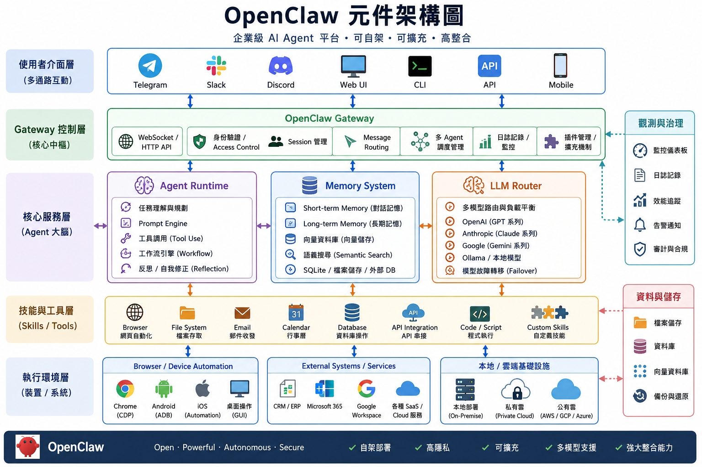

# 2a｜OpenClaw：自主 AI Agent 框架

> NVIDIA DGX Spark Playbooks 參考：https://build.nvidia.com/spark/openclaw  
> OpenClaw 官方網站：https://openclaw.ai/  
> ⚠️ 本章節的做法與描述與原廠說明不同，原廠網址僅供參考。

---

## 什麼是 OpenClaw？

**OpenClaw** 是一款在 2026 年初爆紅的開源（MIT 授權）AI Agent 框架。  
網友戲稱它為「**養龍蝦**」——因為 OpenClaw 的 Logo 是一隻紅色小龍蝦，名叫 **Molty** 🦞

它不只是像 ChatGPT 那樣的對話機器人，而是能「**動手操作電腦**」的**自主代理人（AI Agent）**。你給它一個目標，它會自己想辦法一步一步完成。

---

## OpenClaw 能做什麼？

### 本機任務自動化
直接在你的電腦上運行，存取並管理檔案、電子郵件、瀏覽器、終端機與各類軟體。

### 多通路整合
可連接 **Telegram、Discord 或 Slack** 等通訊軟體，讓你直接在手機上像聊天一樣對它下指令。

### 自主規劃與執行
能將複雜目標拆解為小步驟，自動執行完整的端到端工作流程。

**範例：** 監控 Email → 抓取數據 → 產出報告 → 自動發送到 Slack

### 持久記憶
具有記憶功能，可保留使用者互動歷史，提供個人化服務。

---

## 應用場景範例

| 場景 | 說明 |
|------|------|
| 社群公關分身 | 自動回覆粉專留言，套用你設定的語氣與規則 |
| 智慧採購 | 監控電商平台，價格低於預算時自動下單 |
| 自動化發佈 | 自動將文章改寫成不同平台（FB / IG / LinkedIn）風格並發布 |
| 日常助手 | 定期整理信箱、排程日曆、監控競爭對手網站 |

---

## 運作方式與架構

OpenClaw 採用「**自託管（Self-hosted）**」模式，運行在你自己的硬體上（如 GB10、個人電腦或伺服器），速度快且完全遵循你設定的規則，資料不外傳。

整體流程：

```
使用者下指令（Input）
       ↓
Gateway / Agent 核心（Brain）：接收指令，與 LLM 互動，解析意圖
       ↓
Hooks 系統（Action）：自動觸發對應腳本，無需修改核心程式碼
       ↓
Skills / Plugins（Tools）：執行具體任務（瀏覽器、Email、API 等）
```

---

## 核心元件說明



### 1. 使用者介面層

多通路互動入口，支援 **Slack / Telegram / Discord / Web**，提供聊天與任務下達的管道。

### 2. Gateway 控制層

OpenClaw 的**核心中樞**，負責：
- 處理所有訊息流
- 管理身份驗證、Session 與路由

### 3. Agent Runtime

AI Agent 的**思考核心**，負責：
- 任務拆解
- 工作流程管理
- 決策與執行

### 4. Memory System

**長短期記憶模組**，可持續保存對話上下文，支援知識庫型應用，讓 AI 記住你是誰、你想要什麼。

### 5. LLM Router

**模型調度層**，支援：
- 多模型切換
- 本地 / 雲端模型混合使用
- 成本與效能優化

### 6. Skills / Tools

OpenClaw **最大的價值所在**，透過外掛元件擴展 AI 的能力，可接入：

- 瀏覽器（Browser）
- 電子郵件（Email）
- 外部 API
- 檔案系統（File System）
- 自動化腳本（Automation Scripts）

### 7. Device / Browser Nodes

**實際執行操作**的節點，可控制網頁、手機應用與系統層級操作。

### 養龍蝦 需要什麼？
1.一個裝龍蝦的系統/電腦.. windows , linux, MACOS ...實體機 虛擬機 容器都可以<br>
2.LLM Provider（模型供應商 / API Provider）： 接雲端服務供應商（OpenAI,Claude.....） , <br>
                                          地端自建 (ollama,LM Studio,vllm, Nvidia NIM)<br>
                                          
透過先前章節的作業 已經有做以下:<br>
1a-Open WebUI with Ollama<br>
1e-LM Studio on DGX Spark<br>
本章將利用在 GB10上安裝OpenClaw 接上 1a-Open WebUI with Ollama 來進行演示


