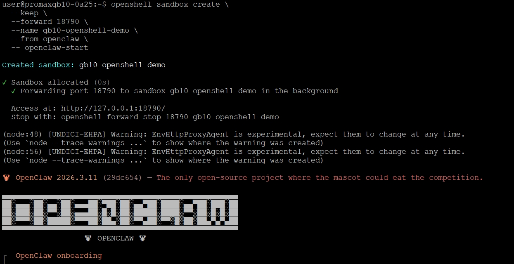
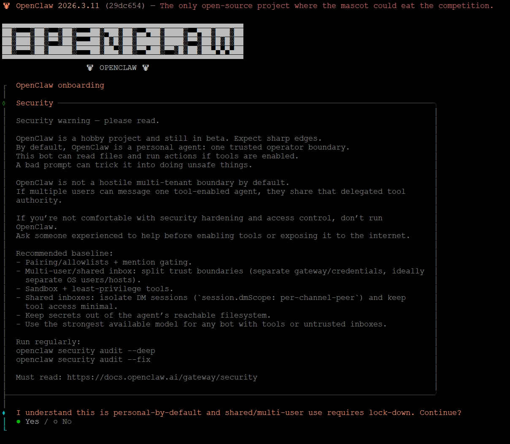
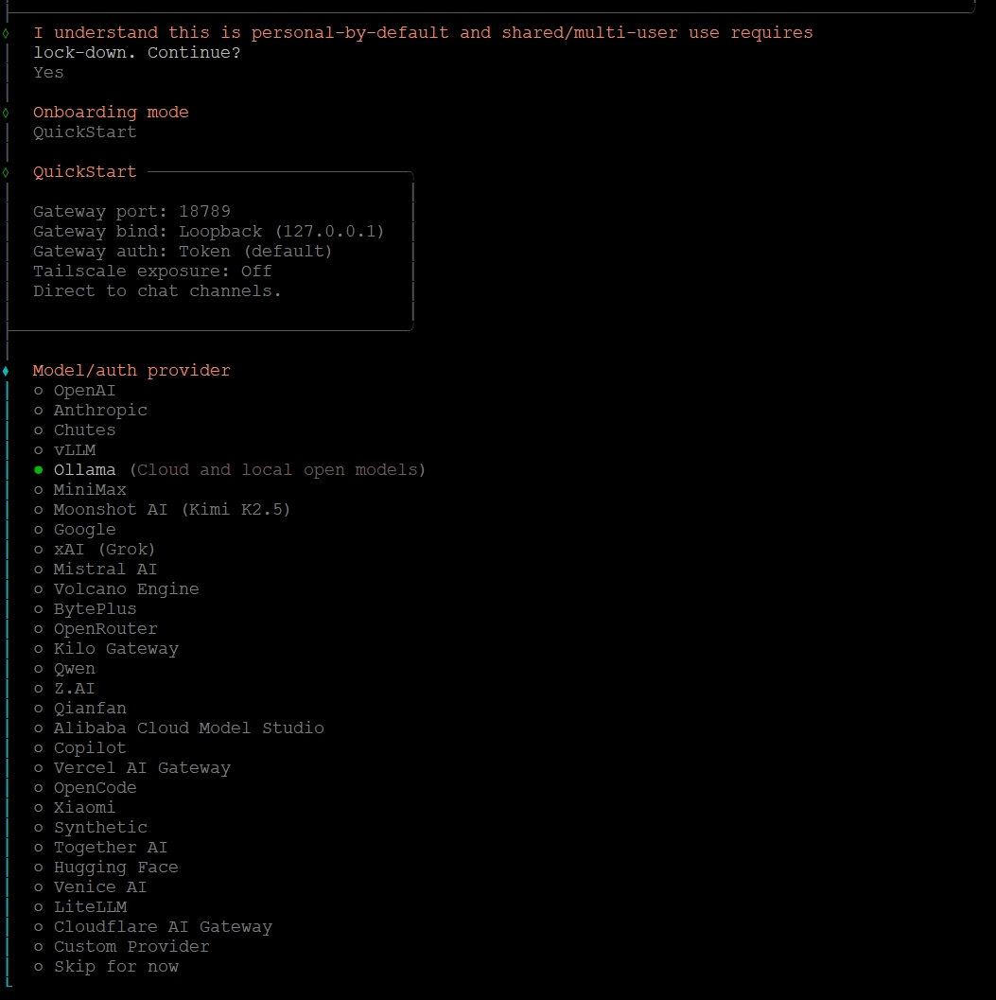
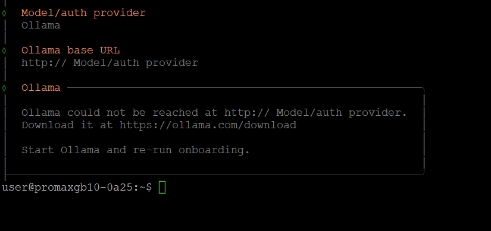
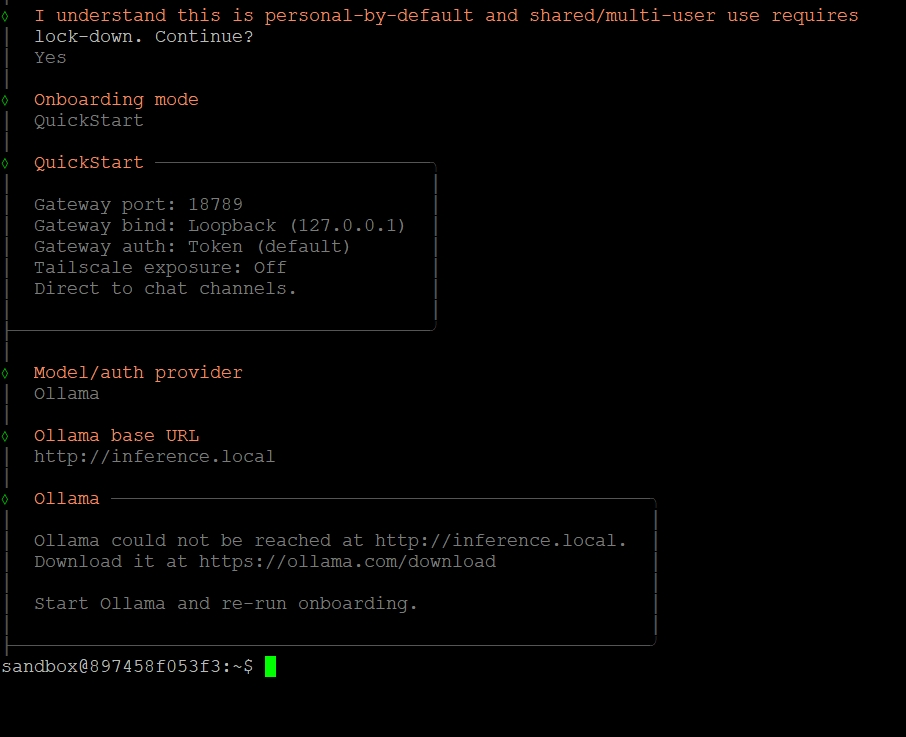
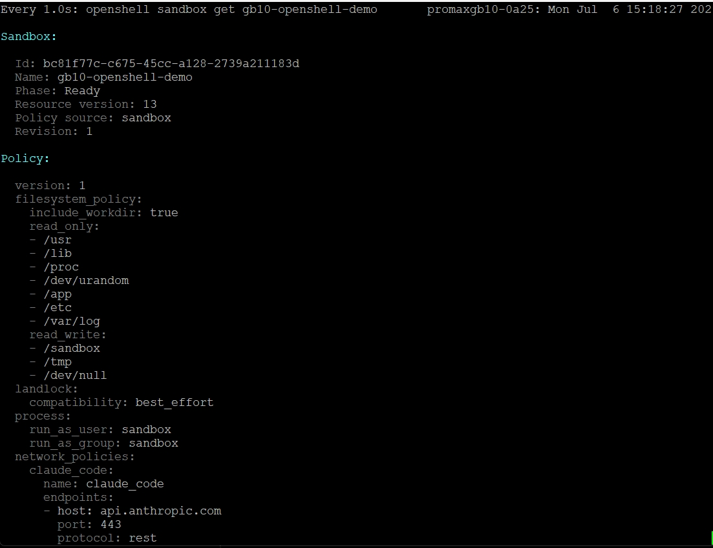
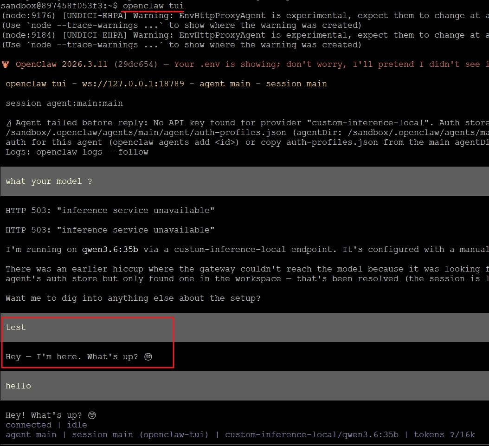
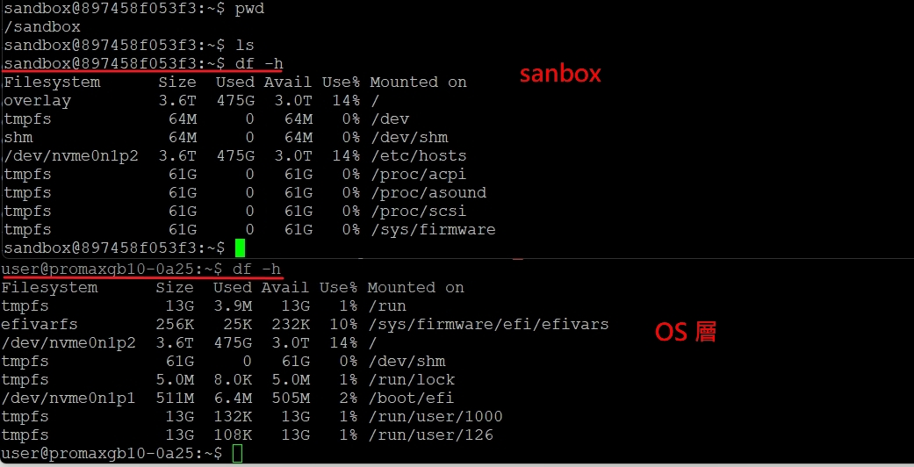

本操作說明與nvidia playbooks Instructions 有所差異, 請進行比對
https://build.nvidia.com/spark/openshell/instructions


依據NVIDIA OpenShell Developer Guide 
# 安裝 OpenShell
使用一條指令即可安裝 OpenShell：

```
curl -LsSf https://raw.githubusercontent.com/NVIDIA/OpenShell/main/install.sh | sh
```
該腳本會偵測您的作業系統，並使用您作業系統自帶的套件管理器安裝 OpenShell 命令列介面和網關。然後，它會啟動本機網關伺服器，以便您可以開始建立沙箱。


以GB10安裝為例，Ubuntu 系統上，安裝腳本使用 Debian 軟體套件。此 Debian 軟體包會安裝openshell命令列介面 (CLI)、openshell-gateway守護程式、虛擬機器沙箱支援以及 systemd 使用者服務。

Linux 用戶服務監聽端口https://127.0.0.1:17670，從內建預設值啟動，並在網關啟動前產生本地 mTLS 封包。~/.config/openshell/gateway.toml僅當需要覆寫這些預設值時才建立該服務。

CLI 從以下位置讀取客戶端包~/.config/openshell/gateways/openshell/mtls/：

安裝程式會自動啟動該服務。當您需要檢查、重新啟動或停止網關服務時，請使用 systemd 使用者命令：

```
systemctl --user status openshell-gateway
systemctl --user restart openshell-gateway
journalctl --user -u openshell-gateway -f
```

為使用戶服務在登出後繼續運行，請啟用 linger：

```
sudo loginctl enable-linger $USER
```

OpenShell cli 的參數有可能因為版本異動而有所差異 , 強烈建議要參考help說明

# 使用 OpenShell 建 sanbox 沙箱
注意：先確保之前已經建立的ollama正常運作且有QWEN模型 , 因為之前已經使用 process方式在GB10 OS 安裝openclaw port 18789 故下面的步驟改為18790
以下程序會建立一個sanbox 名為gb10-openshell-demo  port 18790 會forared接著會進行openclaw的設定程序 
```
openshell sandbox create \
  --keep \
  --forward 18790 \
  --name gb10-openshell-demo \
  --from openclaw \
  -- openclaw-start
```
sanbox 開始建立 , 使用port 18790 forwarding , 接著開始做openclaw ,  目前自動帶出的是 openclaw 2026.3.11版本<br>
<br>

openclaw onboarding 的設定 , 這邊的設定如果打錯或跳出 , 就在sanbox 重新做openclaw onboarding , 沒錯此時已經是在sanbox了<br>
<br>

Model 的選擇: 對接現有的ollama 或者是選擇Custom Provider 自行輸入<br>
<br>

接下來這張圖是一個錯誤示範, ollama base URL 其實沒有正確輸入導致的錯誤直接跳出<br>
<br>
這邊有一問題點 解釋下圖還是錯的原因<br>
<br>
如果目標是 https://inference.local,proxy 會在政策評估之前就把它當作「受管理的推論流量」特殊處理<br>

注意看 原playbooks  https://build.nvidia.com/spark/openshell/instructions  SETP 9 說明： 
If you understand and agree, use the arrow key of your keyboard to select 'Yes' and press the Enter key.
Quickstart vs Manual: select Quickstart and press the Enter key.
Model/auth Provider: Select Custom Provider, the second-to-last option.  << 此處應改用 Custom Provider
API Base URL: update to https://inference.local/v1                       << API URL 應填入 https://inference.local/v1  


驗證方式可使土： 在 sandbox 內部(openshell sandbox connect gb10-openshell-demo)重新測試連線:

```
curl -v http://inference.local/v1/models
```

所以MODEL的設定項目使用如下

```
Model/auth provider
│  Custom Provider
│
◇  API Base URL
│  https://inference.local/v1
│
◇  How do you want to provide this API key?
│  Paste API key now
│
◇  API Key (leave blank if not required)
│  ollama
│
◆  Endpoint compatibility
│  ● OpenAI-compatible (Uses /chat/completions)
│  ○ Anthropic-compatible
│  ○ Unknown (detect automatically)
```
如果沒有其它錯誤就是接到下方
```
Endpoint compatibility
│  OpenAI-compatible
│
◇  Model ID
│  qwen3.6:35b   
│
◇  Verification successful.
│
◆  Endpoint ID
│  custom-inference-local█
└
```
「Verification successful.」——這代表 OpenClaw 剛剛已經成功打通 inference.local、驗證過 qwen3.6:35b 這個模型真的能回應了。 
整條推論路徑正式打通。Endpoint ID 這一步是幫這個設定取個代稱,目前已經自動帶入預設值 custom-inference-local,這個名字本身沒有特殊限制,直接按 Enter 沿用預設值就好,不需要自己重打:按 Enter（保留 custom-inference-local）
接下來可以先不要管openclaw 的 skill hook 把整個 openclaw onboarding 先確認在openshell可以正常運作再說

另外開啟另一個SSH CLI  watch openshell sandbox connect gb10-openshell-demo 
```
watch openshell sandbox connect gb10-openshell-demo
```
 
觀察結果 sanbox 有運作 , policy 看起來是有套用

切換到原先已經在sanbox的視窗 , 進入 openclaw tui 龍蝦的文字TUI界面進行測試確認有接到Model且可以運作

```
openclaw tui
```
 


如果另外加開CLI要進入sanbox 指令如下
```
openshell sandbox connect gb10-openshell-demo
```
觀察在sanbox 的環境

sandbox@897458f053f3:~$ pwd
/sandbox

 

到此 openshell sanbox 作業完成 , 至於 sanbox Gateway , Provider, Policys , Inference Routing 等細節先不深入
有興趣請參考 https://docs.nvidia.com/openshell/about/overview

或者接著做STEP 10之後的指令  細節請參考 
https://build.nvidia.com/spark/openshell/instructions


openshell這一章節是一個概念架構的操作, 在過渡到 nemoclaw 之前 的架構理解,同時應用了先前的ollama LLM ,
強列建議做這個之前一定要有 OS 層建過openclaw的概念 https://github.com/install-safe-press/gb10-playbooks/tree/main/2a-OpenClaw 
因為在本章節的過程中有很多必需手動調整或者是遇到錯誤,可能沒有寫在上述. 各位環境可能不一定一樣如果遇到請求助Gen AI 協助排除

下一章節要進入到 nemoclaw .

# 我的手動架構openshell+openclaw vs. NVIDIA NemoClaw：差在哪裡？

這次做的，是**用 OpenShell 原生 CLI，一步步手動組出跟 NemoClaw 類似效果的環境**。
而 **NemoClaw 是 NVIDIA 官方包好的「一鍵版」**，本質上是在 OpenShell 之上，多包了一層自動化與治理邏輯。
---

## 架構對照表

| 層面 | 我手動做的（本次流程） | NVIDIA NemoClaw |
|---|---|---|
| **建立方式** | 手動下 `openshell provider create`、`openshell sandbox create --from openclaw`、`openshell inference set` 等一連串指令 | `nemoclaw onboard` 單一指令，內部自動完成同樣一連串 OpenShell 操作 |
| **設定來源** | 每一步都是我自己臨時決定、臨時輸入 | 由一份**版本化的 Blueprint（YAML 套件）**統一定義 sandbox 樣貌、預設政策、推論設定，且有 digest 驗證，防止套件被竄改 |
| **Sandbox 內的整合層** | 純 OpenClaw 本身，沒有任何額外插件 | 內建一個 **TypeScript Plugin**，跑在 sandbox 內的 OpenClaw 裡，提供 `/nemoclaw` 指令、並在每個 agent turn 前自動注入「目前 sandbox 名稱、政策摘要、檔案系統政策摘要」這類上下文，讓 agent 隨時知道自己被關在什麼樣的籠子裡 |
| **推論路由踩的坑** | 我親手撞到 `inference.local` 必須用 `https`、選錯 provider 類型等問題，全部手動排查解決 | Blueprint 已經預先包好正確的 provider 設定與 endpoint 格式，這幾類坑理論上在標準流程裡不會出現 |
| **推論後端選擇** | 我自己接的是主機上既有的 Ollama（`qwen3.6:35b`） | 提供三種內建 profile：**NVIDIA Cloud（Nemotron 3 Super 120B）**、**本地 NIM**、**本地 vLLM**，並有一個 **Model Router**，可以依照資料隱私需求，動態決定這次請求要留在本機、還是送到雲端 |
| **憑證存放** | 我手動用 `openshell provider create` 建立、`paste-token` 補上 API key | 同樣存在 OpenShell gateway store（不落地到主機硬碟），但由 NemoClaw 自動管理注入時機，不需要手動補 |
| **API Key 卡住的問題** | 我親手遇到「onboarding 精靈跳過 API Key 欄位，導致 agent 認證失敗」這個坑，另外手動補救 | Blueprint 化的 onboarding 流程理論上會確保這一步不會被跳過或遺漏 |
| **重建/還原** | 我手動 `sandbox create`，設定散落在好幾次指令歷史裡，難以重現 | `nemoclaw onboard` 可重複執行，**用同一份 Blueprint 重建出一模一樣的 sandbox**，具備可重現性 |
| **底層計算驅動** | 這次環境確認是 **Docker 驅動**  | NemoClaw 預設同樣走 **Docker 驅動**，文件上明確寫出「NemoClaw 的預設 Docker 驅動拓樸不會把 sandbox 放進內嵌 k3s 叢集」——這點跟我這次環境的實際觀察一致 |
| **官方支援的 Agent** | 只測了 OpenClaw | 除了 OpenClaw，還官方支援 **Hermes**，走的是不同的「通用 agent manifest」整合路徑，而非 OpenClaw 專屬插件路徑 |
| **監控/除錯工具** | 手動用 `openshell term`、`openshell logs`、curl 逐條排查 | 提供自己的 `status`、`logs`、TUI，且明確支援「在 TUI 裡即時核准/拒絕 agent 的網路請求」這種互動式治理功能 |
| **卸載** | 需要自己手動 `sandbox delete`、清理 provider | 提供 `nemoclaw uninstall`，版本綁定、離線執行，一條指令清乾淨（含連 pull 下來的 Ollama 模型都能一併移除） |

---

## 為什麼值得先手動做一遍，再去看 NemoClaw

這次手動排查踩到的坑（CLI 子命令改名、`inference.local` 只認 `https`、provider 選型錯誤、API Key 認證路徑問題），**正好都是 Blueprint 幫你「包起來」的那些細節**。
先手動走過一遍，能清楚看懂 NemoClaw 這層自動化究竟省下了什麼工： > 「先讓你看到手動組裝有多少眉角，你才會真正明白 NemoClaw 這個一鍵安裝，包了多少層保護在裡面。」
