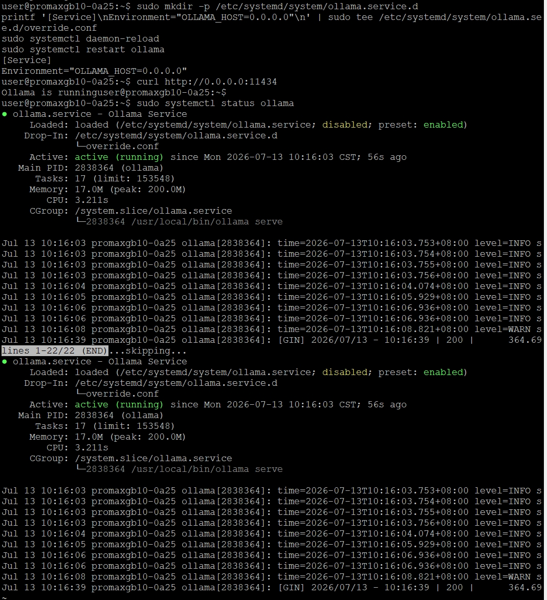
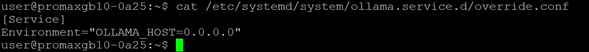
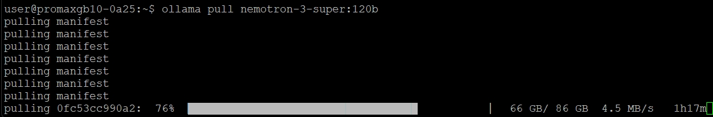

# 使用本地 LLM 運行 NemoClaw

參考文件
https://build.nvidia.com/spark/nemoclaw <br>
https://www.nvidia.com/en-us/ai/build-a-claw <br>
https://www.nvidia.com/zh-tw/ai/build-a-claw <br>

# 在 GB10 上部署 NemoClaw：打造地端安全 AI Agent
## 為什麼要做這件事
### 背景
**OpenClaw**  一個可以長時間自主運行的 AI Agent 框架，但直接跑 OpenClaw 有一個問題：它預設沒有安全防護層，Agent 一旦被 prompt injection 攻擊或誤操作，可能會存取到不該碰的檔案、發出不該發的網路請求。

### NemoClaw 要解決的問題
NemoClaw 是 NVIDIA 推出的開源參考堆疊，核心目的是：
1. **安全性** — 把 OpenClaw 包進 **OpenShell** runtime 執行，提供 Landlock + seccomp + network namespace 隔離，限制 Agent 能碰的檔案系統範圍與網路對外連線
2. **完全地端運行** — 搭配 **Ollama** 跑 **Nemotron 3 Super (120B)** 模型，所有推論都在自己的 GB10 上完成，不需要把資料送到雲端
3. **降低上手門檻** — 一行安裝指令，自動處理 Node.js、OpenShell、CLI 安裝，搭配互動式精靈完成設定
### 為什麼選 GB10
GB10 的 128GB unified memory 剛好可以把 120B 參數的模型整個放進記憶體跑，不用像一般顯卡受限於 VRAM 大小，這是這篇實作選擇在 Spark 上做的原因。
---
## 整體流程架構
### 流程概覽
```
┌─────────────────────────────────────────┐
│  Phase 0：環境確認                       │
│  Ubuntu 24.04 / GB10 GPU / Docker 28.x+ │
└──────────────────┬──────────────────────┘
                   ↓
┌─────────────────────────────────────────┐
│  Phase 1：前置準備（Host 端）            │
│  Step 1  Docker + NVIDIA runtime 設定   │
│  Step 2  安裝 Ollama（systemd 管理）     │
│  Step 3  Ollama pull Nemotron 3 Super   │
└──────────────────┬──────────────────────┘
                   ↓
┌───────────────────────────────────────────┐
│  Phase 2：安裝 NemoClaw（Sandbox 端）      │
│  Step 4  一行指令裝 NemoClaw               │
│         → 自動裝 Node.js + OpenShell + CLI │
│         → onboard 精靈建立 sandbox         │
│  Step 5  連進 sandbox，驗證推論路由         │
│  Step 6  CLI 對話測試                      │
│  Step 7  互動式 TUI                        │
│  Step 8  開啟 Web UI                       │
└──────────────────┬────────────────────────┘
                   ↓
┌────────────────────────────────────────────┐
│  Phase 3：選用功能（可跳過）                 │
│  Step 9-10  Telegram Bot + cloudflared     │
└──────────────────┬─────────────────────────┘
                   ↓
┌────────────────────────────────────────────┐
│  Phase 4：清理與解除安裝（可跳過）           │
│  Step 11-12  停止服務 / uninstall           │
└────────────────────────────────────────────┘
```

### 兩個關鍵角色分工
| 元件 | 跑在哪裡 | 負責什麼 |
|---|---|---|
| **Ollama** | Host（GB10 主機本身） | 純推論引擎，載入 Nemotron 3 Super 120B 模型權重，對外開 11434 port |
| **NemoClaw / OpenShell** | Docker container（sandbox） | Agent 執行環境，提供檔案系統/網路/程序隔離，透過內部路由呼叫 Host 上的 Ollama |

這個分工是整篇文章的核心概念——**推論引擎跟 Agent 執行環境是分離的兩層**，中間靠 NemoClaw 的 inference router 串接（`https://inference.local/v1/models`）。

### 為什麼要先裝 Ollama 才裝 NemoClaw
因為 NemoClaw 的 onboard 精靈在問「選擇推論來源」時，需要偵測到本地已經有一個跑起來的 Ollama 服務才能選，所以順序不能顛倒。
---

## Phase 0：環境確認
在動手安裝之前，先確認手上的(GB10)環境符合需求，避免裝到一半才發現版本不對。
### 硬體需求
- ** GB10 **，可接鍵盤螢幕操作，或透過 SSH 遠端連線

### 軟體需求
- 全新安裝、且已更新到最新版本的 **DGX OS**（底層是 Ubuntu 24.04）

### 驗證指令

在終端機依序執行以下三行指令：

```bash
head -n 2 /etc/os-release
nvidia-smi
sudo docker info --format '{{.ServerVersion}}'
```

### 預期結果


| 檢查項目 | 指令 | 預期輸出 |
|---|---|---|
| 作業系統版本 | `head -n 2 /etc/os-release` | 顯示 `Ubuntu 24.04` |
| GPU 驅動與型號 | `nvidia-smi` | 看得到 **NVIDIA GB10** GPU 資訊 |
| Docker 版本 | `sudo docker info --format '{{.ServerVersion}}'` | **28.x** 以上 |

### 補充說明

- `nvidia-smi` 在 GB10 上有個特別的地方：因為 CPU 與 GPU 共用同一塊 unified memory（128GB LPDDR5X），不是傳統獨立顯卡架構，所以 `Memory-Usage` 欄位可能會顯示 `Not Supported`，這是**正常現象**，不是錯誤。
- 如果 `docker info` 版本低於 28.x，建議先更新 Docker 再繼續下一步，避免後面 Step 1 設定 NVIDIA container runtime 時出現相容性問題。
- 如果 `nvidia-smi` 完全抓不到 GPU（例如純 CPU 資訊），代表驅動程式或系統映像檔有問題，需要先排除這個狀況才能繼續，因為後續所有推論（Ollama、NemoClaw sandbox）都仰賴 GPU 加速。

---

## Phase 1：前置準備

### Step 1：設定 Docker 與 NVIDIA container runtime

OpenShell 在後續（Step 4）安裝時，其 gateway 會在 Docker 裡執行 k3s 來管理 sandbox 容器。因此必須**提前**在這一步把 Docker 的 **NVIDIA runtime** 與 **host cgroup namespace mode** 設定好，否則等到 Step 4 真正啟動 OpenShell gateway 時會失敗。

#### 1. 設定 Docker 使用 NVIDIA container runtime

```bash
sudo nvidia-ctk runtime configure --runtime=docker
```

#### 2. 設定 cgroup namespace mode 為 host

這一步要修改 `/etc/docker/daemon.json`，用 Python 腳本安全地新增設定值（避免手動編輯 JSON 打錯格式）：

```bash
sudo python3 -c "
import json, os
path = '/etc/docker/daemon.json'
d = json.load(open(path)) if os.path.exists(path) else {}
d['default-cgroupns-mode'] = 'host'
json.dump(d, open(path, 'w'), indent=2)
"
```


#### 3. 重新啟動 Docker 服務

```bash
sudo systemctl daemon-reload
sudo systemctl restart docker
sudo systemctl status docker
```


#### 4. 驗證 NVIDIA runtime 是否正常運作

```bash
sudo docker run --rm --runtime=nvidia --gpus all ubuntu nvidia-smi
```


若指令成功執行，容器內應該要能看到 GB10 GPU 的資訊，代表 GPU 直通設定成功。

#### 5.（若遇到權限問題）將使用者加入 docker 群組

如果執行 `docker` 指令時出現 `permission denied` 錯誤：

```bash
sudo usermod -aG docker $USER
newgrp docker
```

`newgrp docker` 會讓群組變更立即在目前的終端機 session 生效；也可以選擇登出再登入，效果相同。

---

### ⚠️ 重點提醒

> **DGX Spark 使用 cgroup v2。** 到了 Step 4 安裝 NemoClaw 時，OpenShell 的 gateway 會內嵌 k3s 在 Docker 裡執行，需要 host cgroup namespace 的存取權限。如果現在（Step 1）沒有先設定好 `default-cgroupns-mode: host`，等到 Step 4 gateway 啟動時可能會出現 **「Failed to start ContainerManager」** 的錯誤，導致 NemoClaw 安裝失敗。

### 這一步做完後應該確認的事

- [ ] `docker run --rm --runtime=nvidia --gpus all ubuntu nvidia-smi` 執行成功，且看得到 GB10
- [ ] 執行 `docker` 相關指令時不需要每次都加 `sudo`（代表使用者已在 docker 群組中）
- [ ] `/etc/docker/daemon.json` 裡已經有 `"default-cgroupns-mode": "host"` 這個設定值

可以用下面這行快速檢查設定檔內容是否正確寫入：

```bash
cat /etc/docker/daemon.json
```
---

### Step 2 : 安裝 Ollama

Ollama 是這套架構裡的**推論引擎**，跑在 Host（GHB10 主機本身），負責載入並執行 Nemotron 模型。之後 NemoClaw 的 sandbox 容器會透過內部路由連到這個服務，所以必須先在 Host 上裝好、跑起來。

#### 1. 執行官方安裝腳本

```bash
curl -fsSL https://ollama.com/install.sh | sh
```

這行會安裝 Ollama 執行檔，並自動建立一個 systemd service（`ollama.service`），方便後續用 `systemctl` 管理。

#### 2. 設定 Ollama 監聽所有網路介面

預設情況下 Ollama 只會監聽 `127.0.0.1`，NemoClaw 的 sandbox 容器（跑在另一個網路 namespace）連不到。需要建立一個 systemd override，加上 `OLLAMA_HOST=0.0.0.0` 環境變數：

```bash
sudo mkdir -p /etc/systemd/system/ollama.service.d
printf '[Service]\nEnvironment="OLLAMA_HOST=0.0.0.0"\n' | sudo tee /etc/systemd/system/ollama.service.d/override.conf
```

#### 3. 重新載入設定並重啟服務

```bash
sudo systemctl daemon-reload
sudo systemctl restart ollama
```

#### 4. 驗證服務正常運作且監聽正確

```bash
curl http://0.0.0.0:11434
```
預期輸出：
```
Ollama is running
```
如果沒有回應，可以先檢查服務狀態：
```bash
sudo systemctl status ollama
```



若服務沒有啟動，手動啟動：

```bash
sudo systemctl start ollama
```
---

### 這一步做完後應該確認的事

- [ ] `sudo systemctl status ollama` 顯示 `active (running)`
- [ ] `curl http://0.0.0.0:11434` 回傳 `Ollama is running`
- [ ] override 設定檔內容正確：

```bash
cat /etc/systemd/system/ollama.service.d/override.conf
```
應該要看到：

```
[Service]
Environment="OLLAMA_HOST=0.0.0.0"
```

---
### Step 3 : 下載 Nemotron 3 Super 模型
Ollama 服務跑起來之後，接下來要把 **Nemotron 3 Super 120B** 模型權重下載下來。這是 NemoClaw 官方教學指定搭配的模型，參數量 120B，靠 GB10 的 128GB unified memory 才能整個放進記憶體執行。

#### 1. 下載模型

```bash
ollama pull nemotron-3-super:120b
```
模型大小約 **86 GB**，視網路連線速度。下載過程中會顯示進度條，請預留半天直接放著跑，先去做別的事。


#### 2. 預先載入模型到記憶體

下載完成後，先手動跑一次，讓 Ollama 把權重載入記憶體並做一次初始化：

```bash
ollama run nemotron-3-super:120b
```

進入互動模式後，可以先簡單問一句話測試回應是否正常，例如：

```
>>> 你好，請簡單自我介紹
```

測試完成後，輸入 `/bye` 離開：

```
>>> /bye
```

#### 3. 確認模型已經在本地清單中

```bash
ollama list
```

預期輸出應該要看到類似這樣的一行：

```
NAME                       ID              SIZE      MODIFIED
nemotron-3-super:120b      xxxxxxxxxxxx    87 GB     x minutes ago
```

---

### ⚠️ 重點提醒

> 第一次執行 `ollama run` 載入 120B 模型時，回應速度可能會比較慢（首次載入權重到記憶體需要時間），屬於正常現象，之後同一個 Ollama 服務再次呼叫這個模型會快很多，因為權重已經常駐在記憶體。

> 下載前建議先確認硬碟可用空間至少有 **100GB** 以上（87GB 模型本體 + 額外操作空間），可以用以下指令檢查：
> ```bash
> df -h /
> ```

### 這一步做完後應該確認的事

- [ ] `ollama pull nemotron-3-super:120b` 完整下載完成，沒有中斷錯誤
- [ ] `ollama run nemotron-3-super:120b` 可以正常對話、有收到回應
- [ ] `ollama list` 可以看到 `nemotron-3-super:120b` 出現在清單中，且大小約 87GB

---

## Phase 2：安裝並啟動 NemoClaw

前置準備（Docker/NVIDIA runtime、Ollama、Nemotron 3 Super 模型）都完成後，接下來這一步是整個流程的核心——一行指令裝好 NemoClaw 本體。

### 官方頁面資訊摘要

| 項目 | 內容 |
|---|---|
| 頁面標題 | NemoClaw with Nemotron 3 Super and Telegram on DGX Spark |
| 預估時間 | 30 分鐘 |
| 標籤 | AI Agent、DGX、NemoClaw、Nemotron 3 Super、Ollama、OpenShell、Spark、Telegram |
| 原始碼 | [NemoClaw on GitHub](https://github.com/NVIDIA/NemoClaw) |
| 官方分頁 | [Overview](https://build.nvidia.com/spark/nemoclaw/overview) / [Instructions](https://build.nvidia.com/spark/nemoclaw/instructions) / [Troubleshooting](https://build.nvidia.com/spark/nemoclaw/troubleshooting) |

官方頁面在 Phase 1 開頭有特別註明：

> 這些步驟是為了在全新的 GB10 上準備好 NemoClaw 執行環境。**如果 NVIDIA runtime、Ollama 都已經設定好了，可以直接跳到 Phase 2。**

也就是說，如果你（跟我們前面一路走過來一樣）已經完成 Step 1~3，接下來就是正式進入 **Phase 2** 的核心步驟。

### Step 4：安裝 NemoClaw

這一行指令會處理所有事情：安裝 Node.js（若尚未安裝）、安裝 OpenShell、複製最新穩定版 NemoClaw、建置 CLI，並執行 onboard 精靈來建立 sandbox。

```bash
curl -fsSL https://www.nvidia.com/nemoclaw.sh | bash
```

#### Onboard 精靈會依序詢問這些設定

**1. Sandbox 名稱**

取一個名稱（例如 `my-assistant`）。**限制：只能用小寫英數字加連字號**。

**2. 推論來源（Inference provider）**

選擇 **Local Ollama**。

**3. 模型（Model）**

選擇 **nemotron-3-super:120b**（就是我們在 Step 3 已經下載好的那個）。

**4. 訊息通道（Messaging channels）**

如果要接 Telegram bot，這裡選 `telegram`，並貼上先前跟 [@BotFather](https://t.me/BotFather)申請好的 bot token。
如果這步先跳過，之後要啟用 Telegram，必須**重新執行安裝程序來重建 sandbox**，不能事後補加。

**5. 政策預設（Policy presets）**

出現提示時按 **Y** 接受建議的預設值即可。

---

### ⚠️ 重點提醒

> **Telegram 必須在這一步的 onboard 精靈中就設定好。** 
channel plugin 和 bot token 是在 sandbox 建立當下就寫進容器內部的，事後無法透過在 host 上設定環境變數的方式補加到既有的 sandbox。

### 安裝完成後的輸出畫面  NemoClaw 完整安裝成功了 

完成後會看到類似這樣的資訊：
```
  ──────────────────────────────────────────────────
  OpenClaw is ready
  Sandbox:  gb10-assistant
  Model:    nemotron-3-super:120b (Local Ollama)
  Start chatting
    Browser:
      http://127.0.0.1:18789/
    Terminal:
      nemoclaw gb10-assistant connect
      then run: openclaw tui
  Authenticated dashboard URL, if needed:
    nemoclaw gb10-assistant dashboard-url --quiet
  Remote access (SSH session detected):
    On your workstation, run:
      ssh -L 18789:127.0.0.1:18789 user@<host>
    Then open the dashboard URL above in your local browser.

  Manage later
    Status:      nemoclaw gb10-assistant status
    Logs:        nemoclaw gb10-assistant logs --follow
    Model:       nemoclaw inference set --model <model> --provider <provider> --sandbox gb10-assistant
    Policies:    nemoclaw gb10-assistant policy-add
    Credentials: nemoclaw credentials reset <KEY> && nemoclaw onboard
  ──────────────────────────────────────────────────
```

終端機視窗要先刷新 PATH 才能用 nemoclaw 指令：
```
source /home/user/.bashrc
export PATH="/home/user/.local/bin:$PATH"
```
或者最簡單的做法：直接開一個全新的終端機視窗。確認指令可以用：
```
nemoclaw gb10-assistant status
```
如何連接進入sanbox 啟用 openclaw tui

■方式一：終端機互動（CLI/TUI）
```
nemoclaw gb10-assistant connect
```
連進 sandbox 之後：
```
openclaw tui
```

■方式二：瀏覽器 Dashboard
因為你是 SSH 連線進來操作，安裝程式也已經偵測到並給了對應提示：
```
ssh -L 18789:127.0.0.1:18789 user@<host>
```
建好 tunnel 後，在你本機瀏覽器打開：
```
nemoclaw gb10-assistant dashboard-url --quiet
```
這個指令會印出帶完整 token 的網址，直接貼到瀏覽器即可。

之後的管理指令整理
|用途|指令|
|---|---|
|查看狀態|nemoclaw gb10-assistant status|
|查看即時| lognemoclaw gb10-assistant logs --follow|
|換模型|nemoclaw inference set --model <model> --provider <provider> --sandbox gb10-assistant|
|補加網路權限|nemoclaw gb10-assistant policy-add|
|重設憑證/重跑| onboardnemoclaw credentials reset <KEY> && nemoclaw onboard|


### 這一步做完後應該確認的事

- [ ] onboard 精靈完整跑完，沒有中途報錯
- [ ] 有看到 Dashboard / Sandbox / Model 的摘要輸出
- [ ] 已經複製保存好帶 token 的 Web UI 網址
- [ ] 終端機輸入 `nemoclaw` 指令，能正常顯示說明（不是 command not found）

---

### 延伸資源（官方頁面附帶連結）

- [NemoClaw GitHub Repo](https://github.com/NVIDIA/NemoClaw)
- [NemoClaw 官方文件](https://docs.nvidia.com/nemoclaw/latest/index.html)
- [OpenClaw 官方文件](https://docs.openclaw.ai)
- [DGX Spark 官方文件](https://docs.nvidia.com/dgx/dgx-spark)
- [DGX Spark 討論區](https://forums.developer.nvidia.com/c/accelerated-computing/dgx-spark-gb10)

### 相關 Playbook（同樣在 build.nvidia.com/spark 上，之後有興趣可以延伸閱讀）

| 分類 | Playbook |
|---|---|
| use case | [Secure Long Running AI Agents with OpenShell on DGX Spark](https://build.nvidia.com/spark/openshell) |
| use case | [OpenClaw 🦞](https://build.nvidia.com/spark/openclaw)（純 OpenClaw，沒有 OpenShell 安全層） |
| inference | [Run models with llama.cpp on DGX Spark](https://build.nvidia.com/spark/llama-cpp) |
| inference | [Nemotron-3-Nano with llama.cpp](https://build.nvidia.com/spark/nemotron)（前面澄清過，跟 NemoClaw 是不同路線，不是前置步驟） |
| tools | [DGX Dashboard](https://build.nvidia.com/spark/dgx-dashboard) |

*（下一部分：Step 5～8 — 連進 sandbox、驗證推論、CLI 對話測試、開啟 Web UI）*


