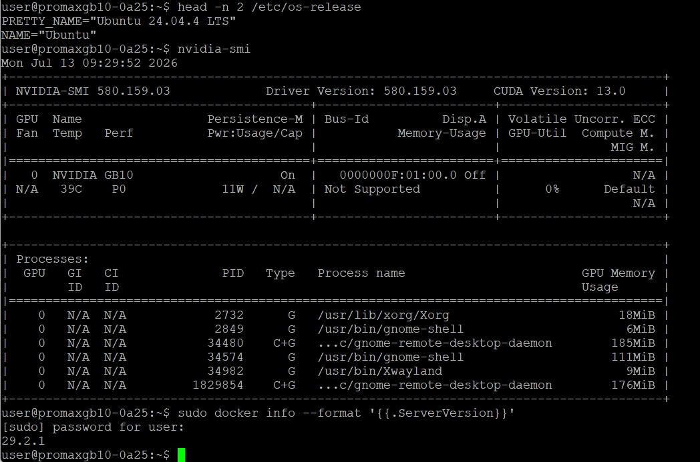
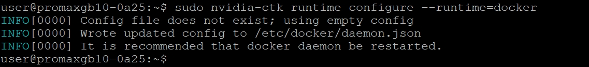
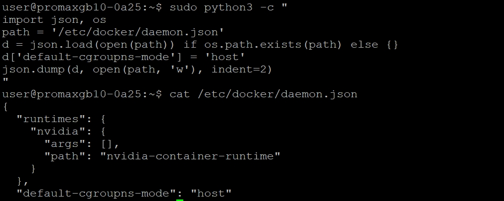
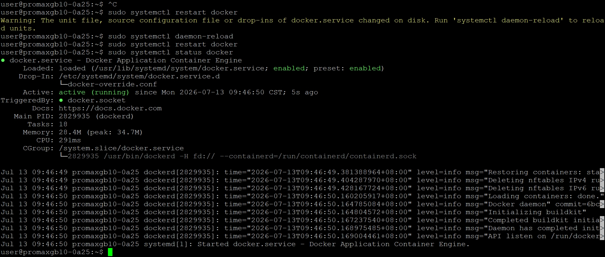
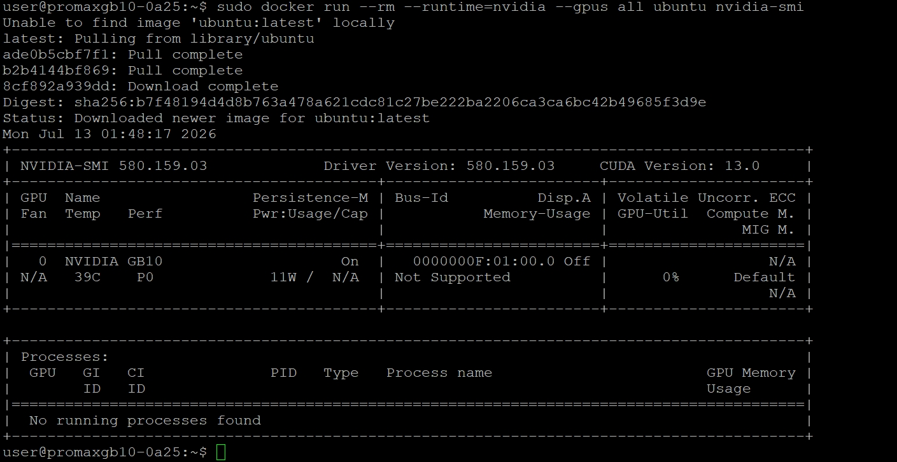

# 使用本地 LLM 運行 NemoClaw

參考文件
https://build.nvidia.com/spark/nemoclaw <br>
https://www.nvidia.com/en-us/ai/build-a-claw <br>
https://www.nvidia.com/zh-tw/ai/build-a-claw <br>

# 在 GB10 上部署 NemoClaw：打造地端安全 AI Agent
## 為什麼要做這件事
### 背景
NVIDIA 在 GTC 2026 發表了 **OpenClaw** —— 一個可以長時間自主運行的 AI Agent 框架，被 Jensen Huang 稱為「個人 AI 的作業系統」。但直接跑 OpenClaw 有一個問題：它預設沒有安全防護層，Agent 一旦被 prompt injection 攻擊或誤操作，可能會存取到不該碰的檔案、發出不該發的網路請求。

### NemoClaw 要解決的問題
NemoClaw 是 NVIDIA 推出的開源參考堆疊，核心目的是：
1. **安全性** — 把 OpenClaw 包進 **OpenShell** runtime 執行，提供 Landlock + seccomp + network namespace 隔離，限制 Agent 能碰的檔案系統範圍與網路對外連線
2. **完全地端運行** — 搭配 **Ollama** 跑 **Nemotron 3 Super (120B)** 模型，所有推論都在自己的 GB10 上完成，不需要把資料送到雲端
3. **降低上手門檻** — 一行安裝指令，自動處理 Node.js、OpenShell、CLI 安裝，搭配互動式精靈完成設定
### 為什麼選 GB10
GB10 的 128GB unified memory 剛好可以把 120B 參數的模型整個放進記憶體跑，不用像一般顯卡受限於 VRAM 大小，這是這篇實作選擇在 Spark 上做的原因。
---
## 整體流程架構
### 流程概覽
```
┌─────────────────────────────────────────┐
│  Phase 0：環境確認                        │
│  Ubuntu 24.04 / GB10 GPU / Docker 28.x+  │
└──────────────────┬────────────────────────┘
                   ↓
┌─────────────────────────────────────────┐
│  Phase 1：前置準備（Host 端）              │
│  Step 1  Docker + NVIDIA runtime 設定     │
│  Step 2  安裝 Ollama（systemd 管理）       │
│  Step 3  Ollama pull Nemotron 3 Super     │
└──────────────────┬────────────────────────┘
                   ↓
┌─────────────────────────────────────────┐
│  Phase 2：安裝 NemoClaw（Sandbox 端）      │
│  Step 4  一行指令裝 NemoClaw               │
│         → 自動裝 Node.js + OpenShell + CLI │
│         → onboard 精靈建立 sandbox         │
│  Step 5  連進 sandbox，驗證推論路由         │
│  Step 6  CLI 對話測試                      │
│  Step 7  互動式 TUI                        │
│  Step 8  開啟 Web UI                       │
└──────────────────┬────────────────────────┘
                   ↓
┌─────────────────────────────────────────┐
│  Phase 3：選用功能（可跳過）                │
│  Step 9-10  Telegram Bot + cloudflared     │
└──────────────────┬────────────────────────┘
                   ↓
┌─────────────────────────────────────────┐
│  Phase 4：清理與解除安裝（可跳過）           │
│  Step 11-12  停止服務 / uninstall          │
└─────────────────────────────────────────┘
```

### 兩個關鍵角色分工
| 元件 | 跑在哪裡 | 負責什麼 |
|---|---|---|
| **Ollama** | Host（GB10 主機本身） | 純推論引擎，載入 Nemotron 3 Super 120B 模型權重，對外開 11434 port |
| **NemoClaw / OpenShell** | Docker container（sandbox） | Agent 執行環境，提供檔案系統/網路/程序隔離，透過內部路由呼叫 Host 上的 Ollama |
這個分工是整篇文章的核心概念——**推論引擎跟 Agent 執行環境是分離的兩層**，中間靠 NemoClaw 的 inference router 串接（`https://inference.local/v1/models`）。
### 為什麼要先裝 Ollama 才裝 NemoClaw
因為 NemoClaw 的 onboard 精靈在問「選擇推論來源」時，需要偵測到本地已經有一個跑起來的 Ollama 服務才能選，所以順序不能顛倒。
---

## Phase 0：環境確認
在動手安裝之前，先確認手上的(GB10)環境符合需求，避免裝到一半才發現版本不對。
### 硬體需求
- ** GB10 **，可接鍵盤螢幕操作，或透過 SSH 遠端連線

### 軟體需求
- 全新安裝、且已更新到最新版本的 **DGX OS**（底層是 Ubuntu 24.04）

### 驗證指令

在終端機依序執行以下三行指令：

```bash
head -n 2 /etc/os-release
nvidia-smi
sudo docker info --format '{{.ServerVersion}}'
```

### 預期結果




| 檢查項目 | 指令 | 預期輸出 |
|---|---|---|
| 作業系統版本 | `head -n 2 /etc/os-release` | 顯示 `Ubuntu 24.04` |
| GPU 驅動與型號 | `nvidia-smi` | 看得到 **NVIDIA GB10** GPU 資訊 |
| Docker 版本 | `sudo docker info --format '{{.ServerVersion}}'` | **28.x** 以上 |

### 補充說明

- `nvidia-smi` 在 GB10 上有個特別的地方：因為 CPU 與 GPU 共用同一塊 unified memory（128GB LPDDR5X），不是傳統獨立顯卡架構，所以 `Memory-Usage` 欄位可能會顯示 `Not Supported`，這是**正常現象**，不是錯誤。
- 如果 `docker info` 版本低於 28.x，建議先更新 Docker 再繼續下一步，避免後面 Step 1 設定 NVIDIA container runtime 時出現相容性問題。
- 如果 `nvidia-smi` 完全抓不到 GPU（例如純 CPU 資訊），代表驅動程式或系統映像檔有問題，需要先排除這個狀況才能繼續，因為後續所有推論（Ollama、NemoClaw sandbox）都仰賴 GPU 加速。

---

## Phase 1：前置準備

### Step 1：設定 Docker 與 NVIDIA container runtime

OpenShell 在後續（Step 4）安裝時，其 gateway 會在 Docker 裡執行 k3s 來管理 sandbox 容器。因此必須**提前**在這一步把 Docker 的 **NVIDIA runtime** 與 **host cgroup namespace mode** 設定好，否則等到 Step 4 真正啟動 OpenShell gateway 時會失敗。

#### 1. 設定 Docker 使用 NVIDIA container runtime

```bash
sudo nvidia-ctk runtime configure --runtime=docker
```

#### 2. 設定 cgroup namespace mode 為 host

這一步要修改 `/etc/docker/daemon.json`，用 Python 腳本安全地新增設定值（避免手動編輯 JSON 打錯格式）：

```bash
sudo python3 -c "
import json, os
path = '/etc/docker/daemon.json'
d = json.load(open(path)) if os.path.exists(path) else {}
d['default-cgroupns-mode'] = 'host'
json.dump(d, open(path, 'w'), indent=2)
"
```


#### 3. 重新啟動 Docker 服務

```bash
sudo systemctl daemon-reload
sudo systemctl restart docker
sudo systemctl status docker
```


#### 4. 驗證 NVIDIA runtime 是否正常運作

```bash
sudo docker run --rm --runtime=nvidia --gpus all ubuntu nvidia-smi
```


若指令成功執行，容器內應該要能看到 GB10 GPU 的資訊，代表 GPU 直通設定成功。

#### 5.（若遇到權限問題）將使用者加入 docker 群組

如果執行 `docker` 指令時出現 `permission denied` 錯誤：

```bash
sudo usermod -aG docker $USER
newgrp docker
```

`newgrp docker` 會讓群組變更立即在目前的終端機 session 生效；也可以選擇登出再登入，效果相同。

---

### ⚠️ 重點提醒

> **DGX Spark 使用 cgroup v2。** 到了 Step 4 安裝 NemoClaw 時，OpenShell 的 gateway 會內嵌 k3s 在 Docker 裡執行，需要 host cgroup namespace 的存取權限。如果現在（Step 1）沒有先設定好 `default-cgroupns-mode: host`，等到 Step 4 gateway 啟動時可能會出現 **「Failed to start ContainerManager」** 的錯誤，導致 NemoClaw 安裝失敗。

### 這一步做完後應該確認的事

- [ ] `docker run --rm --runtime=nvidia --gpus all ubuntu nvidia-smi` 執行成功，且看得到 GB10
- [ ] 執行 `docker` 相關指令時不需要每次都加 `sudo`（代表使用者已在 docker 群組中）
- [ ] `/etc/docker/daemon.json` 裡已經有 `"default-cgroupns-mode": "host"` 這個設定值

可以用下面這行快速檢查設定檔內容是否正確寫入：

```bash
cat /etc/docker/daemon.json
```

---

*（下一部分：Phase 1 — Step 2 安裝 Ollama）*


