# NemoClaw 安裝紀錄（NVIDIA DGX Spark / GB10）

本文件記錄在 NVIDIA DGX Spark（GB10）主機上，透過 `curl | bash` 安裝 NemoClaw，並選用本機 Ollama（`nemotron-3-super:120b`）作為推論後端、建立 OpenClaw sandbox 的完整流程。

---

## 1. 執行安裝腳本

在主機終端機執行安裝指令，腳本會顯示 NemoClaw 的第三方軟體聲明（Apache 2.0 授權），需輸入 `yes` 同意後才會繼續安裝。

```bash
curl -fsSL https://www.nvidia.com/nemoclaw.sh | bash
```

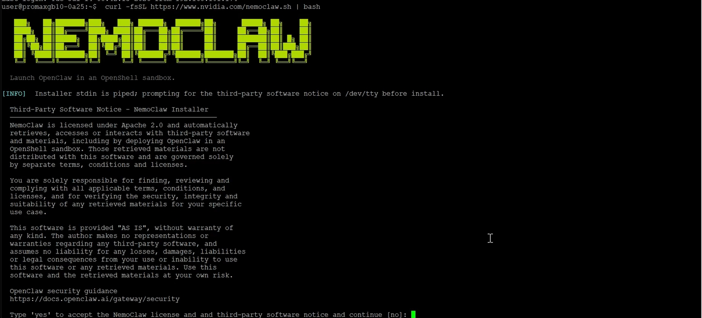

---

## 2. 安裝 Node.js 與 NemoClaw CLI

同意授權後，安裝程式依序完成：

- **[1/3] Node.js**：偵測到系統未安裝 Node.js，透過 `nvm` 安裝 Node.js 22（v22.23.1）
- **[2/3] NemoClaw CLI**：從 GitHub 取得原始碼並建置 CLI 模組、OpenClaw 套件、OpenShell CLI，最後在 `~/.local/bin` 建立 `nemoclaw`、`nemohermes`、`nemo-deepagents` 等指令的 shim
- **[3/3] Onboarding**：進入代理人（Agent）選擇畫面，可選擇 OpenClaw、Hermes Agent 或 LangChain Deep Agents Code

畫面提示選擇代理人（預設 `[1]`）：

```
1) OpenClaw — Gateway-based AI agent with plugin ecosystem (openclaw.ai)
2) Hermes Agent — Self-improving AI agent with learning loop (Nous Research)
3) LangChain Deep Agents Code — Terminal coding agent built on the Deep Agents SDK
```


本次選擇 **1) OpenClaw**。

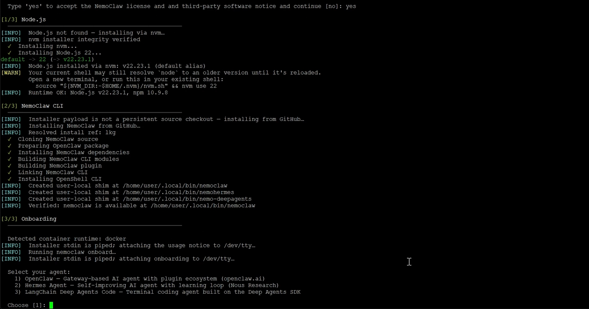

---

## 3. Onboarding 流程：Preflight 檢查與推論供應商設定

輸入 `1` 後進入 `NemoClaw Onboarding` 流程：

**[1/8] Preflight checks** — 檢查項目包含：
- Docker 是否執行中、是否可啟動 bridge containers
- Container DNS 解析
- Docker CDI GPU 支援（偵測到 `/run/cdi/nvidia.yaml`）
- Container runtime 資源：20 vCPU / 121.6 GiB
- openshell CLI 版本：0.0.72
- Port 8080 是否可用（OpenShell gateway）
- 偵測到 **NVIDIA GB10 GPU（124546 MB）**
- Sandbox GPU：enabled (auto)
- Memory OK：124546 MB RAM + 16383 MB swap

**[2/8] Starting OpenShell gateway** — 啟動 OpenShell Docker-driver gateway，並確認 gateway 運作正常。

**[3/8] Configuring inference provider** — 偵測到本機已安裝 Ollama，提供以下推論供應商選項：

```
1) NVIDIA Endpoints
2) OpenRouter
3) OpenAI
4) Other OpenAI-compatible endpoint
5) Anthropic
6) Other Anthropic-compatible endpoint
7) Google Gemini
8) Local Ollama (localhost:11434) — running (suggested)
9) Install vLLM (DGX Spark)
10) Model Router (experimental)
```

本次選擇 **8) Local Ollama**。

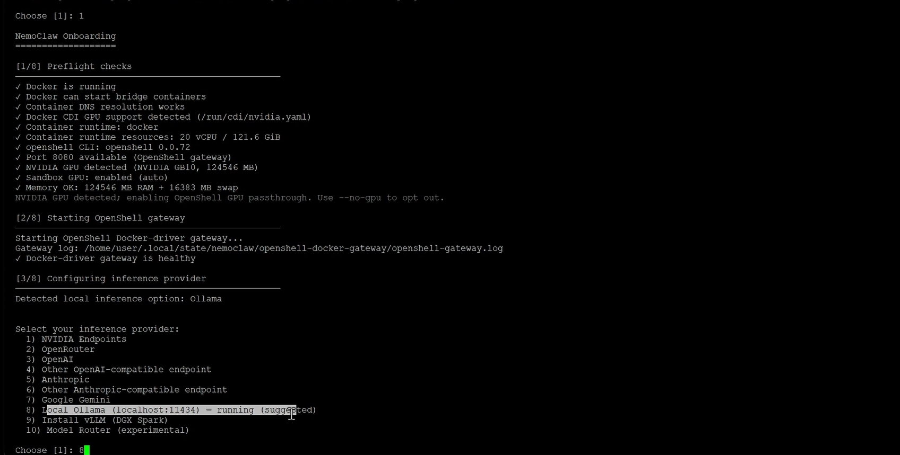

---

## 4. 設定 Ollama 與選擇模型

選擇 Local Ollama 後，安裝程式會設定 Ollama systemd loopback override（`OLLAMA_HOST=127.0.0.1:11434`），此步驟需要 `sudo` 權限來寫入 drop-in 設定、重新載入 systemd 並重啟服務。

設定完成後列出可用的 Ollama 模型：

```
Ollama models:
1) qwen3.6:35b
2) nemotron-3-super:120b
3) Other...
```

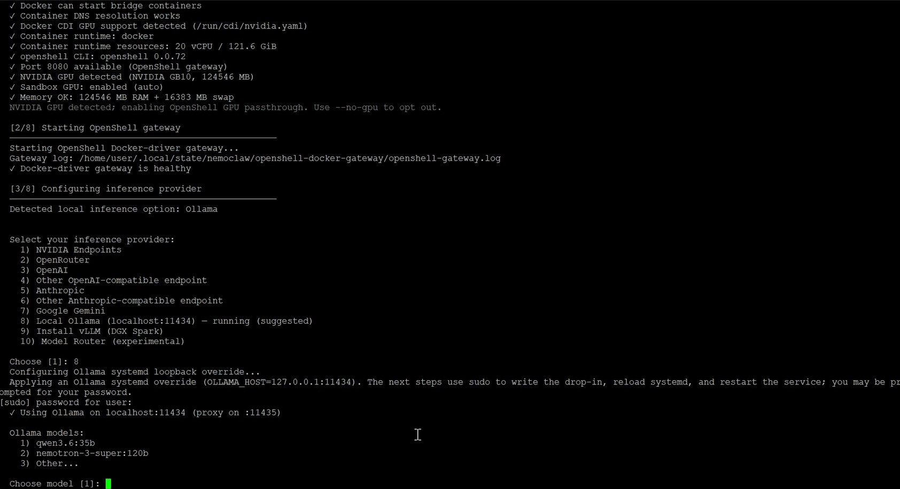

本次選擇 **2) nemotron-3-super:120b**，開始載入模型。

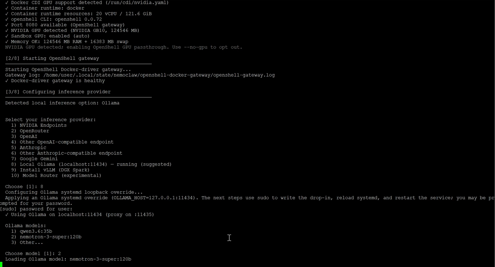

---

## 5. 監控 GPU / 記憶體資源（sparkview）

在模型載入期間，另外開啟監控視窗（`sparkview v0.2.3`）觀察系統資源，可看到 `llama-server`（ollama 使用者）已佔用約 79 GiB GPU 記憶體，UMA（統一記憶體架構）使用率達到 **CRITICAL** 等級：

- GPU 使用率：2%，溫度 42°C，功耗 12.5W
- 記憶體使用：68.9%（83.8Gi / 121.6Gi）
- UMA：狀態為 CRITICAL（some 9.16 / full 9.15）
- CPU：使用率 6.0%

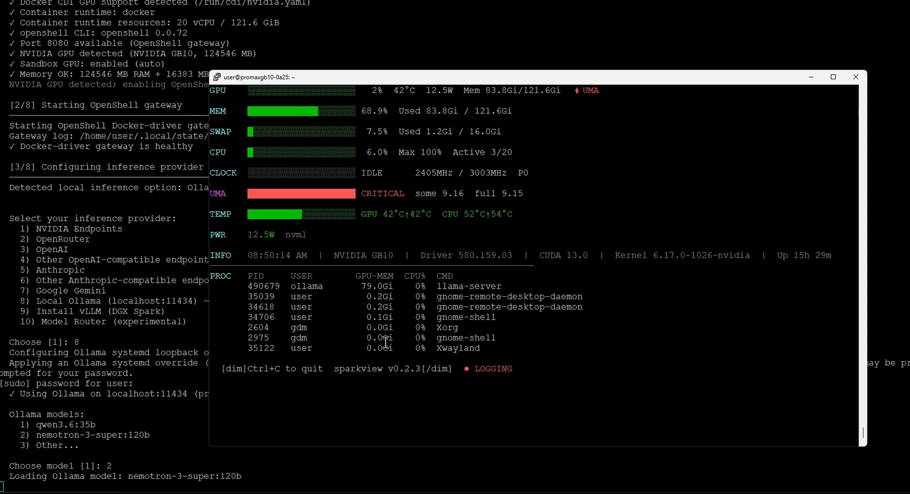

---

## 6. 模型載入逾時，重新選擇模型

首次選擇的 `nemotron-3-super:120b` 因探測逾時未回應（可能仍在載入、對主機而言過大，或服務異常），系統要求重新選擇模型：

```
Selected Ollama model 'nemotron-3-super:120b' did not answer the local probe in time.
It may still be loading, too large for the host, or otherwise unhealthy.
Choose a different Ollama model or select Other.
```

再次選擇 **2) Other...**，並手動輸入模型 id `nemotron-3-super:120b` 重試，這次成功載入，並顯示：

```
Chat Completions API available — OpenClaw will use openai-completions.
✓ Using Ollama runtime context length: 16384 tokens
```

接著輸入 Sandbox 名稱：`gb10-assistant`。

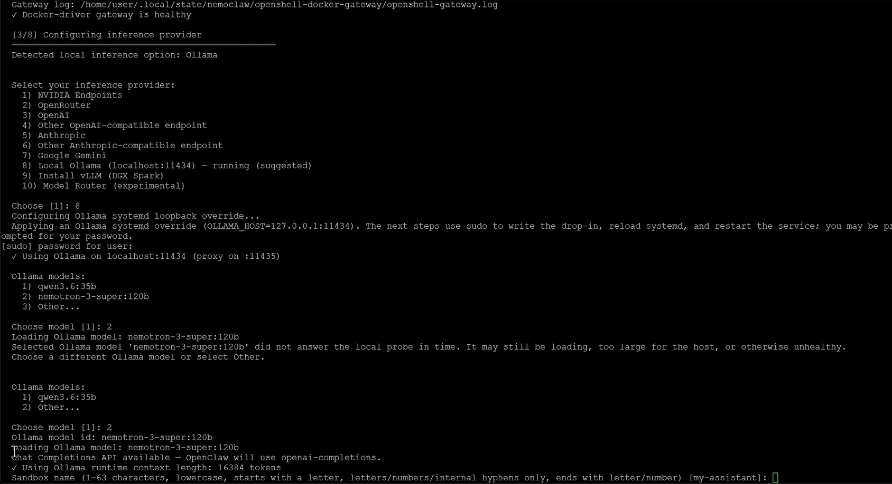

---

## 7. 確認設定並套用

顯示設定總覽供確認：

| 項目 | 內容 |
|---|---|
| Provider | ollama-local |
| Model | nemotron-3-super:120b |
| API key | 不需要（ollama-local） |
| Web search | disabled |
| Managed tools | none |
| Messaging | none |
| Sandbox name | gb10-assistant |

輸入 `y` 套用設定。

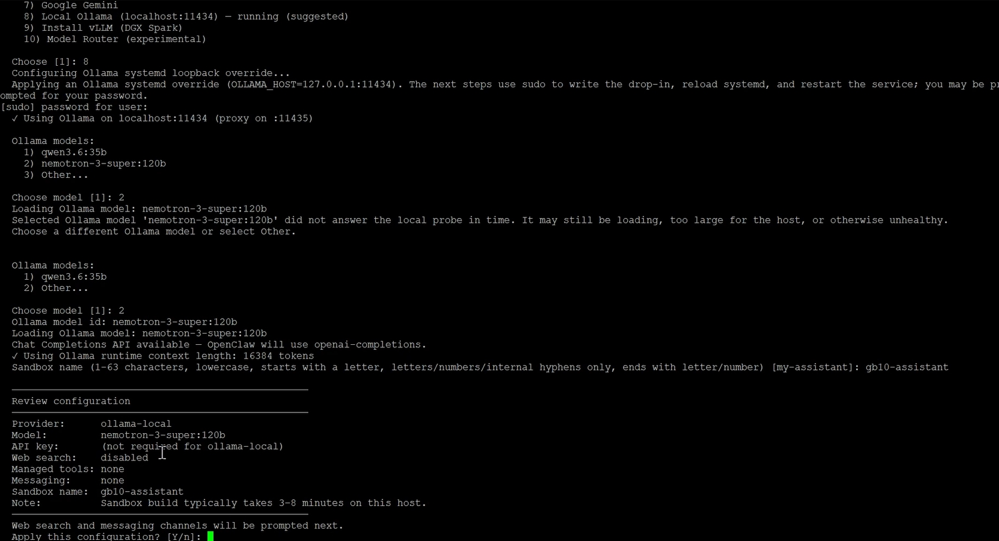

---

## 8. 設定推論路由、Web Search 與 Messaging 頻道

**[4/8] Setting up inference provider** — 建立 `ollama-local` provider，並設定 Gateway 推論路由（route：`inference.local`，model：`nemotron-3-super:120b`，timeout：180 秒）。

Web search 選項本次選擇 **[1] No web search (default)**。

**[5/8] Messaging channels** — 提供以下訊息頻道可勾選：

```
[1] ● telegram — Telegram bot messaging
[2] ● discord — Discord bot messaging
[3] o wechat — WeChat (personal) bot messaging
[4] o slack — Slack bot messaging
[5] o whatsapp — WhatsApp Web messaging (QR pairing)
[6] o teams — Microsoft Teams bot messaging (experimental)
```

本次勾選 **telegram** 與 **discord**。

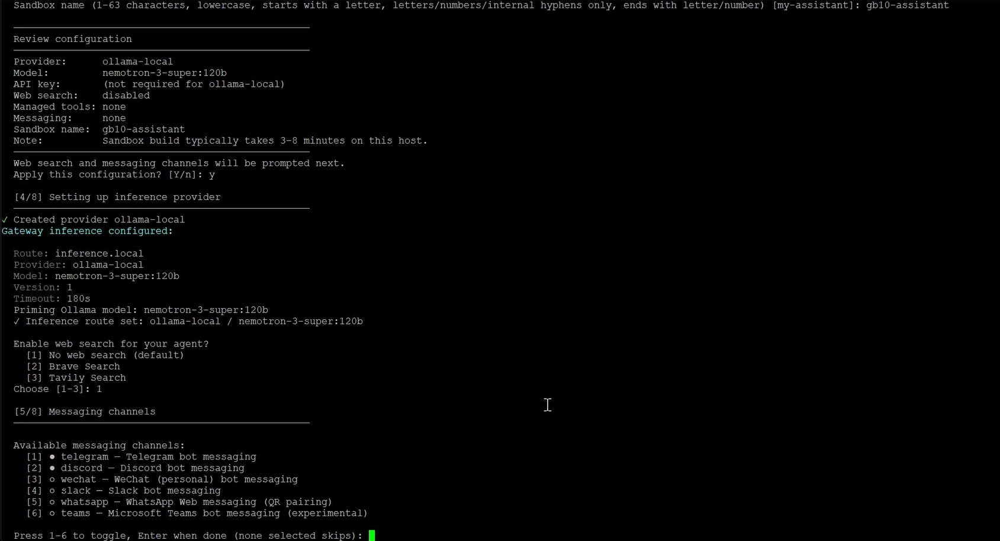

---

## 9. 設定 Telegram / Discord Bot 與資源設定檔

依序輸入 Telegram Bot Token、允許回覆模式（僅 @mention）、Telegram 使用者 ID、群組政策；接著輸入 Discord Bot Token、Server ID、回覆模式（僅 @mention）。

> 註：本次 Telegram reachability check 顯示失敗（Bot API request failed），但流程仍繼續進行。

**Resource profiles** 選項：

```
1) creator (cpu=50%, ram=50%)
2) gamer (cpu=25%, ram=25%)
3) game-developer (cpu=60%, ram=60%)
4) developer (cpu=75%, ram=75%)
5) custom (enter values manually)
6) No profile (OpenShell defaults)
```

本次選擇 **6) No profile**，接著進入 **[6/8] Creating sandbox**，開始建立 `gb10-assistant` sandbox。

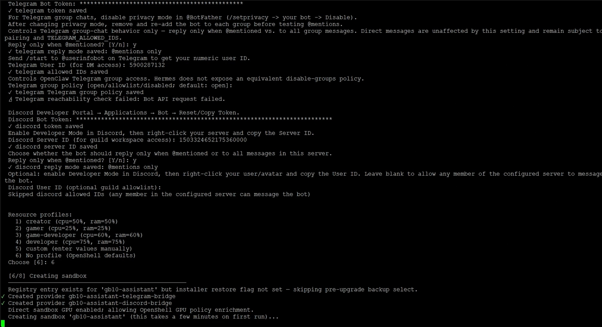

---

## 10. 建置 Sandbox 映像檔

Docker 建置 sandbox 映像檔，過程中出現數則 `SecretsUsedInArgOrEnv` 警告（提醒不要用 ARG/ENV 傳遞機密資料，例如 `NEMOCLAW_PROVIDER_KEY`）。建置完成後：

- GPU proof 全數通過（`nvidia-smi`、`/proc/<pid>/task/<tid>/comm` 寫入、`cuInit(0)` via `libcuda.so.1`）
- Sandbox CUDA 可用性確認成功
- NemoClaw dashboard 啟動完成
- Sandbox `gb10-assistant` 建立成功，Active gateway 設為 `nemoclaw`

**[7/8] Setting up OpenClaw inside sandbox** — OpenClaw gateway 於 sandbox 內啟動成功。

**[8/8] Policy presets** — 進入網路政策層級選擇：

```
[ ] Restricted
[✓] Balanced
[ ] Open
```

本次選擇 **Balanced**。

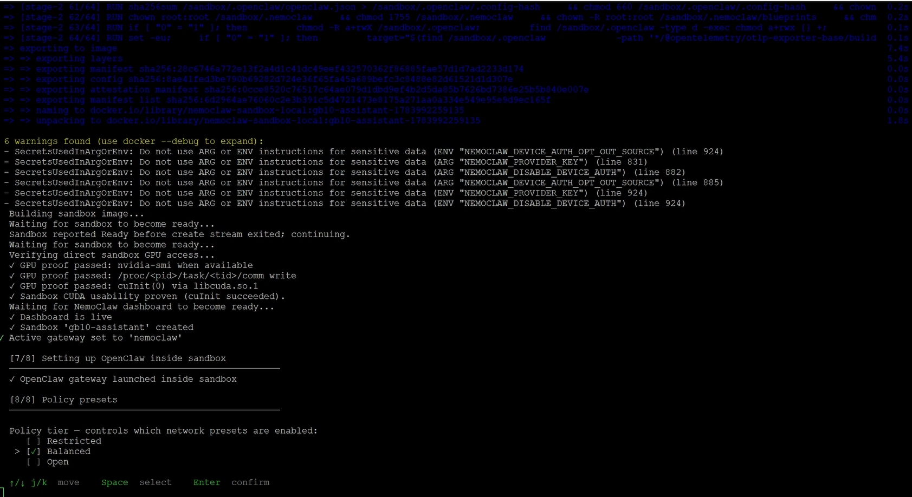

---

## 11. 選擇政策 Preset（網路存取白名單）

在 Balanced 層級下，逐一勾選允許存取的服務/白名單（並可切換 read/write 權限 `[rw]`）：

已勾選項目：`npm`、`pypi`、`huggingface`、`brew`、`brave`、`local-inference`、`openclaw-pricing`、`telegram`、`discord`。

套用每個 preset 時會自動放寬對應網域的 sandbox egress 規則，例如：

```
Widening sandbox egress — adding: registry.npmjs.org, registry.yarnpkg.com
✓ Policy version 3 submitted (hash: 68709d02db04)
✓ Policy version 3 loaded (active version: 3)
Applied preset: npm
...
```

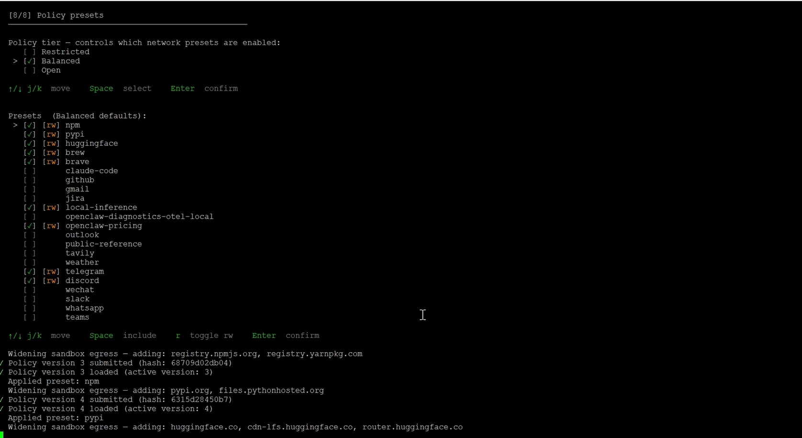

---

## 12. 安裝完成

所有政策套用完畢後，顯示安裝完成訊息：

```
OpenClaw is ready

Sandbox:  gb10-assistant
Model:    nemotron-3-super:120b (Local Ollama)

Start chatting
  Browser:
    http://127.0.0.1:18789/

  Terminal:
    nemoclaw gb10-assistant connect
    then run: openclaw tui

Authenticated dashboard URL, if needed:
    nemoclaw gb10-assistant dashboard-url --quiet

Remote access (SSH session detected):
  On your workstation, run:
    ssh -L 18789:127.0.0.1:18789 user@<host>
  Then open the dashboard URL above in your local browser.

Manage later
  Status:      nemoclaw gb10-assistant status
  Logs:        nemoclaw gb10-assistant logs --follow
  Model:       nemoclaw inference set --model <model> --provider <provider> --sandbox gb10-assistant
  Policies:    nemoclaw gb10-assistant policy-add
  Credentials: nemoclaw credentials reset <KEY> && nemoclaw onboard
```

> 提示：目前終端機的 PATH 尚未更新，需執行以下指令才能使用 `nemoclaw` 指令，或開啟新終端機：
> ```bash
> source /home/user/.bashrc
> export PATH="/home/user/.local/bin:$PATH"
> ```

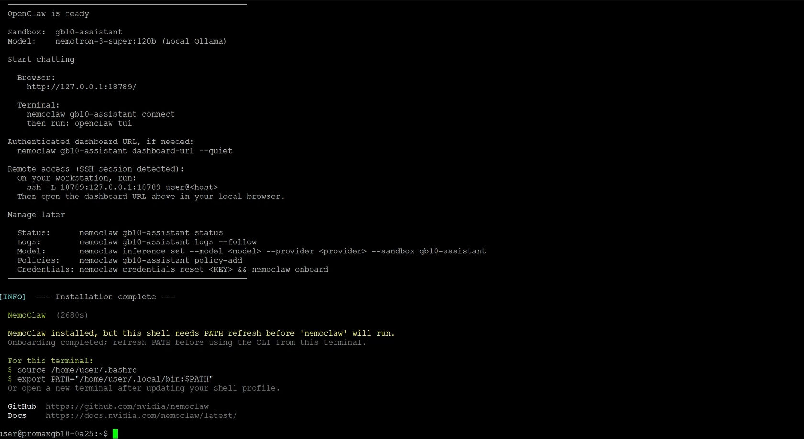

---

## 13. 驗證安裝：查詢 Sandbox 狀態

以 SSH 重新連線主機（`user@192.168.101.159`，NVIDIA DGX Spark Version 7.5.0）後，執行狀態查詢指令：

```bash
nemoclaw gb10-assistant status
```

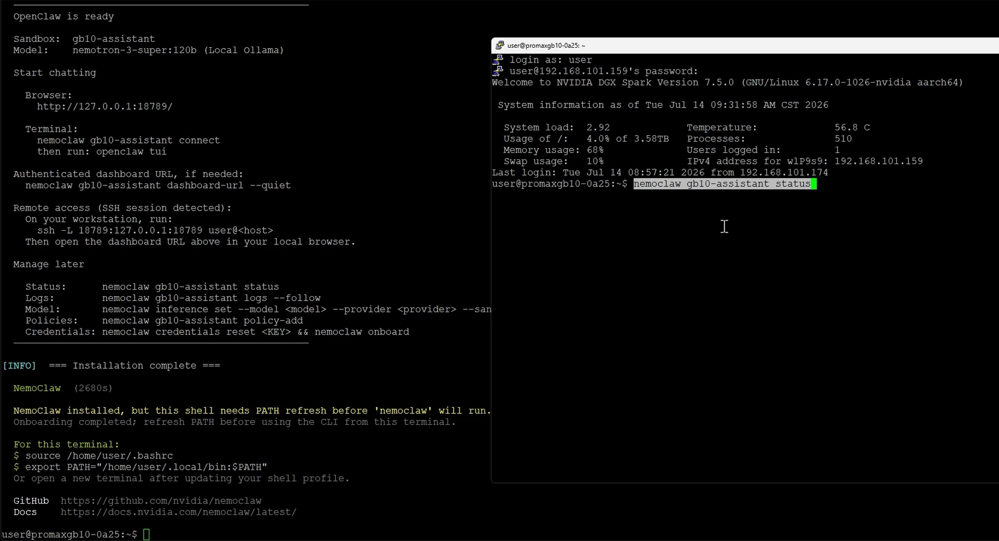

指令輸出顯示 sandbox 內的政策設定細節（binaries 白名單、telegram_bot 的 endpoint 規則等），並確認：

```
OpenClaw: running
Docker health: healthy
```

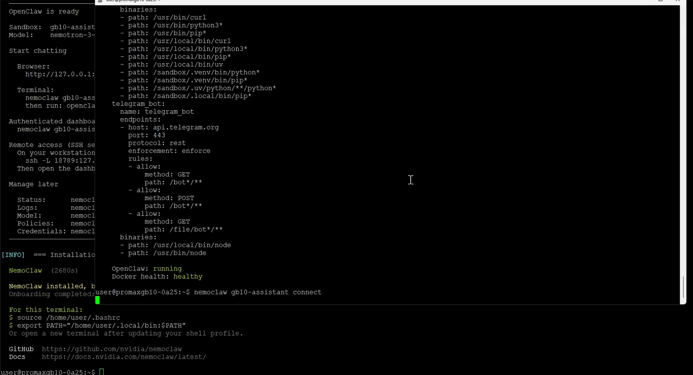

---

## 14. 連線至 Sandbox 並啟動聊天介面

執行連線指令進入 sandbox：

```bash
nemoclaw gb10-assistant connect
```

```
✓ Connecting to sandbox 'gb10-assistant'
Inside the sandbox, run `openclaw tui` to start chatting with the agent.
Type `/exit` to leave the chat, then `exit` to return to the host shell.

Note: this sandbox restricts outbound network access by policy.
Blocked requests fail with 'CONNECT tunnel failed, response 403'.
See which rule denied a request:  nemoclaw <name> logs --tail 50
```

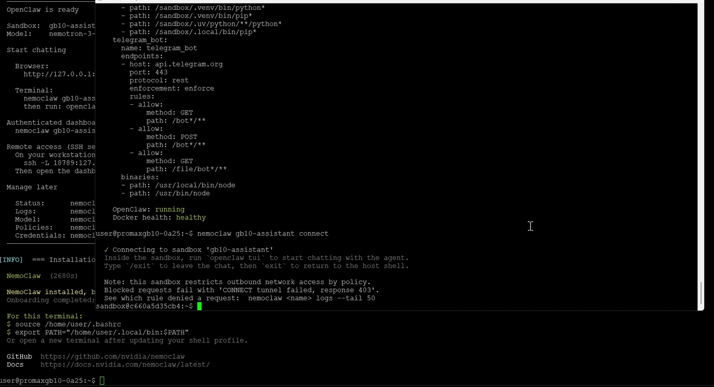

在 sandbox shell 內執行 `openclaw tui`，啟動聊天介面（版本 `OpenClaw 2026.6.10 (aa69b12)`），並成功連線至 gateway：

```
gateway connected | idle
agent main | session main | inference/nemotron-3-super:120b | tokens 0/16k (0%)
```

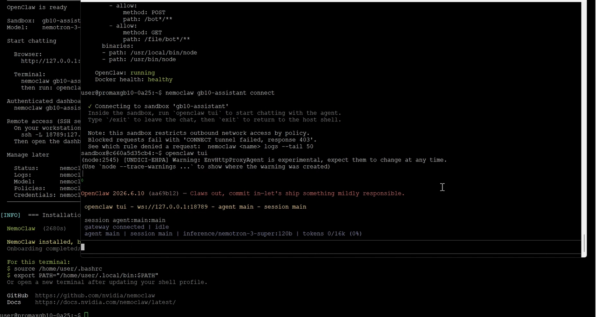

---

## 15. 測試對話

在 TUI 介面輸入 `hello` 測試對話，Agent 成功回應：

```
> hello
Hello! How can I help you today?
connected | idle
agent main | session main | inference/nemotron-3-super:120b | tokens ?/16k
```

至此，NemoClaw + OpenClaw + 本機 Ollama（nemotron-3-super:120b）安裝與測試完成。

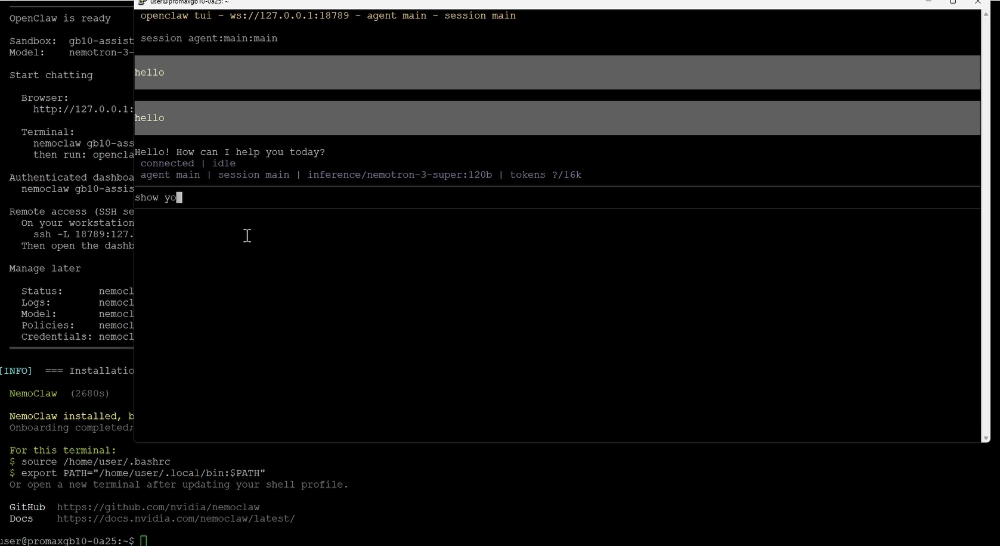

---

## 環境摘要

| 項目 | 內容 |
|---|---|
| 硬體 | NVIDIA DGX Spark（GB10 GPU，124546 MB） |
| 系統 | NVIDIA DGX Spark Version 7.5.0（Linux 6.17.0-1026-nvidia, aarch64） |
| Container runtime | Docker（20 vCPU / 121.6 GiB） |
| 推論後端 | 本機 Ollama（localhost:11434，proxy on :11435） |
| 使用模型 | nemotron-3-super:120b |
| Agent | OpenClaw |
| Sandbox 名稱 | gb10-assistant |
| 政策層級 | Balanced |
| 已啟用 Messaging | Telegram、Discord |

