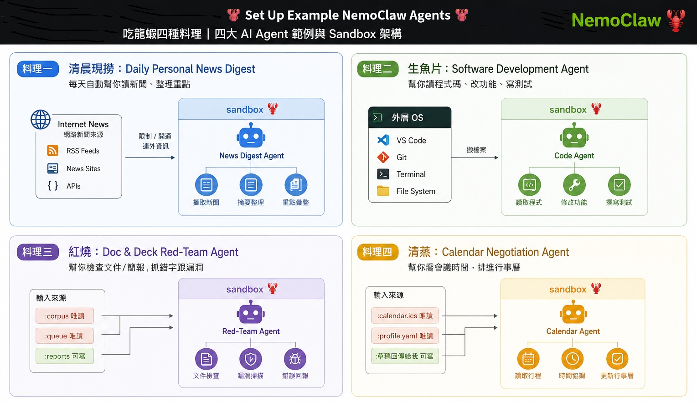

## NemoClaw 的應用範例 

# 在 NemoClaw 上跑出真正有用的應用：四個現成 Agent 實戰

> 本篇是 [《在 DGX Spark (GB10) 上部署 NemoClaw：打造地端安全 AI Agent》](#) 的應用延伸篇。如果你還沒有一個能跑的 NemoClaw sandbox，請先完成那篇安裝教學，這裡假設你已經有一個健康運作的 sandbox（本文範例沿用 `gb10-assistant`）。
https://github.com/install-safe-press/gb10-playbooks/tree/main/2c-1-nemoclaw-LLM  <br>


## 第一部分：這篇要做什麼

### 這是「安裝篇」之後的下一步

上一篇我們把 NemoClaw + OpenShell + Ollama 這套地端 AI Agent 環境從零架起來，驗證了 sandbox、GPU 直通、Telegram/Discord bridge 都能正常運作。但一個「能跑」的 sandbox，跟一個「真正有用」的 sandbox 之間還有一段距離——這篇要做的事，就是把它變成能實際解決生活/工作問題的工具。

NVIDIA 官方為此準備了一份專門的續集 playbook：[**Set Up Example NemoClaw Agents**](https://build.nvidia.com/spark/nemoclaw-applications)，裡面提供四個現成、可以直接照抄套用的應用場景。

### 四個現成應用一覽



| 應用 | 一句話說明 |
|---|---|
| 📰 **Daily Personal News Digest** | 排程觸發的晨間簡報，掃過你關心的主題與白名單新聞來源，整理成結構化摘要推播到 Telegram |
| 💻 **Software Development Agent** | 讀取單一專案目錄，依你指定的需求規劃、實作、自我 review，最後產出一份 `develop-and-review.md` 供你合併前檢查 |
| 📊 **Deck Reviewer** | 文件/簡報的紅隊審查員，掃描數字不一致、無來源主張、缺資料、跟舊版矛盾之處，回傳依嚴重度排序的修改清單 |
| 📅 **Calendar Negotiator** | 排程協商總管，把「什麼時候有空？」的信件串轉換成實際排進行事曆的會議，同時尊重你的專注時段與時區公平性 |

每個應用都用同樣的三段式結構呈現：

1. **Policy setup** — 這個應用需要哪些額外的 sandbox policy 變更（通訊管道、對外網路、檔案系統掛載）
2. **Agent prompt** — 完整、可以直接複製貼上的 prompt，定義了這個應用端到端的完整行為，這是唯一需要的設定
3. **How to personalize** — 可以調整的參數（路徑、排程時間、目標受眾、人設）

所有應用都跑在 NemoClaw onboard 時建立的**同一個 OpenShell sandbox** 裡，agent 的檔案系統、網路、行程、推論存取，全部維持在你授予的 policy 邊界內——這也延續了我們上一篇反覆強調的核心精神：**能力擴張，但邊界不變**。

### ⚠️ 風險等級：Medium（比安裝篇更高，這次要碰真實資料）

官方明確標註：

> 每個應用都會給 agent 超出預設 sandbox 的額外能力——新聞摘要需要對外網路，程式碼審查、簡報審查、行事曆協商都需要檔案系統存取。這個風險透過嚴格的個別應用 policy 有所降低（唯讀來源資料的 host 端 `chmod`、`share mount` 的 SSHFS 權限傳遞、限定範圍的 sandbox 目錄讓 agent 一次只看得到一棵掛載樹、透過 `nemoclaw policy-add` preset 的明確 egress 白名單、以及能抵抗單則訊息覆寫的 prompt 內建安全規則），但風險並未完全消除。**在檢查過 policy 之前，不要把這些配方指向敏感資料、正式環境帳號或個人檔案。**

這跟安裝篇有本質上的差異——安裝篇的風險主要是「裝不起來、跑不動」，這篇的風險是**「agent 現在有能力碰到你真正在乎的東西」**，值得用更謹慎的心態往下走。

---

## 第二部分：開始前的準備

### 前提檢查：確認 sandbox 是健康的

```bash
nemoclaw list
nemoclaw gb10-assistant status
```

預期結果：你的 sandbox 出現在清單裡，且 `status` 回報為 **Running**，推論來源指向你本地的 Ollama 模型。

### 需要具備的基礎能力

- 已完成安裝篇，有一個能跑的 sandbox
- 基本的 Linux 終端機操作、YAML 檔案編輯能力
- 對 agent 風險範圍有基本認知（可回顧安裝篇疑難排解章節的概念）

### 硬體與存取需求

| 項目 | 說明 |
|---|---|
| DGX Spark (GB10) | 已完成 NemoClaw 安裝 |
| OpenShell gateway + sandbox | 由 onboard 精靈建立，`nemoclaw list` 至少能看到一個 |
| Telegram bot | **News Digest** 與 **Calendar Negotiator** 需要在 onboard 時就接好；若當初跳過，需要重跑安裝程序重建 sandbox 並啟用 Telegram |

### 軟體需求

| 項目 | 說明 |
|---|---|
| Ollama | 服務中，跑著你 onboard 時選定的模型 |
| 公開 webhook tunnel | 任何 Telegram 驅動的應用都需要：`nemoclaw tunnel start` |

### 動手前，四個應用各自要準備的東西（建議先看過這張表，決定你要先做哪一個）

| 需要準備的東西 | 從哪裡取得 | 給哪個應用用 |
|---|---|---|
| Sandbox 名稱 | `nemoclaw list` | 全部應用 |
| Telegram bot token + 數字 User ID | [@BotFather](https://t.me/BotFather)（`/newbot`）、`@userinfobot` | News Digest、Calendar Negotiator 必要；Software Dev Agent、Deck Reviewer 選用（用於「可以 review 了」通知） |
| 新聞來源網域白名單 | 自己列出信任的網站 | News Digest |
| 一個包含專案的 host 目錄 | 複製/clone 你要處理的專案，例如 `~/nemoclaw-projects/my-app/` | Software Development Agent |
| 待審佇列資料夾 + 標準語料庫資料夾 + `profile.yaml`（紅隊規則） | 整理過去的簡報、品牌指南、標準數據檔案，例如 `~/nemoclaw-redteam/` | Deck Reviewer |
| `calendar.ics` 匯出檔 + 含工時/專注時段/時區的 `profile.yaml` | 從你的行事曆匯出（Google：設定 → 匯入與匯出），存到 `~/nemoclaw-calendar/` | Calendar Negotiator |

### 這篇文件不需要額外下載任何東西

官方特別說明：所有 policy 片段與範例 prompt 都直接寫在各應用的分頁裡，沒有需要另外 clone 的外部資源。sandbox 的內建 policy 是 NemoClaw/OpenShell 本身就有的，這幾個應用只是在**修改**它，不是重新安裝。

### 預估時間與回滾方式

- **預估時間**：走完全部四個應用約 30～45 分鐘，每個應用單獨約 5～10 分鐘（前提是準備工作都做好了）；如果還沒接 Telegram，Policy Setup 那步要再抓 10 分鐘
- **回滾方式**：每個應用都有對應的回滾步驟——網路類的 policy 變更可以熱重載直接復原；比較深層的變更則需要銷毀重建 sandbox（但會用原始 policy 重建）。真的想全部砍掉重來，`nemoclaw uninstall` 可以移除所有東西

---

*下一部分：四個應用會分別寫在本章節目錄下各自的檔案 請各別開啟各自章節*<br>
1-Daily Personal News Digest.md <br>
2-Software Development Agent.md <br>
3-Deck Reviewer.md  <br>
4-Calendar Negotiation.md  <br>


後記： NVIDIA 對於Agent的playbook持續生成新的章節在 build.nvidia.com 例如 NemoClaw for Hermes Agent <br>
https://build.nvidia.com/nvidia/nemoclaw-for-hermes-agent/nemoclawcard<br>

相關新增內容將會再後續進行.


