> 原始內容 https://build.nvidia.com/spark/hermes-agent
---
本文件與原始內容環境略有不同, 請自行比對

使用本地模型運行 Hermes Agent。
在 GB10 上安裝並執行 Hermes 自改良 AI 代理程式。

Hermes Agent
GitHub   https://github.com/nousresearch/hermes-agent

Nous Research開發的這款自學習型 AI 智能體，是唯一內建學習循環的智能體——它能從經驗中積累技能，在使用過程中不斷改進，持續學習並鞏固知識，還能搜尋過往對話記錄，並在不同會話中逐步構建更深入的自我認知模型。它可以運行在 5 美元的 VPS、GPU 叢集或幾乎零成本的無伺服器基礎架構上。它不依賴你的筆記型電腦——即使它在雲端虛擬機上運行，你也可以透過文字命令或Telegram 與它互動。
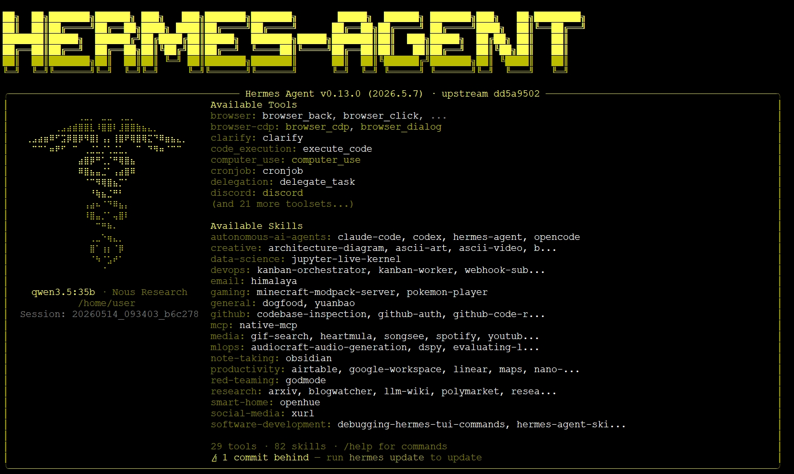


Dell Pro MAX GB10環境
依gb10-playbooks專案文件配置
1a-Open WebUI with Ollama , docker 
2a-OpenClaw , 系統最外層

## Install Hermes 安裝 Hermes  , 於系統最外層 
安裝過程開始記錄
```
curl -fsSL https://raw.githubusercontent.com/NousResearch/hermes-agent/main/scripts/install.sh | bash
```

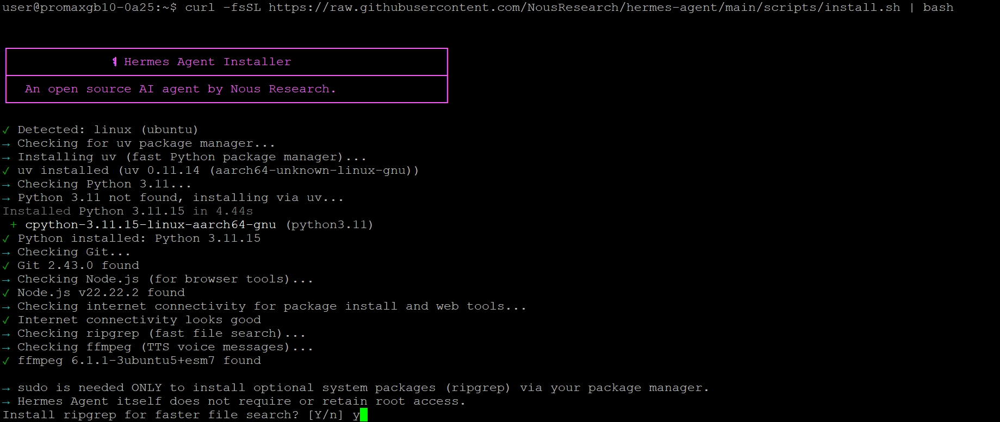

```
┌─────────────────────────────────────────────────────────┐
│             ⚕ Hermes Agent Installer                    │
├─────────────────────────────────────────────────────────┤
│  An open source AI agent by Nous Research.              │
└─────────────────────────────────────────────────────────┘

✓ Detected: linux (ubuntu)
→ Checking for uv package manager...
→ Installing uv (fast Python package manager)...
✓ uv installed (uv 0.11.14 (aarch64-unknown-linux-gnu))
→ Checking Python 3.11...
→ Python 3.11 not found, installing via uv...
Installed Python 3.11.15 in 4.44s
 + cpython-3.11.15-linux-aarch64-gnu (python3.11)
✓ Python installed: Python 3.11.15
→ Checking Git...
✓ Git 2.43.0 found
→ Checking Node.js (for browser tools)...
✓ Node.js v22.22.2 found
→ Checking internet connectivity for package install and web tools...
✓ Internet connectivity looks good
→ Checking ripgrep (fast file search)...
→ Checking ffmpeg (TTS voice messages)...
✓ ffmpeg 6.1.1-3ubuntu5+esm7 found

→ sudo is needed ONLY to install optional system packages (ripgrep) via your package manager.
→ Hermes Agent itself does not require or retain root access.
Install ripgrep for faster file search? [Y/n]  >>Y
```

Hermes Agent 建議安裝 ripgrep (rg)，用途是：<br>
更快搜尋本地檔案<br>
提升程式碼/文件掃描效率<br>
強化 agent 工具能力<br>
不影響核心安裝，但建議裝<br>
.
.
.
```
 + codex
  + claude-code
  + native-mcp
  + jupyter-live-kernel

Done: 87 new, 0 updated, 0 unchanged. 87 total bundled.
✓ Skills synced to ~/.hermes/skills/
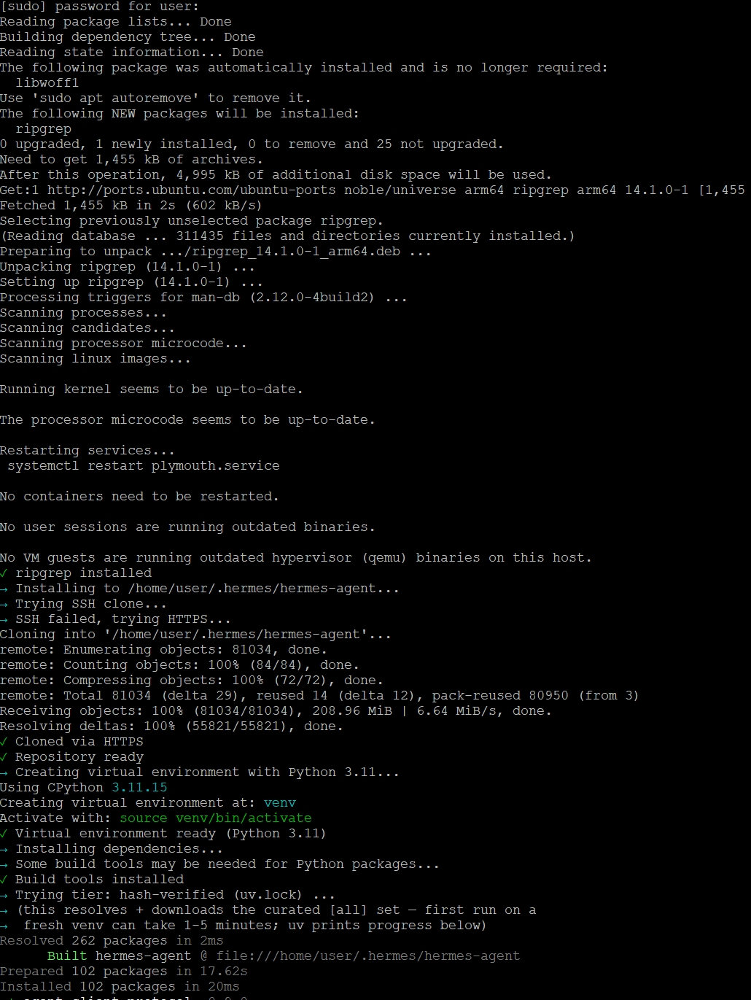
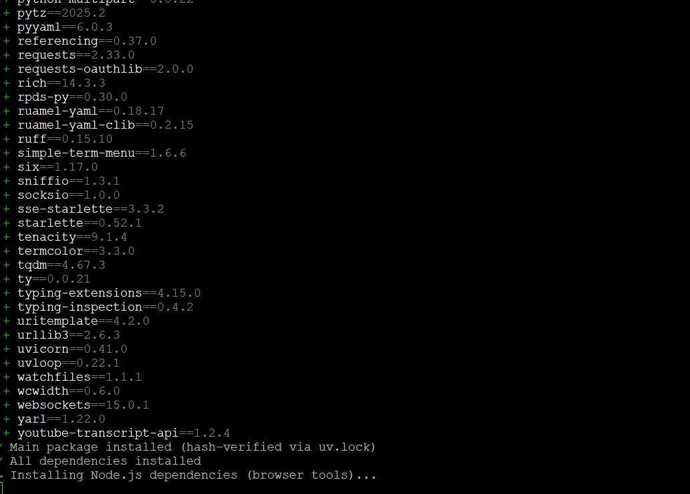

→ Starting setup wizard...


┌─────────────────────────────────────────────────────────┐
│             ⚕ Hermes Agent Setup Wizard                │
├─────────────────────────────────────────────────────────┤
│  Let's configure your Hermes Agent installation.       │
│  Press Ctrl+C at any time to exit.                     │
└─────────────────────────────────────────────────────────┘


◆ OpenClaw Installation Detected
  Found OpenClaw data at /home/user/.openclaw
  Hermes can preview what would be imported before making any changes.

Would you like to see what can be imported? [Y/n]: Y
```

為什麼選 Y：<br>
Hermes 只會先「預覽可匯入內容」，不會直接覆蓋：<br>
可能包含：<br>
API Keys<br>
MCP Servers<br>
Browser tools<br>
Discord / Telegram 設定<br>
部分 Agent skills<br>
環境變數<br>

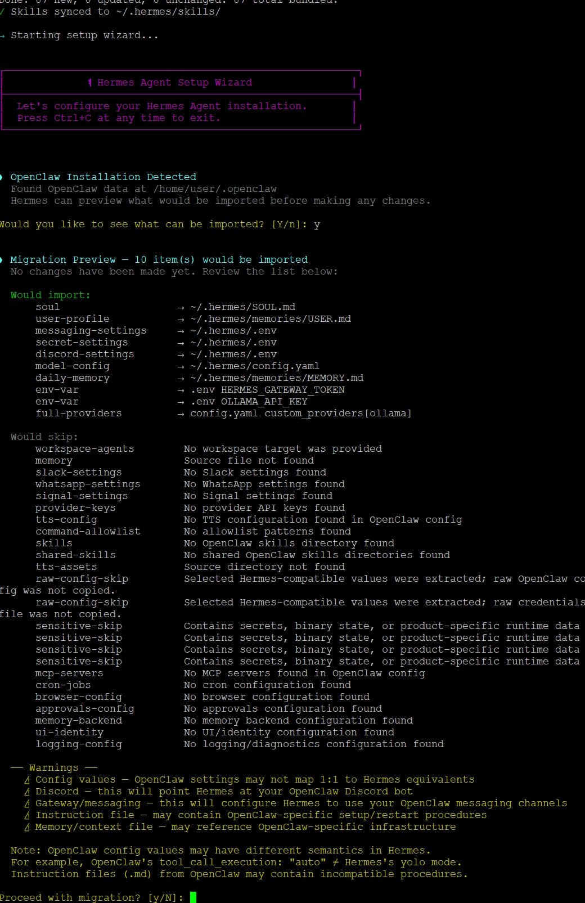

```
◆ Migration Preview — 10 item(s) would be imported
  No changes have been made yet. Review the list below:

  Would import:
      soul                   → ~/.hermes/SOUL.md
      user-profile           → ~/.hermes/memories/USER.md
      messaging-settings     → ~/.hermes/.env
      secret-settings        → ~/.hermes/.env
      discord-settings       → ~/.hermes/.env
      model-config           → ~/.hermes/config.yaml
      daily-memory           → ~/.hermes/memories/MEMORY.md
      env-var                → .env HERMES_GATEWAY_TOKEN
      env-var                → .env OLLAMA_API_KEY
      full-providers         → config.yaml custom_providers[ollama]

  Would skip:
      workspace-agents        No workspace target was provided
      memory                  Source file not found
      slack-settings          No Slack settings found
      whatsapp-settings       No WhatsApp settings found
      signal-settings         No Signal settings found
      provider-keys           No provider API keys found
      tts-config              No TTS configuration found in OpenClaw config
      command-allowlist       No allowlist patterns found
      skills                  No OpenClaw skills directory found
      shared-skills           No shared OpenClaw skills directories found
      tts-assets              Source directory not found
      raw-config-skip         Selected Hermes-compatible values were extracted; raw OpenClaw config was not copied.
      raw-config-skip         Selected Hermes-compatible values were extracted; raw credentials file was not copied.
      sensitive-skip          Contains secrets, binary state, or product-specific runtime data
      sensitive-skip          Contains secrets, binary state, or product-specific runtime data
      sensitive-skip          Contains secrets, binary state, or product-specific runtime data
      sensitive-skip          Contains secrets, binary state, or product-specific runtime data
      mcp-servers             No MCP servers found in OpenClaw config
      cron-jobs               No cron configuration found
      browser-config          No browser configuration found
      approvals-config        No approvals configuration found
      memory-backend          No memory backend configuration found
      ui-identity             No UI/identity configuration found
      logging-config          No logging/diagnostics configuration found

  ── Warnings ──
    ⚠ Config values — OpenClaw settings may not map 1:1 to Hermes equivalents
    ⚠ Discord — this will point Hermes at your OpenClaw Discord bot
    ⚠ Gateway/messaging — this will configure Hermes to use your OpenClaw messaging channels
    ⚠ Instruction file — may contain OpenClaw-specific setup/restart procedures
    ⚠ Memory/context file — may reference OpenClaw-specific infrastructure

  Note: OpenClaw config values may have different semantics in Hermes.
  For example, OpenClaw's tool_call_execution: "auto" ≠ Hermes's yolo mode.
  Instruction files (.md) from OpenClaw may contain incompatible procedures.

Proceed with migration? [y/N]: N
```
建議選：N<br>
為什麼不要直接匯入：<br>
你目前看到的內容包含高風險共用項：<br>
風險項目：<br>
Discord Bot 共用<br>
Messaging Gateway 共用<br>
Telegram/訊息通道混用<br>
OpenClaw Memory 匯入<br>
SOUL / USER Profile 匯入<br>
OLLAMA API Key 共用<br>
Hermes Gateway Token 共用<br>
OpenClaw 指令邏輯污染<br>
可能造成：<br>
OpenClaw / Hermes 搶同一 Bot<br>
Discord 回覆混亂<br>
記憶混用<br>
行為設定錯誤<br>
prompt 汙染<br>
模型 provider 配置衝突<br>


```
How would you like to set up Hermes?
  ↑↓ navigate  ENTER/SPACE select  ESC cancel

 → (●) Quick setup — provider, model & messaging (recommended)
   (○) Full setup — configure everything
```
Quick setup 通常會設定：<br>
必要項：<br>
Provider（Ollama / OpenAI / NVIDIA / Claude）<br>
Default model<br>
Messaging channel<br>
基本 .env<br>

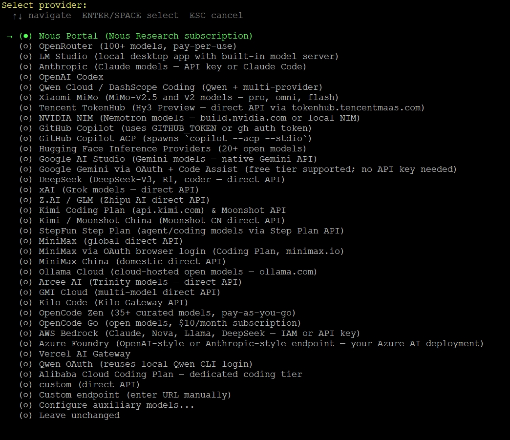

```
Select provider:
  ↑↓ navigate  ENTER/SPACE select  ESC cancel

   (○) Nous Portal (Nous Research subscription)
   (○) OpenRouter (100+ models, pay-per-use)
   (○) LM Studio (local desktop app with built-in model server)
   (○) Anthropic (Claude models — API key or Claude Code)
   (○) OpenAI Codex
   (○) Qwen Cloud / DashScope Coding (Qwen + multi-provider)
   (○) Xiaomi MiMo (MiMo-V2.5 and V2 models — pro, omni, flash)
   (○) Tencent TokenHub (Hy3 Preview — direct API via tokenhub.tencentmaas.com)
   (○) NVIDIA NIM (Nemotron models — build.nvidia.com or local NIM)
   (○) GitHub Copilot (uses GITHUB_TOKEN or gh auth token)
   (○) GitHub Copilot ACP (spawns `copilot --acp --stdio`)
   (○) Hugging Face Inference Providers (20+ open models)
   (○) Google AI Studio (Gemini models — native Gemini API)
   (○) Google Gemini via OAuth + Code Assist (free tier supported; no API key needed)
   (○) DeepSeek (DeepSeek-V3, R1, coder — direct API)
   (○) xAI (Grok models — direct API)
   (○) Z.AI / GLM (Zhipu AI direct API)
   (○) Kimi Coding Plan (api.kimi.com) & Moonshot API
   (○) Kimi / Moonshot China (Moonshot CN direct API)
   (○) StepFun Step Plan (agent/coding models via Step Plan API)
   (○) MiniMax (global direct API)
   (○) MiniMax via OAuth browser login (Coding Plan, minimax.io)
   (○) MiniMax China (domestic direct API)
   (○) Ollama Cloud (cloud-hosted open models — ollama.com)
   (○) Arcee AI (Trinity models — direct API)
   (○) GMI Cloud (multi-model direct API)
   (○) Kilo Code (Kilo Gateway API)
   (○) OpenCode Zen (35+ curated models, pay-as-you-go)
   (○) OpenCode Go (open models, $10/month subscription)
   (○) AWS Bedrock (Claude, Nova, Llama, DeepSeek — IAM or API key)
   (○) Azure Foundry (OpenAI-style or Anthropic-style endpoint — your Azure AI deployment)
   (○) Vercel AI Gateway
   (○) Qwen OAuth (reuses local Qwen CLI login)
   (○) Alibaba Cloud Coding Plan — dedicated coding tier
   (○) custom (direct API)
 → (●) Custom endpoint (enter URL manually)    <<< 選這個本地手動輸入
   (○) Configure auxiliary models...
   (○) Leave unchanged

## "Select Provider" — Choose Custom endpoint (enter URL manually) so Hermes can be pointed at the model endpoint running on your DGX Spark.

◆ Inference Provider
  Choose how to connect to your main chat model.
     Guide: https://hermes-agent.nousresearch.com/docs/integrations/providers

Warning: No inference provider configured. Run 'hermes model' to choose a provider and model, or set an API key (OPENROUTER_API_KEY, OPENAI_API_KEY, etc.) in ~/.hermes/.env. Falling back to auto provider detection.

  Current model:    anthropic/claude-opus-4.6
  Active provider:  none

Custom OpenAI-compatible endpoint configuration:
API base URL [e.g. https://api.example.com/v1]:

http://localhost:11434/v1   <<< 本機 ollama 

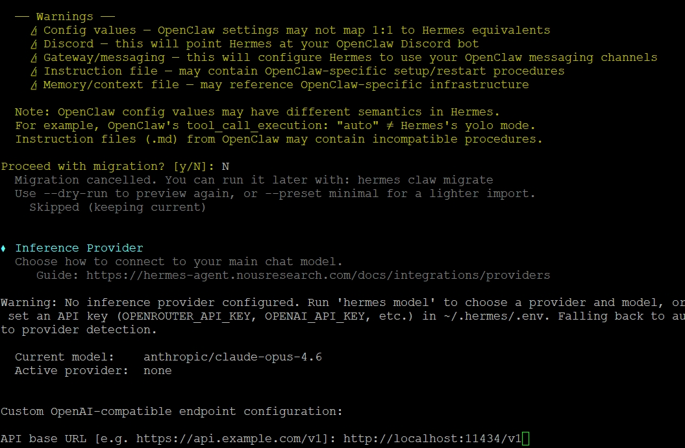

Select API compatibility mode:
  1. Auto-detect [current]
     Use Hermes URL heuristics; best for standard OpenAI-compatible endpoints.
  2. Chat Completions
     Use /chat/completions for standard OpenAI-compatible servers.
  3. Responses / Codex
     Use /responses for Codex-compatible tool-calling backends.
  4. Anthropic Messages
     Use /v1/messages for Anthropic-compatible endpoints.
Choice [1-4, Enter to keep current/detected]:1   <<<列出目前標機ollama 已經有的模型
  API mode: auto-detect
  Available models:
    1. qwen3.5:35b
    2. gemma4:31b
    3. gpt-oss:120b
    4. llama3:latest
  Select model [1-4] or type name: 1    << 此範例採用 qwen3.5:35b模型

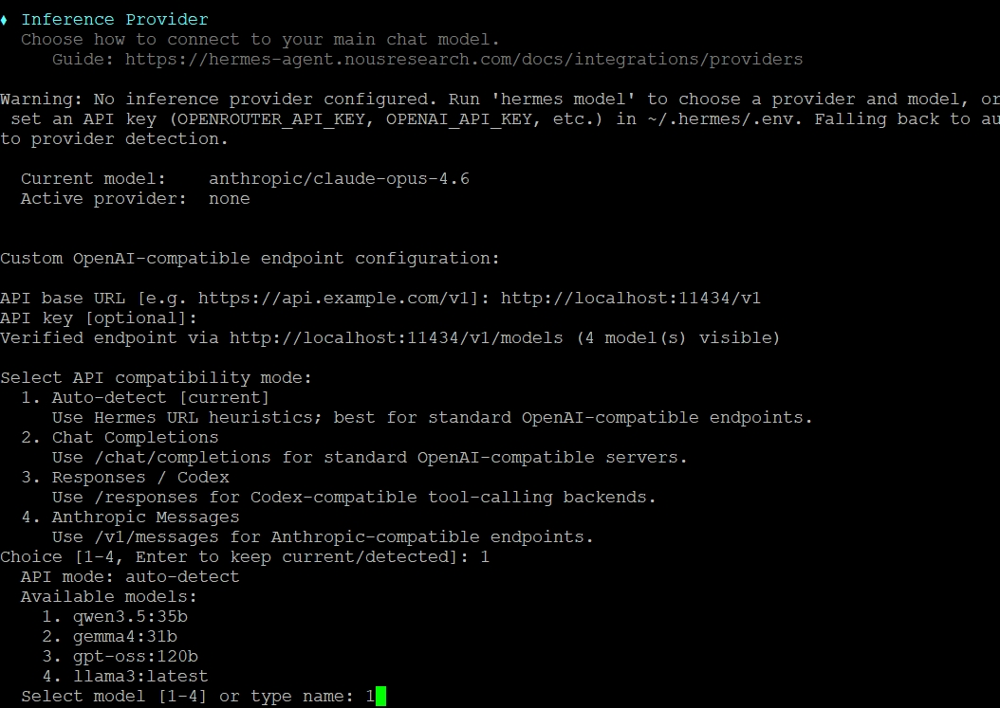

Context length in tokens [leave blank for auto-detect]:
Display name [Local (localhost:11434)]:
Default model set to: qwen3.5:35b (via http://localhost:11434/v1)
  💾 Saved to custom providers as "Local (localhost:11434)" (edit in config.yaml)

◆ Terminal Backend
  Choose where Hermes runs shell commands and code.
  This affects tool execution, file access, and isolation.
     Guide: https://hermes-agent.nousresearch.com/docs/developer-guide/environments

    Skipped (keeping current)

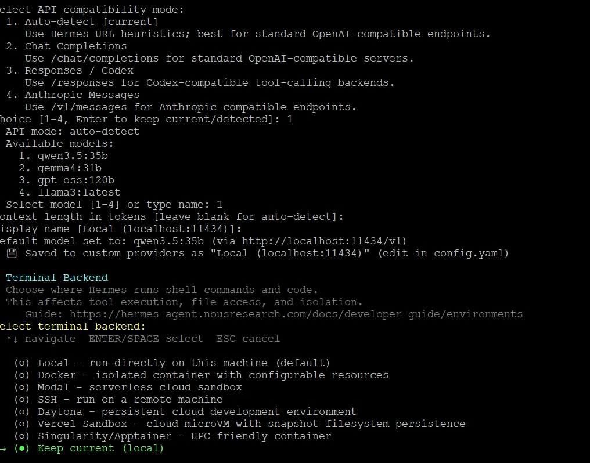


  Keeping current backend: local
✓ Applied recommended defaults:
    Max iterations: 90
    Tool progress: all
    Compression threshold: 0.50
    Session reset: inactivity (1440 min) + daily (4:00)
    Run `hermes setup agent` later to customize.
Connect a messaging platform? (Telegram, Discord, etc.)
  ↑↓ navigate  ENTER/SPACE select  ESC cancel

 → (●) Set up messaging now (recommended)   << 直接按 ENTER
   (○) Skip — set up later with 'hermes setup gateway'

Select platforms to configure:
  Toggle by number, Enter to confirm.

  [ ]  1. 📱 Telegram  (not configured)
  [ ]  2. 💬 Discord  (not configured)
  [ ]  3. 💼 Slack  (not configured)
  [ ]  4. 🔐 Matrix  (not configured)
  [ ]  5. 💬 Mattermost  (not configured)
  [ ]  6. 📲 WhatsApp  (not configured)
  [ ]  7. 📡 Signal  (not configured)
  [ ]  8. 📧 Email  (not configured)
  [ ]  9. 📱 SMS (Twilio)  (not configured)
  [ ] 10. 💬 DingTalk  (not configured)
  [ ] 11. 🪽 Feishu / Lark  (not configured)
  [ ] 12. 💬 WeCom (Enterprise WeChat)  (not configured)
  [ ] 13. 💬 WeCom Callback (Self-Built App)  (not configured)
  [ ] 14. 💬 Weixin / WeChat  (not configured)
  [ ] 15. 💬 BlueBubbles (iMessage)  (not configured)
  [ ] 16. 🐧 QQ Bot  (not configured)
  [ ] 17. 💎 Yuanbao  (not configured)
  [ ] 18. 💬 Google Chat  (not configured)
  [ ] 19. 💬 IRC  (not configured)
  [ ] 20. 💚 LINE  (not configured)
  [ ] 21. 💼 Microsoft Teams  (not configured)

  Toggle # (or Enter to confirm):

 Toggle # (or Enter to confirm): 1  << 範例採用 Telegram

  [✓]  1. 📱 Telegram  (not configured)
  [ ]  2. 💬 Discord  (not configured)
  [ ]  3. 💼 Slack  (not configured)
  [ ]  4. 🔐 Matrix  (not configured)
  [ ]  5. 💬 Mattermost  (not configured)
  [ ]  6. 📲 WhatsApp  (not configured)
  [ ]  7. 📡 Signal  (not configured)
  [ ]  8. 📧 Email  (not configured)
  [ ]  9. 📱 SMS (Twilio)  (not configured)
  [ ] 10. 💬 DingTalk  (not configured)
  [ ] 11. 🪽 Feishu / Lark  (not configured)
  [ ] 12. 💬 WeCom (Enterprise WeChat)  (not configured)
  [ ] 13. 💬 WeCom Callback (Self-Built App)  (not configured)
  [ ] 14. 💬 Weixin / WeChat  (not configured)
  [ ] 15. 💬 BlueBubbles (iMessage)  (not configured)
  [ ] 16. 🐧 QQ Bot  (not configured)
  [ ] 17. 💎 Yuanbao  (not configured)
  [ ] 18. 💬 Google Chat  (not configured)
  [ ] 19. 💬 IRC  (not configured)
  [ ] 20. 💚 LINE  (not configured)
  [ ] 21. 💼 Microsoft Teams  (not configured)

  Toggle # (or Enter to confirm):

◆ Telegram
  Create a bot via @BotFather on Telegram       << 先去Telegram  BotFather  /newbot 產生一個新的bot 取得token 
Telegram bot token:                             << 取得token  貼到這邊 , 貼上去時不會顯示 再按ENTER
✓ Telegram token saved

  🔒 Security: Restrict who can use your bot
     To find your Telegram user ID:
     1. Message @userinfobot on Telegram
     2. It will reply with your numeric ID (e.g., 123456789)

Allowed user IDs (comma-separated, leave empty for open access):    << 如要管控只有限定USER可以與bot 溝通 就填入 

 📬 Home Channel: where Hermes delivers cron job results,
     cross-platform messages, and notifications.
     For Telegram DMs, this is your user ID (same as above).
     You can also set this later by typing /set-home in your Telegram chat.
Home channel ID (leave empty to set later):

No home channel set for: Telegram
     Without a home channel, cron jobs and cross-platform
     messages can't be delivered to those platforms.
     Set one later with /set-home in your chat, or:
       hermes config set TELEGRAM_HOME_CHANNEL <channel_id>

  Install the gateway as a systemd service? (runs in background, starts on boot) [Y/n]:

 Choose how the gateway should run in the background:
  ↑↓ navigate  ENTER/SPACE select  ESC cancel

  (○) User service (no sudo; best for laptops/dev boxes; may need linger after logout)
 → (●) System service (starts on boot; requires sudo; still runs as your user)
   (○) Skip service install for now

解釋
「選擇網關在背景的運作方式：」 — 如果您希望 Hermes 在啟動時自動運行而無需互動式登錄，請選擇「系統服務」。該服務仍將以您的使用者帳戶執行，以便讀取您的 Hermes 配置；只有安裝時需要 sudo 權限。如果您在設定完成後（而非透過精靈）安裝網關，請使用下文「sudo 和 hermes PATH」所示的 system-service 選項。

接下來開始跑幾秒鐘
◆ Telegram
  Create a bot via @BotFather on Telegram
Telegram bot token:
✓ Telegram token saved

  🔒 Security: Restrict who can use your bot
     To find your Telegram user ID:
     1. Message @userinfobot on Telegram
     2. It will reply with your numeric ID (e.g., 123456789)

Allowed user IDs (comma-separated, leave empty for open access):
  ⚠️  No allowlist set - anyone who finds your bot can use it!

  📬 Home Channel: where Hermes delivers cron job results,
     cross-platform messages, and notifications.
     For Telegram DMs, this is your user ID (same as above).
     You can also set this later by typing /set-home in your Telegram chat.
Home channel ID (leave empty to set later):

  ━━━━━━━━━━━━━━━━━━━━━━━━━━━━━━━━━━━━━━━━━━━━━━━━━━
✓ Messaging platforms configured!

⚠ No home channel set for: Telegram
     Without a home channel, cron jobs and cross-platform
     messages can't be delivered to those platforms.
     Set one later with /set-home in your chat, or:
       hermes config set TELEGRAM_HOME_CHANNEL <channel_id>

  Install the gateway as a systemd service? (runs in background, starts on boot) [Y/n]:

⚠   System service install requires sudo, so Hermes can't create it from this user session.
    After setup, run: sudo hermes gateway install --system --run-as-user user
    Then start it with: sudo hermes gateway start --system

  ━━━━━━━━━━━━━━━━━━━━━━━━━━━━━━━━━━━━━━━━━━━━━━━━━━

✓ Setup complete! You're ready to go.

    Configure all settings:    hermes setup


◆ Tool Availability Summary
  6/11 tool categories available:

   ✓ Vision (image analysis)
   ✗ Mixture of Agents (missing OPENROUTER_API_KEY)
   ✗ Web Search & Extract (missing EXA_API_KEY, PARALLEL_API_KEY, FIRECRAWL_API_KEY/FIRECRAWL_API_URL, TAVILY_API_KEY, or SEARXNG_URL)
   ✓ Browser Automation (Local browser)
   ✗ Image Generation (missing FAL_KEY or OPENAI_API_KEY)
   ✓ Text-to-Speech (Edge TTS)
   ✗ RL Training (Tinker) (missing TINKER_API_KEY)
   ✗ Skills Hub (GitHub) (missing GITHUB_TOKEN)
   ✓ Terminal/Commands
   ✓ Task Planning (todo)
   ✓ Skills (view, create, edit)

⚠ Some tools are disabled. Run 'hermes setup tools' to configure them,
⚠ or edit ~/.hermes/.env directly to add the missing API keys.


┌─────────────────────────────────────────────────────────┐
│              ✓ Setup Complete!                          │
└─────────────────────────────────────────────────────────┘

📁 All your files are in ~/.hermes/:

   Settings:  /home/user/.hermes/config.yaml
   API Keys:  /home/user/.hermes/.env
   Data:      /home/user/.hermes/cron/, sessions/, logs/

────────────────────────────────────────────────────────────

📝 To edit your configuration:

   hermes setup          Re-run the full wizard
   hermes setup model    Change model/provider
   hermes setup terminal Change terminal backend
   hermes setup gateway  Configure messaging
   hermes setup tools    Configure tool providers

   hermes config         View current settings
   hermes config edit    Open config in your editor
   hermes config set <key> <value>
                          Set a specific value

   Or edit the files directly:
   nano /home/user/.hermes/config.yaml
   nano /home/user/.hermes/.env

────────────────────────────────────────────────────────────

🚀 Ready to go!

   hermes              Start chatting
   hermes gateway      Start messaging gateway
   hermes doctor       Check for issues


→ Messaging platform token detected!
→ The gateway needs to be running for Hermes to send/receive messages.

Would you like to install the gateway as a background service? [Y/n]

Would you like to install the gateway as a background service? [Y/n]
→ Installing systemd service...
Installing user systemd service to: /home/user/.config/systemd/user/hermes-gateway.service

✓ User service installed and enabled!

Next steps:
  hermes gateway start              # Start the service
  hermes gateway status             # Check status
  journalctl --user -u hermes-gateway -f  # View logs

✓ Systemd linger is enabled (service survives logout)
✓ Gateway service installed
✓ User service started
✓ Gateway started! Your bot is now online.


┌─────────────────────────────────────────────────────────┐
│              ✓ Installation Complete!                   │
└─────────────────────────────────────────────────────────┘


📁 Your files:

   Config:    /home/user/.hermes/config.yaml
   API Keys:  /home/user/.hermes/.env
   Data:      /home/user/.hermes/cron/, sessions/, logs/
   Code:      /home/user/.hermes/hermes-agent

─────────────────────────────────────────────────────────

🚀 Commands:

   hermes              Start chatting
   hermes setup        Configure API keys & settings
   hermes config       View/edit configuration
   hermes config edit  Open config in editor
   hermes gateway install Install gateway service (messaging + cron)
   hermes update       Update to latest version

─────────────────────────────────────────────────────────

⚡ Reload your shell to use 'hermes' command:

   source ~/.bashrc


user@promaxgb10-0a25:~$
```
安裝完成 上面的提示稍為看一下

從Telegram 發送訊息 , 會得到必需進行配對提示

GB10 CLI
```
hermes pairing approve telegram 配對碼
```
Telegram 再次發送訊息  這次Hermes 應該會有回應

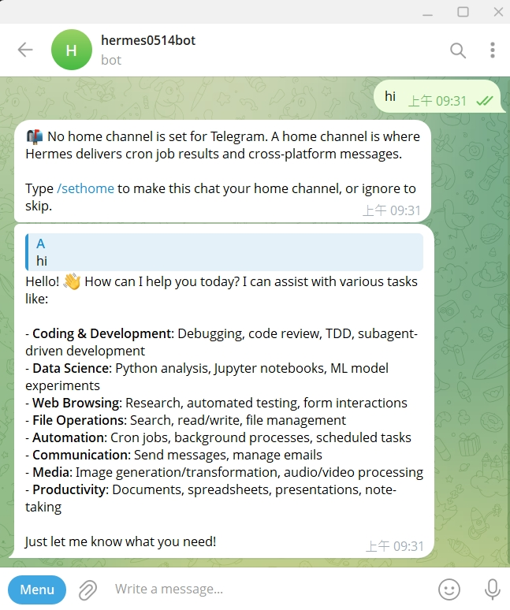


回到SSH/終端

進入Hermes Terminal UI 


```
hermes
```
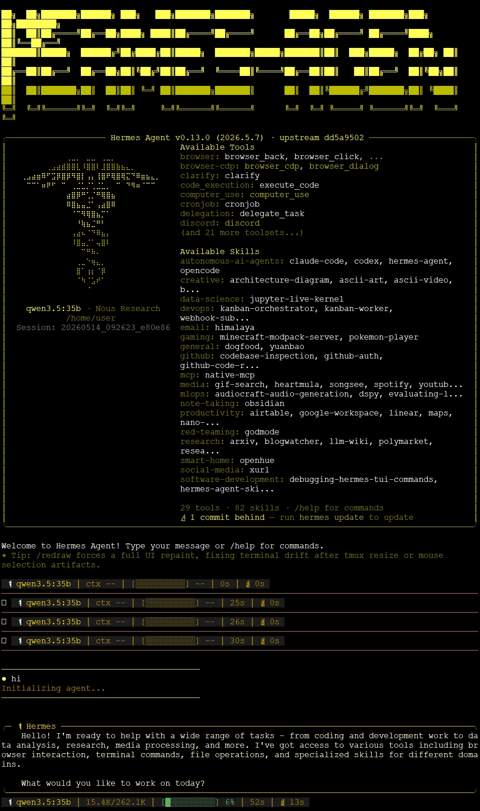


在 TUI 中執行指令，/reasoning show即可顯示模型的中間推理過程及其回應。這對於追蹤智能體在多步驟或複雜問題上的進展以及調試意外結果尤其有用。

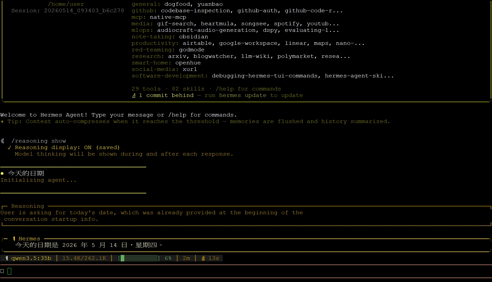


## 安裝完成之後可以做什麼？ 
1.透過 hermes TUI 終端文字發送命令 , ssh 先連上再進入Hermes Terminal UI , 只能敲文字
2.或者是 通訊程式Telegram發送命令 , 可敲文字 , 附檔案 , 附圖檔 

演示範例：
Telegram發送圖片
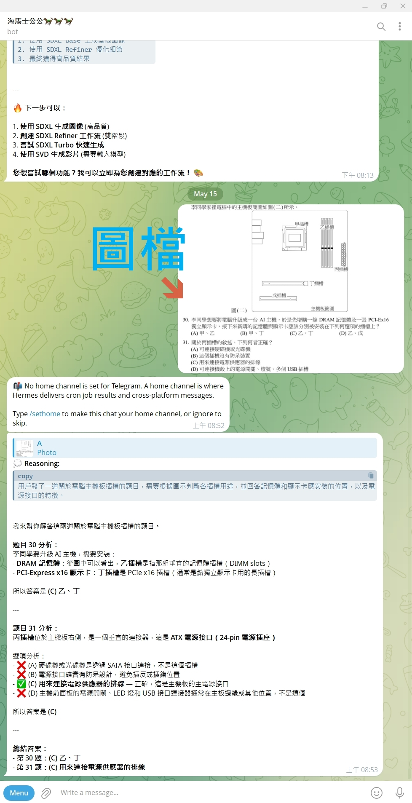

Telegram發送檔案
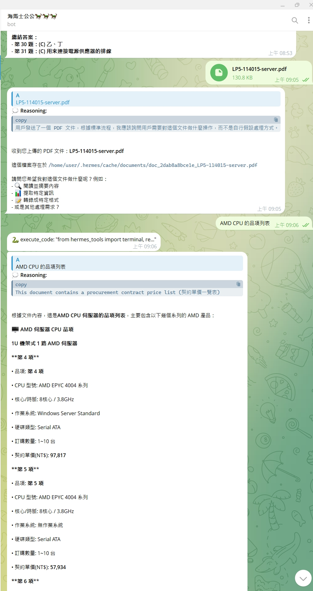
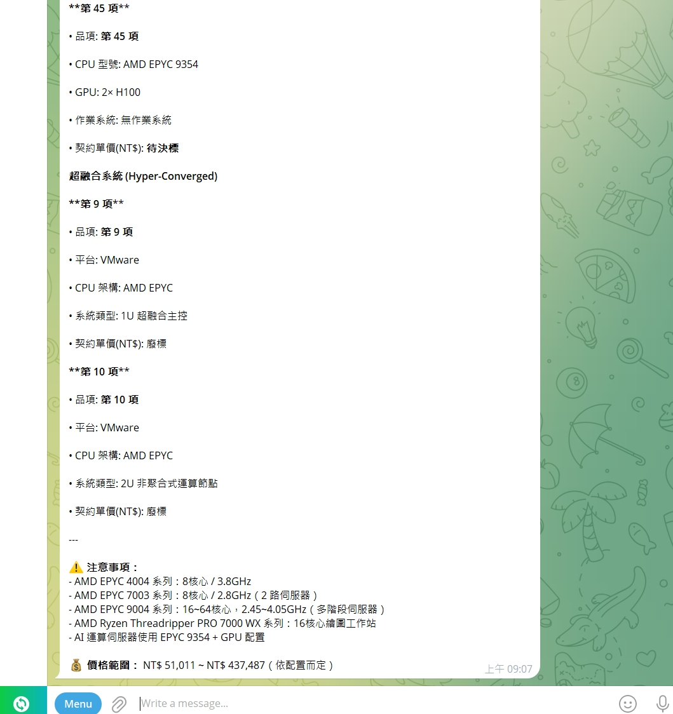


我只能舉這種範例 , 如下圖還有無限應用
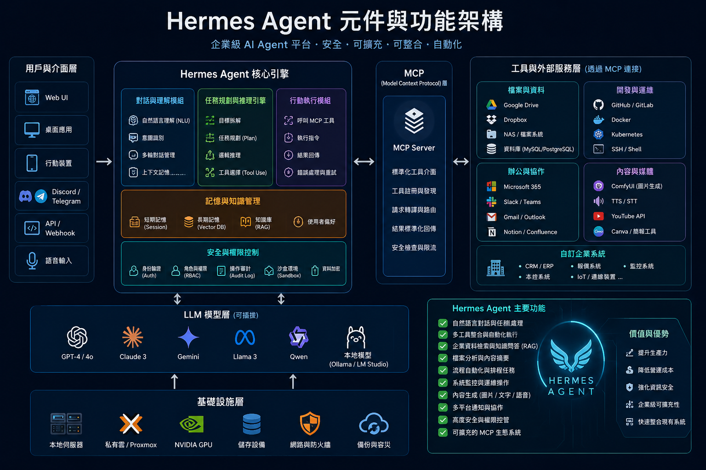 


2026/06/12 [https://hermes-agent.nousresearch.com/hermes-agent ](https://hermes-agent.nousresearch.com/desktop) 
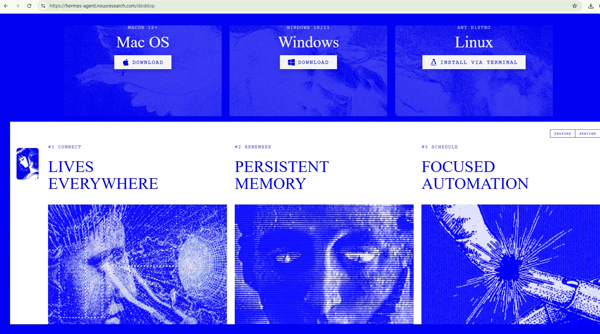 


