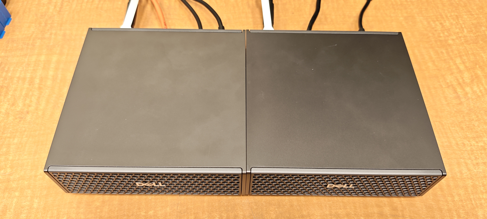
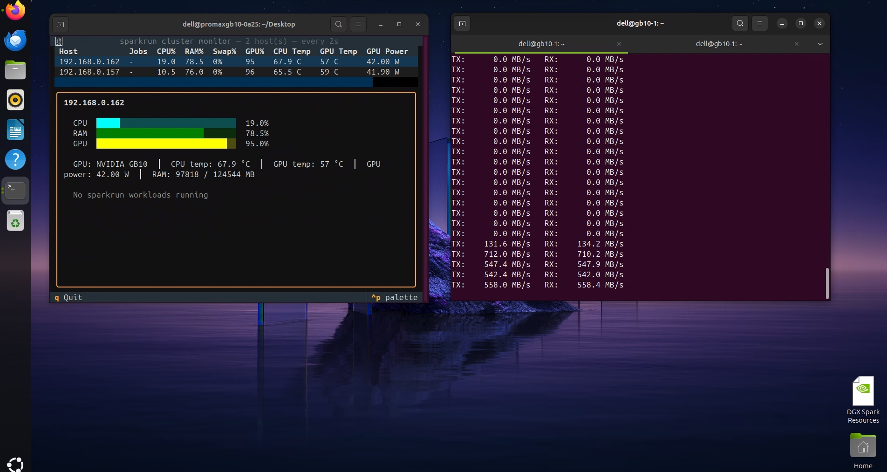

# 兩台 Dell Pro Max GB10（DGX Spark）雙機互連與 vLLM 分散式推論實戰

Oct 5, 2026 · @Install-Safe


## 前言與環境
<br> 


本文記錄用一條 QSFP 線把兩台 Dell Pro Max GB10 直連，完成 NCCL 驗證，並用 vLLM 以 tensor parallel（TP=2）跨兩台提供模型服務。Dell Pro Max GB10 與 NVIDIA DGX Spark 是同一平台，流程完全沿用 NVIDIA 官方 playbook，另外補上實作時踩到的坑。

| 項目 | gb10-1（head） | gb10-2（worker） |
| --- | --- | --- |
| 管理網路 enP7s7 | 192.168.0.162 | 192.168.0.157 |
| QSFP 介面 | enp1s0f1np1 | enp1s0f1np1 |
| QSFP IP | 172.16.7.1/24 | 172.16.7.2/24 |
| RoCE 裝置 | rocep1s0f1 | rocep1s0f1 |

- 線材：100G QSFP DAC（官方建議 QSFP112 400G 被動式 DAC 可跑滿 200G）
- 帳號：兩台使用相同使用者名稱 `dell`
- 分工：管理 IP 負責 SSH 與 MPI/Ray 啟動，QSFP 負責 NCCL 的 RDMA 資料傳輸

參考文件：

- [Connect Two Sparks](https://build.nvidia.com/spark/connect-two-sparks)
- [NCCL for Two Sparks](https://build.nvidia.com/spark/nccl/stacked-sparks)
- [Serve LLMs with vLLM：Multi-node](https://build.nvidia.com/spark/vllm/multi-node)
- [eugr/spark-vllm-docker](https://github.com/eugr/spark-vllm-docker)
- [sparkrun](https://pypi.org/project/sparkrun/)

## Step 1：實體接線與 ConnectX-7 網路設定

用一條 QSFP 線直連兩台背面的 ConnectX-7 埠，不需要交換器。兩台要插同一個位置的埠，介面名稱才會一致。

接好後確認哪個介面是 Up：

```bash
ibdev2netdev
# rocep1s0f0 port 1 ==> enp1s0f0np0 (Down)
# rocep1s0f1 port 1 ==> enp1s0f1np1 (Up)
# roceP2p1s0f0 port 1 ==> enP2p1s0f0np0 (Down)
# roceP2p1s0f1 port 1 ==> enP2p1s0f1np1 (Up)
```

IP 設在 `enp1` 開頭且為 Up 的介面（本例 `enp1s0f1np1`）。`enP2p` 開頭的是同一實體埠經第二條 PCIe 通道映射出來的，設定 IP 時忽略。

在 gb10-1 建立 netplan 設定（gb10-2 把 IP 改成 `172.16.7.2/24`）：

```bash
sudo tee /etc/netplan/40-cx7.yaml > /dev/null <<'EOF'
network:
  version: 2
  ethernets:
    enp1s0f1np1:
      addresses: [172.16.7.1/24]
      mtu: 9000
EOF
sudo chmod 600 /etc/netplan/40-cx7.yaml
sudo netplan apply
```

不需要 gateway 與 DNS，這條線只用於兩台互連。驗證：

```bash
ip -br addr | grep 172.16.7
ping -c 3 172.16.7.2
```

建議同時在路由器為兩台的管理 IP（enP7s7）綁定固定位址，DHCP 變動會讓後續的 SSH 與腳本連錯機器。

## Step 2：免密碼 SSH

MPI、NCCL 測試與 vLLM 叢集腳本都靠 SSH 在另一台啟動程式，必須雙向、含自己、管理 IP 與 QSFP IP 都能免密碼登入。

DGX OS 預設沒有金鑰，直接 `ssh-copy-id -i ~/.ssh/id_rsa.pub` 會報 `No such file`。先產生金鑰（兩台都做）：

```bash
mkdir -p ~/.ssh && chmod 700 ~/.ssh
ssh-keygen -t ed25519 -N "" -f ~/.ssh/id_ed25519
```

接著在兩台各自把公鑰複製到四個位址：

```bash
for h in 192.168.0.162 192.168.0.157 172.16.7.1 172.16.7.2; do
  ssh-copy-id -i ~/.ssh/id_ed25519.pub dell@$h
done
```

第一次連線的主機金鑰詢問一定要回答 `yes`。若在這一步按了 Ctrl+C，後面的 sparkrun 會對該主機顯示 `Host key verification failed`。

驗證（不該要求密碼）：

```bash
for h in 192.168.0.162 192.168.0.157 172.16.7.1 172.16.7.2; do ssh dell@$h hostname; done
```

要求密碼或出現 `REMOTE HOST IDENTIFICATION HAS CHANGED` 時，用 `ssh-keygen -R <IP>` 清掉舊紀錄再連一次。

## Step 3：NCCL 頻寬驗證

實測 100G 線 all\_gather busbw 為 11.48 GB/s（約 92 Gb/s），已用到線路約 92% 頻寬，驗證 RoCE 路徑正常。

官方腳本只需在 gb10-1 執行。參數填**管理 IP**，NCCL 會自動走 QSFP 的 RoCE；管理介面若是 `enP7s7` 就不用改腳本：

```bash
curl -fsSL https://raw.githubusercontent.com/NVIDIA/dgx-spark-playbooks/refs/heads/main/nvidia/nccl/assets/setup.sh -o setup.sh
curl -fsSL https://raw.githubusercontent.com/NVIDIA/dgx-spark-playbooks/refs/heads/main/nvidia/nccl/assets/launch.sh -o launch.sh

bash setup.sh 192.168.0.157                                   # 只填對方
bash launch.sh --topology direct 192.168.0.162 192.168.0.157  # 自己、對方
```

### 坑：nccl-tests 與 NCCL 版本不相容

`setup.sh` 把 NCCL 固定在 v2.30.7，但 nccl-tests 抓最新 main，編譯時報 `'NCCL_WIN_GIN_ONLY' was not declared`。只退回上一個 commit 可能停在改到一半的版本，又出現別的錯誤。穩定解法是退到 NCCL 發布當天的 nccl-tests（兩台都做）：

```bash
cd ~/nccl-tests
git fetch --unshallow 2>/dev/null; git fetch origin
NCCL_DATE=$(cd ~/nccl && git log -1 --format=%ci)
git checkout $(git rev-list -n1 --before="$NCCL_DATE" origin/HEAD)
make clean
make -j MPI=1 MPI_HOME=/usr/lib/aarch64-linux-gnu/openmpi \
  CUDA_HOME=/usr/local/cuda NCCL_HOME=$HOME/nccl/build
ls -l ~/nccl-tests/build/all_gather_perf
```

本例成功版本為 `632ad39`（nccl-tests 2.18.3），另一台可直接 `git checkout 632ad39` 保證一致。`setup.sh` 在 Node 1 失敗就不會處理 Node 2，gb10-2 需自行 clone 編譯（或從 gb10-1 `rsync -a ~/nccl ~/nccl-tests dell@192.168.0.157:~/`）。編好後直接跑 `launch.sh`，不要再執行 `setup.sh`，它會重新抓最新版。

### 結果解讀

```
       size    count  type  ...  algbw   busbw  #wrong
17179869184  2147483648 float ... 22.95   11.48      0
# Avg bus bandwidth    : 11.478
```

2 節點 all\_gather 看 busbw。11.48 GB/s × 8 ≈ 91.8 Gb/s，是 100G 線扣掉封包開銷後的上限。換成 200G 線預期約 22–24 GB/s。`#wrong 0` 表示資料驗證正確。可用 `ethtool enp1s0f1np1 | grep -i speed` 確認協商速度。

## Step 4：vLLM 雙機推論

官方 vLLM 多節點 playbook（2026/9 改版）改用社群專案 `spark-vllm-docker`，NCCL 已包在容器內。網路與 SSH 已手動設好的話，可跳過 NVIDIA Sync 與 Cluster Assistant。

### 4.1 兩台都要：Docker 權限與 Hugging Face 登入

```bash
docker ps                      # 出現 permission denied 才需要下一行
sudo usermod -aG docker $USER && newgrp docker

curl -LsSf https://hf.co/cli/install.sh | bash
source ~/.bashrc               # 否則會出現 hf: command not found
hf auth login
hf auth whoami
```

### 4.2 gb10-1：下載專案並自動偵測叢集

```bash
cd ~
git clone https://github.com/eugr/spark-vllm-docker.git
cd spark-vllm-docker
curl -LsSf https://astral.sh/uv/install.sh | sh
source ~/.bashrc

./run-recipe.sh --discover     # 互動式，回答 yes 儲存 .env
./run-recipe.sh --show-env
```

確認 `CLUSTER_NODES=172.16.7.1,172.16.7.2`（head 在前），介面為 `enp1s0f1np1` / `rocep1s0f1`。偵測失敗時可手動指定：`./launch-cluster.sh --nodes "172.16.7.1,172.16.7.2" --eth-if enp1s0f1np1 --ib-if rocep1s0f1 ...`。

### 4.3 下載模型並複製到 worker

```bash
./hf-download.sh nvidia/Qwen3.8-27B-NVFP4 -c --copy-parallel
```

模型約 21 GB，實測下載 51 分鐘，經 QSFP 複製到 gb10-2 只花 37 秒。注意 gb10-1 的 `du -sh` 可能只顯示幾 MB：新版 hf CLI 把 blobs 做成指向 `~/.cache/huggingface/hub/blobs/` 的連結，改用 `du -shL` 才會看到實際的 21G。

### 4.4 啟動模型（在 tmux 內）

```bash
tmux new -s vllm               # 已存在就用 tmux attach -t vllm
cd ~/spark-vllm-docker
./run-recipe.sh recipes/qwen3.8-27b-nvfp4-dflash2.yaml --setup
```

第一次啟動含載入、編譯與預熱約 8 分鐘（`took 506.64 s`）。看到 `Application startup complete` 即完成，然後按 `Ctrl+b` 再按 `d` 離開 tmux。在 tmux 內按 Ctrl+C 會停掉 vLLM。

### 4.5 測試 API

```bash
curl -s http://localhost:8000/v1/chat/completions \
  -H "Content-Type: application/json" \
  -d '{
    "model": "nvidia/Qwen3.8-27B-NVFP4",
    "messages": [{"role": "user", "content": "用一句話介紹你自己"}],
    "max_tokens": 256
  }'
```

模型會先輸出 `reasoning_content`，`max_tokens` 太小會在思考階段被截斷。外部工具（Open WebUI、Continue 等）使用 `http://192.168.0.162:8000/v1`，API key 填任意字串。

## Step 5：驗證雙機運作與監控

雙機協同運作的證據是：送出請求時兩台 GPU 使用率同時升高，而且 QSFP 上有 RoCE 流量。

### 5.1 GPU 與記憶體

兩台各開一個視窗：

```bash
watch -n 1 nvidia-smi    # 看 GPU-Util
free -h                  # GB10 為 unified memory，nvidia-smi 記憶體欄可能顯示 Not Supported
```

### 5.2 RoCE 流量監看腳本

```bash
cat > ~/roce-watch.sh <<'EOF'
#!/bin/bash
DEV=rocep1s0f1
P=/sys/class/infiniband/$DEV/ports/1/counters
prev_tx=$(cat $P/port_xmit_data); prev_rx=$(cat $P/port_rcv_data)
while sleep 1; do
  tx=$(cat $P/port_xmit_data); rx=$(cat $P/port_rcv_data)
  printf "TX: %8.1f MB/s   RX: %8.1f MB/s\n" \
    $(echo "($tx-$prev_tx)*4/1000000" | bc -l) \
    $(echo "($rx-$prev_rx)*4/1000000" | bc -l)
  prev_tx=$tx; prev_rx=$rx
done
EOF
chmod +x ~/roce-watch.sh && ~/roce-watch.sh
```

計數器單位為 4 bytes。缺 `bc` 時執行 `sudo apt install -y bc`。

### 5.3 產生負載

```bash
for i in $(seq 1 8); do
  curl -s http://localhost:8000/v1/chat/completions \
    -H "Content-Type: application/json" \
    -d '{"model":"nvidia/Qwen3.8-27B-NVFP4","messages":[{"role":"user","content":"詳細解釋什麼是 tensor parallelism"}],"max_tokens":1024}' \
    > /dev/null &
done
wait; echo "全部完成"
```

vLLM log 的 `Avg generation throughput` 可用來比較換線或調參前後的差異。

### 5.4 sparkrun cluster monitor

只安裝程式，不跑完整設定精靈，避免它覆蓋已設好的 CX7 網路（若跑精靈，Configure CX7 networking 回答 N）：

```bash
uvx sparkrun setup install
source ~/.bashrc
sparkrun cluster create gb10 --hosts 192.168.0.162,192.168.0.157 -d "Dell GB10 x2"
sparkrun cluster set-default gb10
sparkrun cluster monitor
```

用 spark-vllm-docker 啟動的 vLLM 不會出現在 Jobs 欄（顯示 `No sparkrun workloads running`），但 CPU、RAM、GPU、功耗照常顯示。兩套工具擇一啟動模型，避免搬 8000 port 與 GPU 記憶體。若某台顯示 `Host key verification failed`，回到 Step 2 對該 IP 重連一次並回答 `yes`。

<br> 

## 附錄：不接螢幕的遠端桌面（xrdp）

DGX OS 內建的 GNOME RDP 分享的是實體螢幕畫面，沒接 HDMI 時常見黑畫面。xrdp 會另開獨立桌面 session，不需要實體螢幕。

```bash
grdctl rdp disable 2>/dev/null
sudo grdctl --system rdp disable 2>/dev/null
sudo apt update && sudo apt install -y xrdp
sudo usermod -a -G ssl-cert xrdp
sudo systemctl enable --now xrdp
sudo ufw allow 3389/tcp
sudo reboot
```

- 同一帳號不能同時在本機登入，需關掉自動登入。
- 登入後黑畫面時，寫入 `~/.xsessionrc`：

```bash
cat > ~/.xsessionrc <<'EOF'
export GNOME_SHELL_SESSION_MODE=ubuntu
export XDG_CURRENT_DESKTOP=ubuntu:GNOME
export XDG_CONFIG_DIRS=/etc/xdg/xdg-ubuntu:/etc/xdg
EOF
```

若需要操作本機主控台畫面，最簡單是插一個 HDMI 假負載（dummy plug）。

## 問題速查與日常操作

| 症狀 | 原因 | 解法 |
| --- | --- | --- |
| `ssh-copy-id` 報 `No such file` | 尚未產生金鑰 | `ssh-keygen -t ed25519` |
| nccl-tests 報 `NCCL_WIN_GIN_ONLY` 未宣告 | nccl-tests 比 NCCL v2.30.7 新 | 退到 NCCL 發布日的 nccl-tests |
| NCCL 只有 1–2 GB/s | ConnectX-7 未完全重置 | 兩台關機拔電 60 秒 |
| busbw 約 11.5 GB/s | 100G 線已跑滿 | 換 QSFP112 線可到約 22–24 GB/s |
| `hf: command not found` | PATH 未生效 | `source ~/.bashrc` |
| `du -sh` 模型只有幾 MB | blobs 為連結 | `du -shL` |
| `duplicate session: vllm` | tmux 工作階段已存在 | `tmux attach -t vllm` |
| `OSError: Address already in use` | 先前的 vLLM 仍在執行 | 先 `curl localhost:8000/v1/models` 確認，必要時 stop 再啟動 |
| sparkrun `Host key verification failed` | 未接受主機金鑰 | `ssh` 該 IP 並回答 `yes` |
| `b12x FP6 plugin ... not registered` | 警告，NVFP4 模型用不到 | 忽略 |

日常操作（gb10-1）：

```bash
curl -s http://localhost:8000/v1/models     # 服務是否在線
tmux attach -t vllm                          # 看 log，離開用 Ctrl+b d
cd ~/spark-vllm-docker
./launch-cluster.sh stop                     # 停止兩台
# stop 不可用時：docker rm -f vllm_node; ssh dell@172.16.7.2 docker rm -f vllm_node
./run-recipe.sh recipes/qwen3.8-27b-nvfp4-dflash2.yaml   # 重新啟動，約 8 分鐘
sparkrun cluster monitor                     # 叢集監控
```
