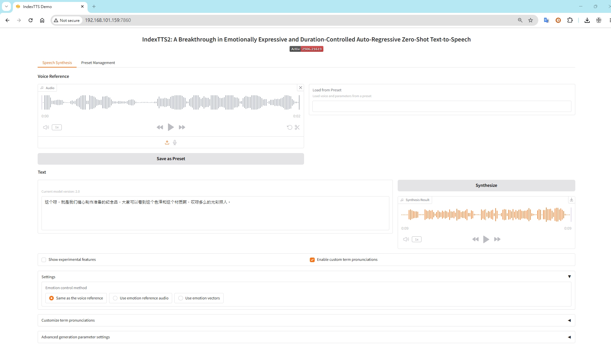
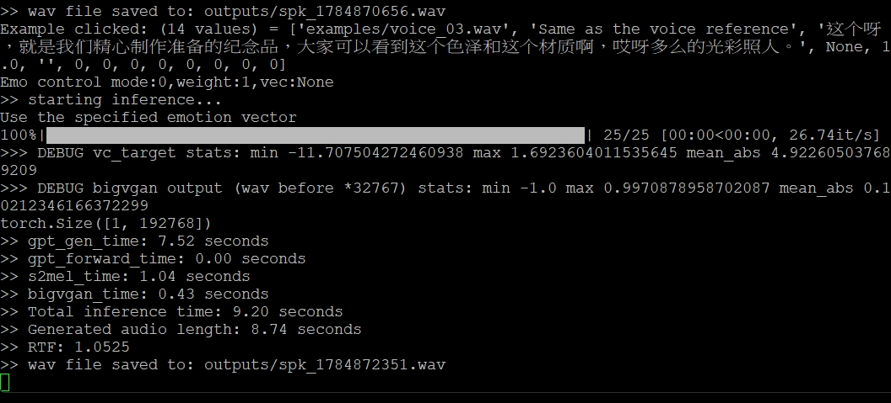
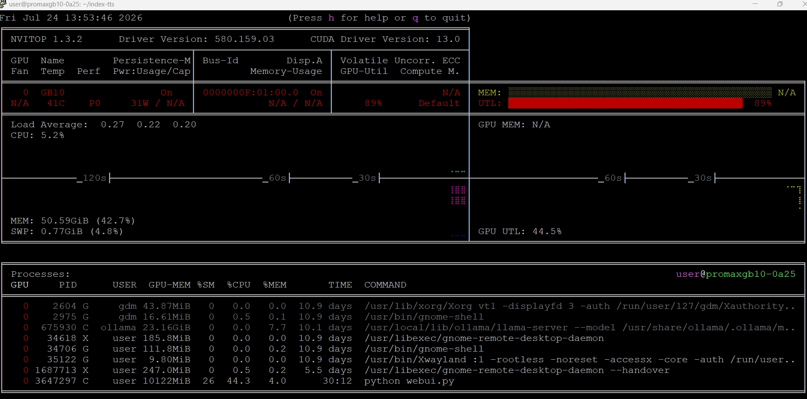
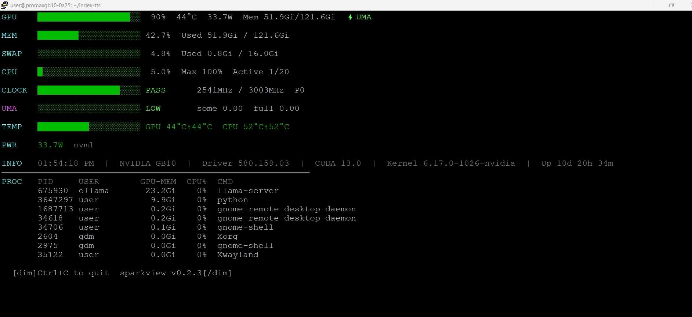
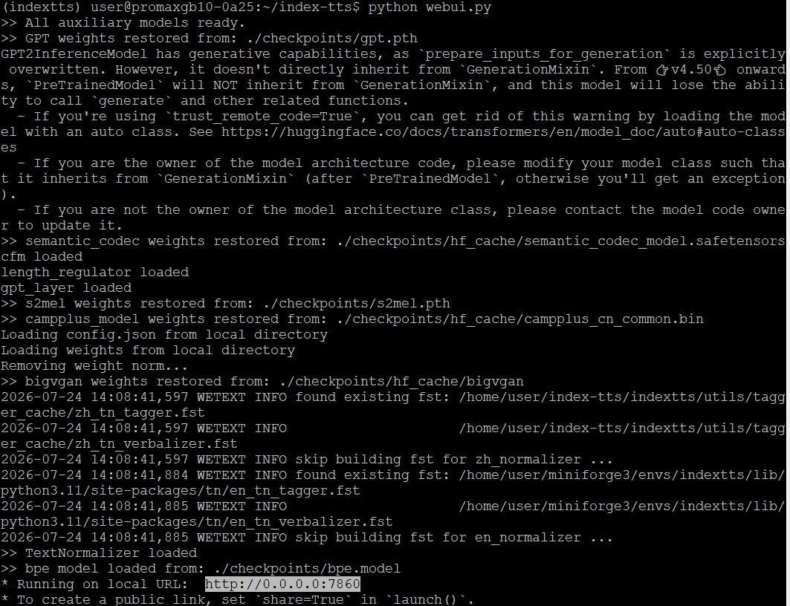

# Index TTS2 在 GB10 上佈署問題解決

大叔裝機安的 YouTube 影片語音都是靠 Text to Voice 作業（辦公室座位環境下不太可能一直唸稿）。

這些年試過一些 Text to Voice 工具，目前比較合我用的是 [IndexTTS2](https://github.com/index-tts/index-tts)。

之前都是在 Intel x64 server + T4 16G VRAM GPU Linux 環境下作業，雖然不快但是可以正常作業（但這台可能之後有其它任務）。

有想轉移到工作環境 Dell Pro Max 16 Windows NB，WSL 環境下，但是 GPU PRO 1000 8G VRAM 實在不給力，慢到無法接受。

所以囉，Dell Pro Max GB10 就是你了！幾個月前有試過，但是過程有問題沒有解決，今天重新檢視並解決問題。

## 問題如下

這台機器跟一般 x86_64 的 WSL/Linux 環境**架構完全不同**，需要 ARM64 專用的套件與 PyTorch build，且 Blackwell 是全新架構，許多套件的預編譯二進位檔還沒跟上，導致安裝過程需要多處手動處理。

在此記錄並創建檔案，作為之後新安裝時的參考。

請參考路徑下的文件 

GB10_IndexTTS2_安裝與除錯紀錄.md <br>
GB10_IndexTTS2_標準安裝流程.md   <br>








# 以下無關只是筆記

啟動 Index-TTS2 進入 conda 虛擬環境，用：
```
conda activate indextts
```
執行後 prompt 前面就會再出現 (indextts)，變回：
(indextts) user@promaxgb10-0a25:~/index-tts$

進入環境之後（看到 (indextts) 出現），依你上次用的方式啟動 IndexTTS2 即可，常見的用法有兩種：

1. 啟動 Web UI（如果你是用網頁介面操作）


```
cd ~/index-tts
```
```
python webui.py
```

2. 用指令列直接生成語音（如果你是寫腳本呼叫）
依你之前的用法，可能類似：

bash
python inference.py --text "你的文字內容" --output output.wav

實際參數要看你之前設定的腳本或指令內容。

如何離開 conda 
```
conda deactivate 
```

如果你是想直接關閉整個終端機/SSH連線，可以用：
```
exit
```


Index-TTS2 WEB
http://GB10-IP:7860/




