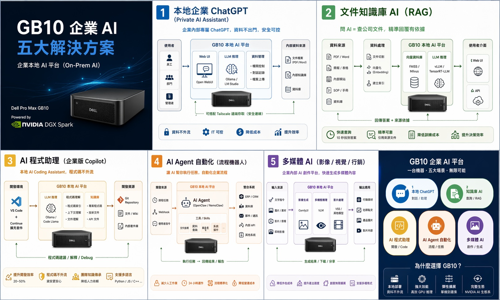

## Dell Pro Max GB10 / NVIDIA DGX Spark 可以做什麼？

## gb10-playbooks 專案目標
* 透過 Spark Playbooks 熟悉各種應用場景，並將實際操作經驗完整記錄下來。  

本專案聚焦於 **NVIDIA GB10 Grace Blackwell 超級晶片** 上的 AI 工作負載應用說明與實作範例。 

## 依據 NVIDIA 官方 Spark Playbooks 為操作基礎
https://build.nvidia.com/spark  

Spark Playbooks 目前約有三十項以上範例劇本，本專案將每一個子項目獨立拆分成單獨目錄進行實作與整理。 

除官方內容外，另額外補充：  
- 硬體架構說明  
- 基本作業系統操作  
- 網路與叢集建置  
- AI 應用部署經驗 

並同步製作成影片，收錄於：  
**大叔裝機安 GB10 Playbooks 播放清單**  
https://www.youtube.com/playlist?list=PLTfgcc_ky0u4sMNSJLS288erbZ4YMv3Zs  

---

## 閱讀與操作說明
每個子目錄代表一個分類主題： 

- `README.md` = 該主題的主要說明文件  
- 其它 `.md` = 延伸教學或補充文件  
- `pdf` = 額外參考資料  
- `image` = 文件內使用的圖片素材  

## （白話文）
**每個目錄都點進去看看，你就能快速理解 GB10 的各種玩法。**

---

# 分類與目錄

| 順序 | 分類 | 順序+標題 | 原始描述 | 主題說明 |
|------|------|------------|----------|----------|
| 00 | 基礎入門 | 00-project-intro | Nvidia DGX Spark Dell Pro Max GB10 專案簡介 | 專案整體介紹與定位 |
| 0a | 基礎入門 | 0a-GB10-Hardware | Dell Pro Max GB10 硬體相關 | 硬體架構、規格與設備說明 |
| 0b | 基礎入門 | 0b-DAC Cable Network NIC Basic | GB10 DAC Cable 有關 QSFP 網路連接 | 高速網路與 DAC/QSFP 基礎 |
| 0c | 基礎入門 | 0c-OS-command | 作業系統相關應用指令 | Linux / DGX OS 常用指令 |
| 0d | 基礎入門 | 0d-DGX Dashboard | Monitor your DGX system and launch JupyterLab | 即時監控硬體並啟動 JupyterLab |
| 1a | 基礎入門 | 1a-Open WebUI with Ollama | Install Open WebUI and use Ollama | 本地 ChatGPT 平台部署 |
| 1b | 基礎入門 | 1b-VS Code | Install and use VS Code locally or remotely | 本地 / 遠端開發環境 |
| 1c | 基礎入門 | 1c-Set up Tailscale on Your Spark | Remote network access | 遠端安全連線 |
| 1d | 基礎入門 | 1d-Comfy UI | AI image generation | 節點式 AI 繪圖工具 |
| 1e | 基礎入門 | 1e-LM Studio on DGX Spark | Deploy LM Studio | 本地模型服務平台 |
| 1f | 基礎入門 | 1f-Vibe Coding in VS Code | Coding assistant | AI 程式開發助手 |
| 2a | AI Agent 應用 | 2a-OpenClaw | Local AI agent | 本地 AI Agent |
| 2b | AI Agent 應用 | 2b-OpenShell | Secure sandbox AI agents | 安全長時間 AI Agent |
| 2c | AI Agent 應用 | 2c-NemoClaw | Telegram integration | Telegram AI Bot |
| 3a | 模型推理 | 3a-NIM on Spark | Deploy NIM | NVIDIA 推理服務 |
| 3b | 模型推理 | 3b-TRT LLM | TensorRT-LLM | 高效能推理 |
| 3c | 模型推理 | 3c-NVFP4 Quantization | Model quantization | 模型量化 |
| 3d | 模型推理 | 3d-Multi-modal Inference | Multi-modal setup | 多模態推理 |
| 3e | 模型推理 | 3e-Speculative Decoding | Fast inference | 推測式解碼 |
| 3f | 模型推理 | 3f-vLLM | vLLM deployment | 高吞吐量推理 |
| 3g | 模型推理 | 3g-Nemotron-3-Nano | llama.cpp | 本地大模型部署 |
| 3h | 模型推理 | 3h-SGLang | SGLang deployment | 推理框架 |
| 3i | 模型推理 | 3i-Multi-Agent Chatbot | Multi-agent system | 多代理聊天系統 |
| 4a | 模型微調 | 4a-LLaMA Factory | Fine-tuning | 模型微調 |
| 4b | 模型微調 | 4b-PyTorch | Local fine-tune | PyTorch 微調 |
| 4c | 模型微調 | 4c-FLUX Dreambooth | Image fine-tune | AI 繪圖模型客製化 |
| 4e | 模型微調 | 4e-NeMo | NVIDIA NeMo | 專業模型微調 |
| 4f | 模型微調 | 4f-Unsloth | Optimized fine-tune | 高效率微調 |
| 5a | 加速運算 | 5a-CUDA-X Data Science | RAPIDS tools | GPU 加速資料科學 |
| 5b | 加速運算 | 5b-Text to Knowledge Graph | Knowledge graph | 知識圖譜 |
| 5c | 加速運算 | 5c-Optimized JAX | JAX optimization | JAX 加速 |
| 5d | 加速運算 | 5d-Portfolio Optimization | Financial optimization | 金融 AI |
| 5e | 加速運算 | 5e-scRNA Sequencing | Bioinformatics | 生物資訊 |
| 5f | 加速運算 | 5f-RAG Application | AI Workbench | RAG 系統 |
| 5g | 加速運算 | 5g-Video Search Agent | VSS Blueprint | AI 視訊搜尋 |
| 5h | 加速運算 | 5h-llama.cpp API | OpenAI-compatible API | 本地 API 模型服務 |
| 6a | 集群與網路 | 6a-Connect Two Sparks | Dual-node setup | 雙機叢集 |
| 6b | 集群與網路 | 6b-NCCL | NCCL setup | 多機通訊 |
| 6c | 集群與網路 | 6c-Three Spark Ring | Ring topology | 三機環形 |
| 6d | 集群與網路 | 6d-Multi Spark Switch | Switch cluster | 多機交換器叢集 |
| 7a | 即時視覺推理 | 7a-Live VLM WebUI | Real-time webcam VLM | 即時視覺推理 |
| 8a | 數位孿生與模擬 | 8a-Isaac Sim | Isaac ecosystem | 機器人模擬 |
| 9a | 多模態互動 | 9a-Reachy Photo Booth | AI photo booth | 多模態互動展示 |

---
---

# 注意事項提示區
* **GB10 採用 ARM 架構（非 x86/x64）**  
* 使用前請特別注意軟體相容性問題  
* 部分傳統 Windows / Linux x64 軟體可能無法直接執行  
* 建議優先選擇：
  - ARM 原生程式  
  - Docker 容器  
  - 跨平台工具
 
---

## 專案文件建立資訊
本專案由 大叔裝機安混合多種 AI 工具共同建立。 一切內容依 https://build.nvidia.com/spark 及各官方網站為主 
**創建起始日：2026.4.20**

